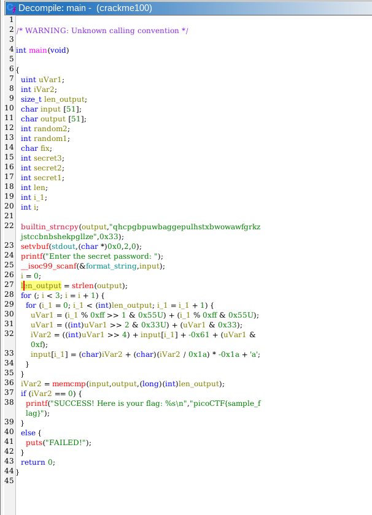

## Classic Crackme 0x100
 

**Description**
A classic Crackme. Find the password, get the flag! Binary can be downloaded here. Crack the Binary file locally and recover the password. Use the same password on the server to get the flag!

Additional details will be available after launching your challenge instance.


**Write-up**

To obtain the flag user must insert the correct flag.


Decompiling the code we observe the algorithm behind the password check.


Overall it is pretty simple, however it contains operations that are tedious to revert programatically by just reversing the algorithm logic, given the "loss of data" when the operation "(iVar2 / 26) * -26" is done. This because iVar2 is based on a value which is calculated with the password letter that we do not know.

Using a solver like z3, the process is automatized only being necessary to pass the symbolic expression representing the sequence of operations, and adding as constraint the final value.

In this case, the algorithm logic does not need to be reversed making the task a lot easier.

```python
from z3 import *

output = "qhcpgbpuwbaggepulhstxbwowawfgrkzjstccbnbshekpgllze" 
len_output = len(output)
flag = []

def do_decrypt(i_1, curr_letter):
    uVar1 = ((i_1 % 0xff >> 1) & 0x55) + (i_1 % 0xff & 0x55)
    uVar1 = ((uVar1 >> 2) & 0x33) + (uVar1 & 0x33)

    iVar2 = (uVar1 >> 4) + curr_letter + -97 + (uVar1 & 15 )
    curr_letter = iVar2 + (iVar2 / 26) * -26 + ord('a')

    return curr_letter


for i in range(0, len(output)):
    s = Solver()
    curr_letter = Int('original_letter')

    letter_op = do_decrypt(i, curr_letter)
    letter_op = do_decrypt(i, letter_op)
    letter_op = do_decrypt(i, letter_op)

    # solve with z3
    s.add(letter_op == ord(output[i]))
    if s.check():
        m = s.model()
        curr_letter = m[curr_letter].as_long()
        flag.append(chr(curr_letter))
    else:
        print("error")
        exit()

print("Flag: " + "".join(flag))
```


**Solution**

Flag: picoCTF{s0lv3_angry_symb0ls_4699696e}


[back](./../..)


