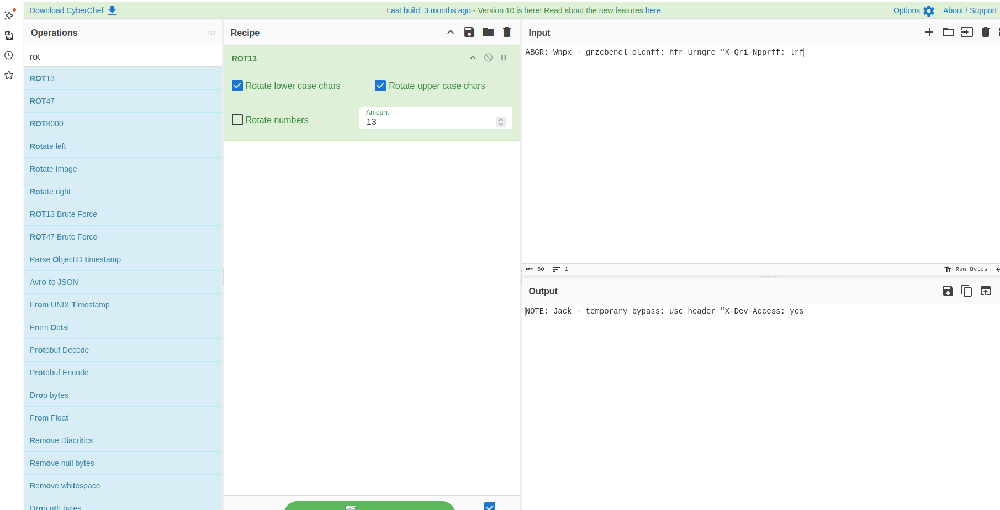

## Crack the Gate 1
 

**Description**

We’re in the middle of an investigation. One of our persons of interest, ctf player, is believed to be hiding sensitive data inside a restricted web portal. We’ve uncovered the email address he uses to log in: ctf-player@picoctf.org. Unfortunately, we don’t know the password, and the usual guessing techniques haven’t worked. But something feels off... it’s almost like the developer left a secret way in. Can you figure it out? The website is running here. Can you try to log in?

**Write-up**

User is presented with login page when visiting the site.

Checking the source code the following comment is visible:

The comment is ROT13 encoded. It indicates to bypass the login page user must send the header "X-Dev-Access: yes".

Added the header using burp.

**Solution**

Flag: picoCTF{brut4_f0rc4_0d39383f}

[back](./../..)