## Java Code Analysis!?!
 

**Description**

BookShelf Pico, my premium online book-reading service. I believe that my website is super secure. I challenge you to prove me wrong by reading the 'Flag' book! Here are the credentials to get you started:

    Username: "user"
    Password: "user"

Source code can be downloaded here. Website can be accessed here!.

**Write-up**

After starting the challenge, logged in with the provided credentials and looked around.
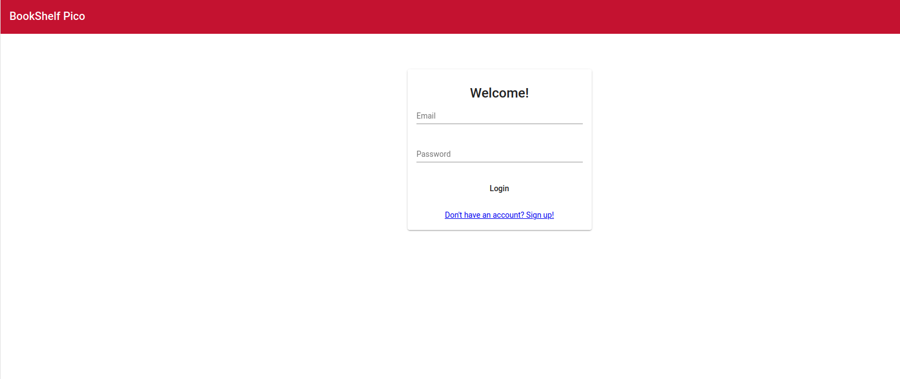

Web app provides a repository of pdf's, one of those is named "FLAG" and requires admin privilege to access.

Looked around the source code/assets and confirmed that the book "FLAG" contains the flag.
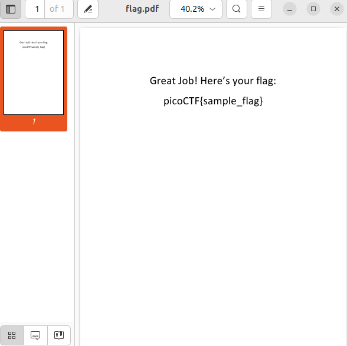

Looking around the code, noticed the authorization mechanism depends on the user "role" being equal or above the book "role".
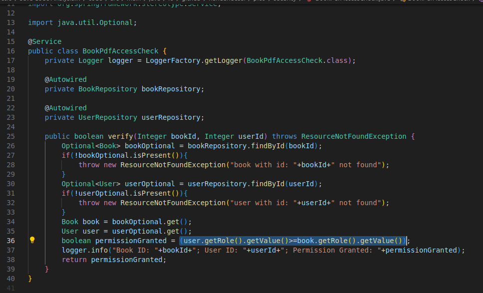

The file "data.sql" defines 4 roles, "admin" being the highest.
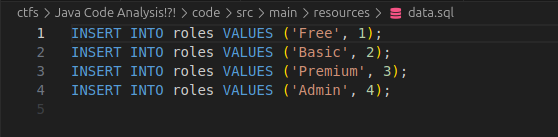

App also implements a filter, executed before the API endpoint code, `doFilterInternal`. This endpoint will decode a JWT token and build a list of authorities which depends on the return value of `getRole`.

The role is extracted from the JWT token by the function `decodeToken` of the `JwtService` class.
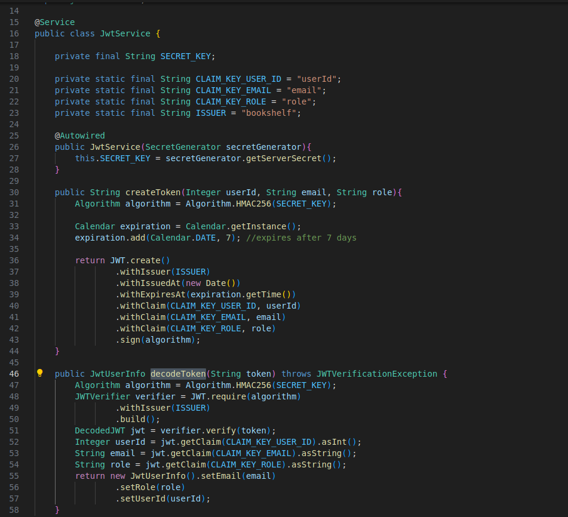

Right above, the function `createToken` will build the user token, using as signing algorithm HMAC Sha 256 (HS256). The secret key used is returned by the function `getServerSecret` of the class `SecretGenerator`. The secret is hardcoded in the function `generateRandomString` as `1234`.
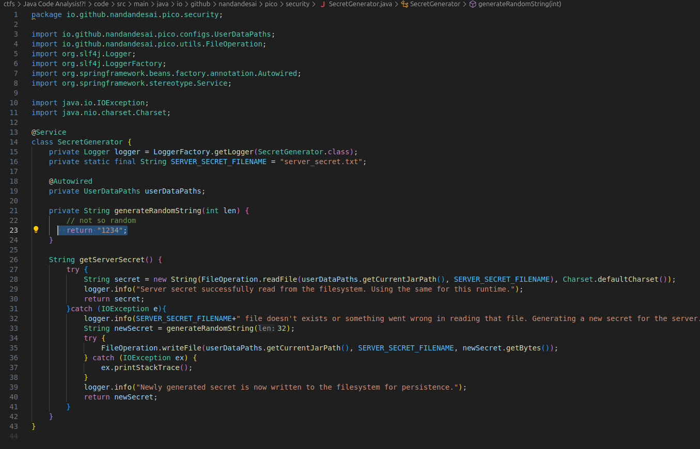

This means, that the JWT token is trivially forged. Using python, generated a fake token to login as "admin". 
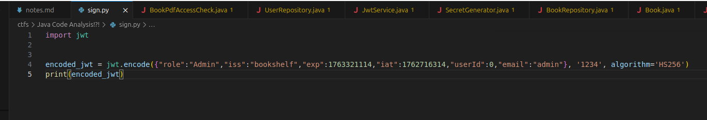
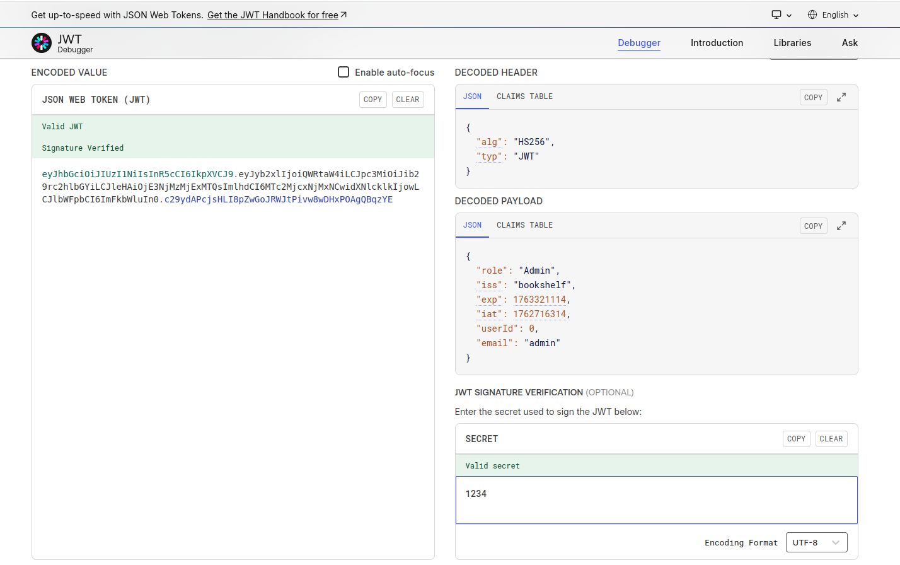
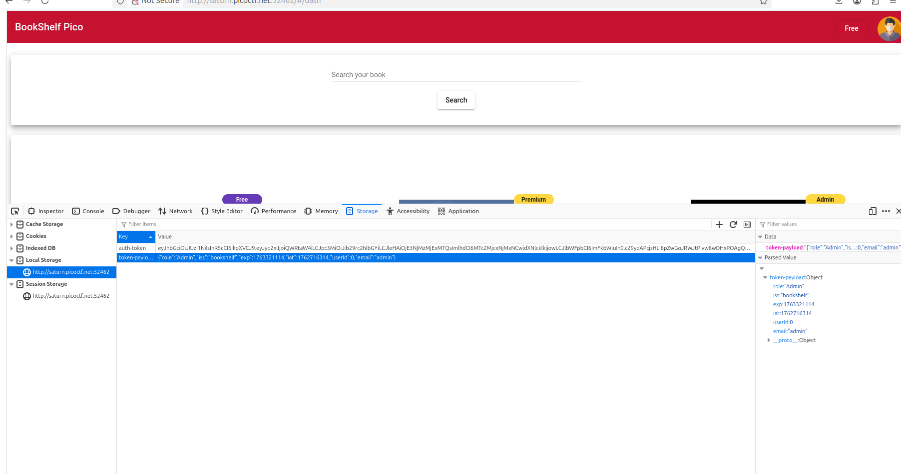

Managed to login as admin and accessed the admin dashboard. Changed the user role freom "Free" to "Admin" and relogged back into the user account.

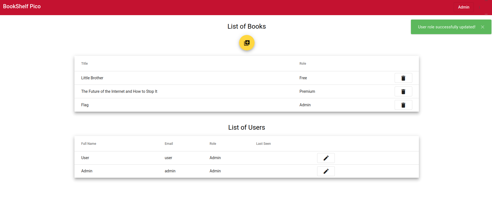

Obtained the flag:
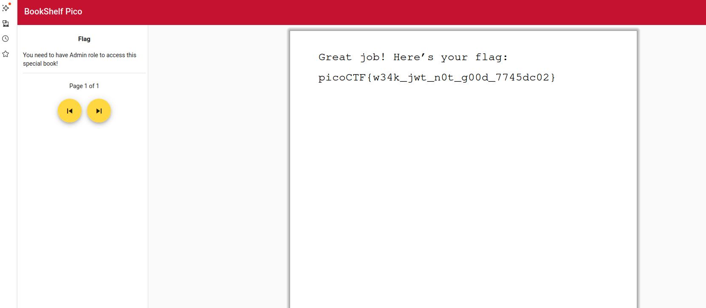

**Solution**

Flag: picoCTF{w34k_jwt_n0t_g00d_7745dc02}

[back](./../..)