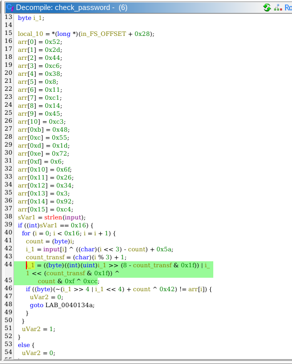

## bipbop
 

**Description**

What are computers working with again?

**Write-up**

Typical challenge where user input is transformed in final values.


Solved with Z3 for fun.

- Takeaway notes.
    - It is preferred to use `BitVecVal` when doing operations between `BitVec's`.
    - The operation: `(val >> 4) | (val << 4)` (byte size, no casting), is effectively a rotation. 
        - Lost a very large amount of time because I didn't realize this, and instead of `RotateRight` and `RotateLeft` was using `<<>>`.
        - As a consequence data was being lost and the system was `unsat`.

```python
from z3 import *

arr = [0x52,0x2d,0x44,0xc6,0x38,0x8,0x11,0xc1,0x14,0x45,0xc3,0x48,0x55,0x1d,0x72,0x6,0x6f,0x26,0x34,0x3,0x92,0xc4]

letters = []
s = Solver()

for i in range(0, len(arr)):
    curr_letter = BitVec(f'curr_letter_{i}', 8)
    letters.append(curr_letter)

    count = i 
    i_1 = curr_letter ^ ((i << 3) - count + 0x5a)

    count_transf = (i % 3) + 1

    i_1 = (RotateRight(i_1, 8 - count_transf & 0x1f) | RotateLeft(i_1, (count_transf & 0x1f))) ^ ((count & 0xf) ^ 0xcc)
    final = ~(RotateRight(i_1, 4) | RotateLeft(i_1, 4)) + count ^ 0x42

    s.add(final == arr[i])


if s.check() == sat:
    m = s.model()
    flag = [chr(m[l].as_long()) for l in letters]
    print("".join(flag))
else:
    print("here we go again")


"""
11110000 >> 4 | 11110000 << 4

00001111 | 0000000
00001111


10111010 >> 4 | 10111010 << 4

00001011 | 10100000
10101011
"""
```

**Solution**


Flag: picoCTF{}


[back](./)