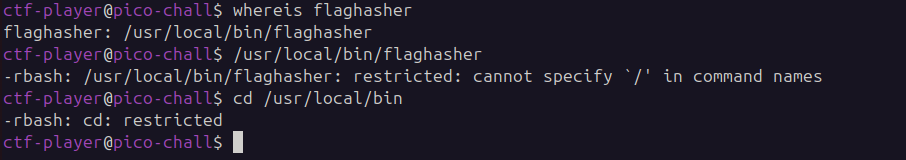
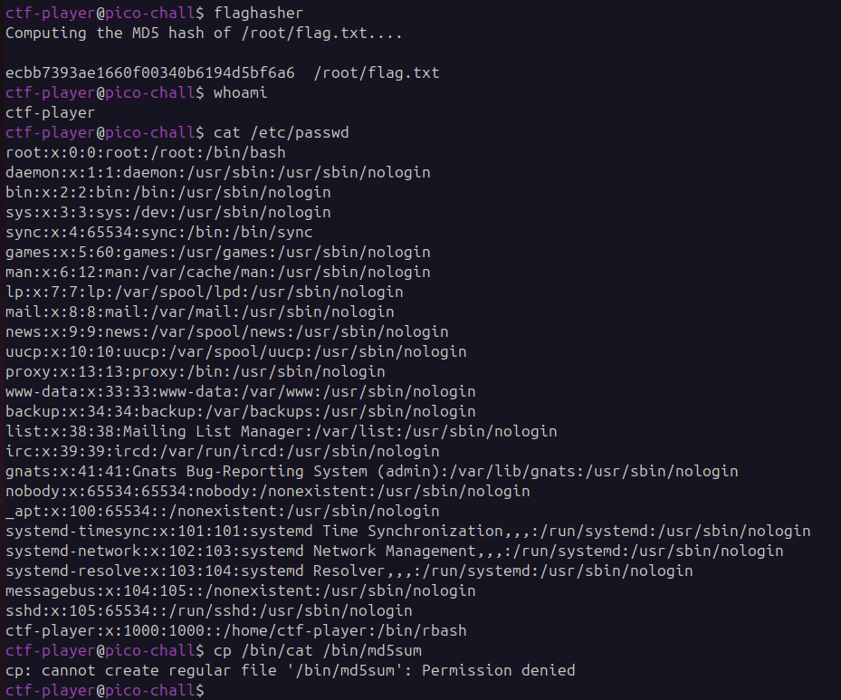
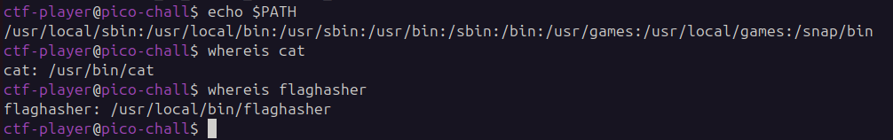

## hash-only-1
 

**Description**

Here is a binary that has enough privilege to read the content of the flag file but will only let you know its hash. If only it could just give you the actual content!

**Write-up**

Located binary.

Last trick won't work directly anymore.

However, because of the `PATH` variable, `/usr/local/bin` directory takes priority when searching for binaries, as such it is possible to copy the `cat` binary to the same folder where `flaghasher` is and have that `md5sum` (cat) take priority.

**Solution**

Flag: picoCTF{Co-@utH0r_Of_Sy5tem_b!n@riEs_364b3672}

[back](./../..)