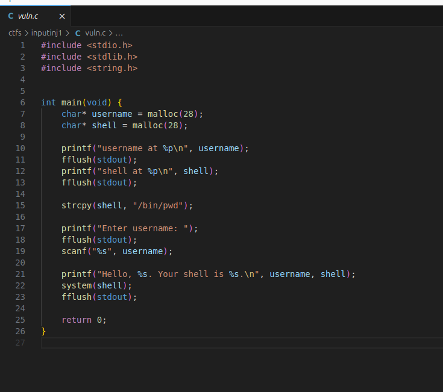
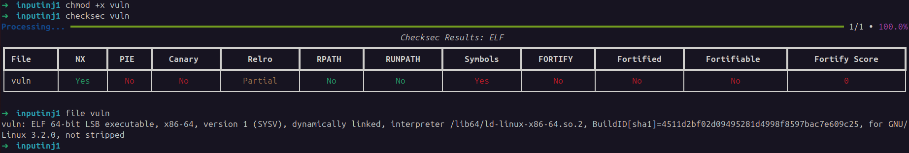
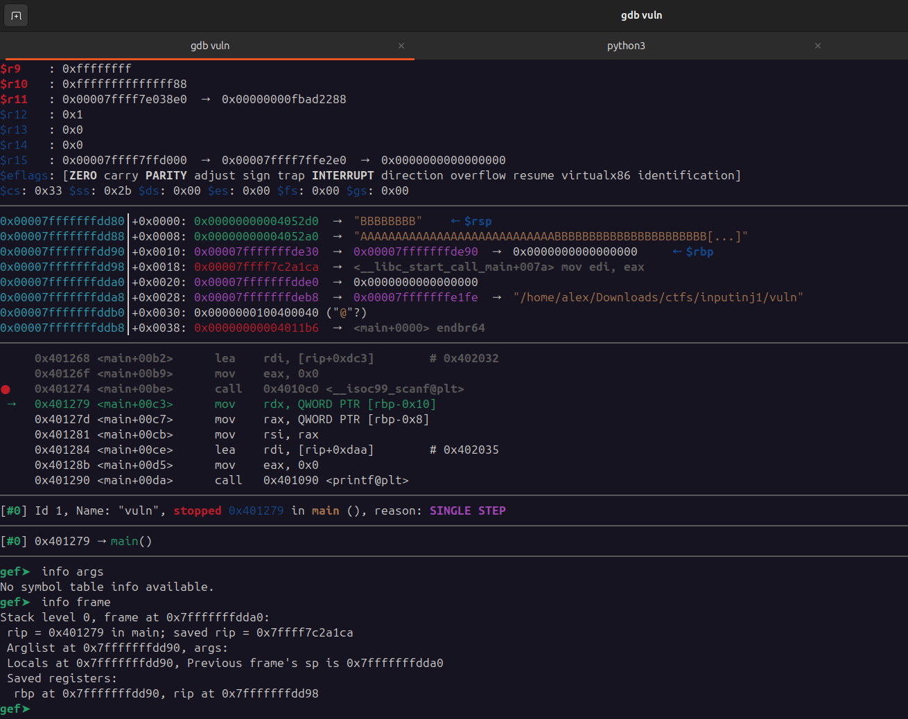
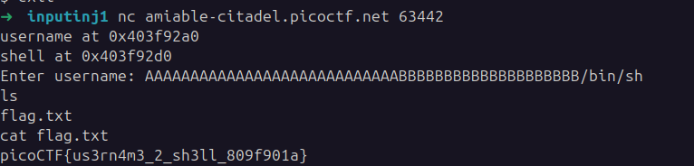

## Input Injection 2
 

**Description**
This program greets you and then runs a command. But can you take control of what command it executes?

**Write-up**

Same logic as previous version, however the overwrite now happens on heap.

Debugging with GDB it is possible to observe in real time that the last 8 `B` bytes, overwrote the content at address `0x4052d0`, which is the `shell` command to be executed.

Obtained flag:

**Solution**

Flag: picoCTF{us3rn4m3_2_sh3ll_809f901a}

[back](./../..)