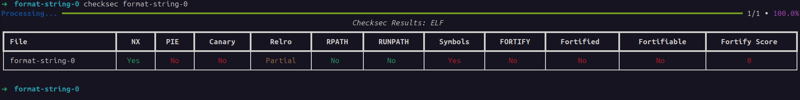
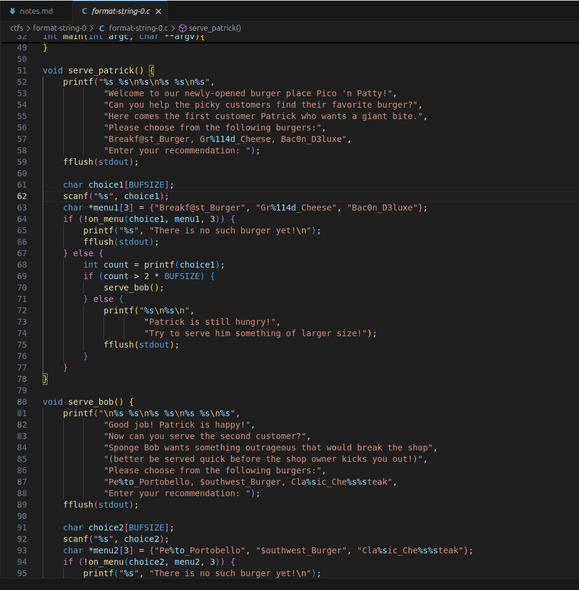
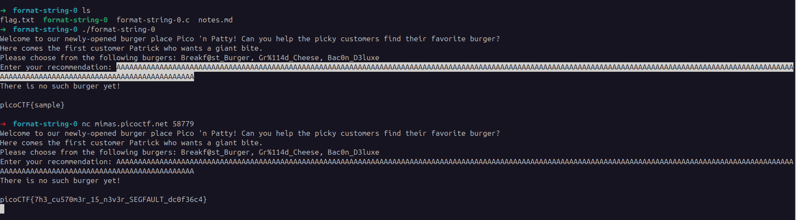
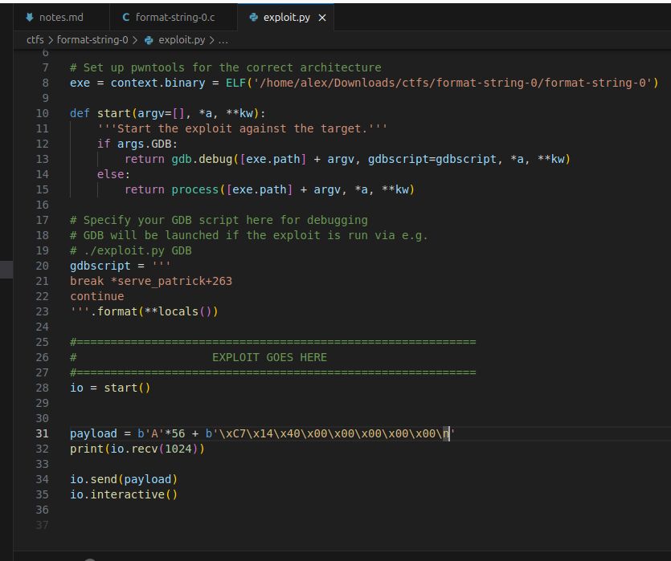
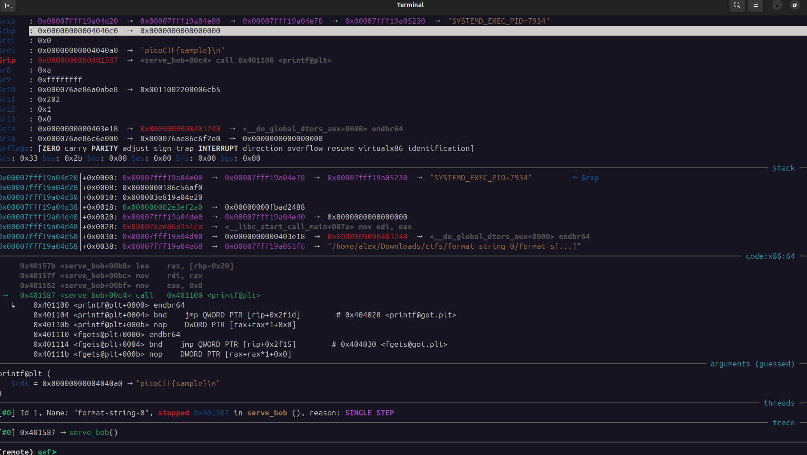
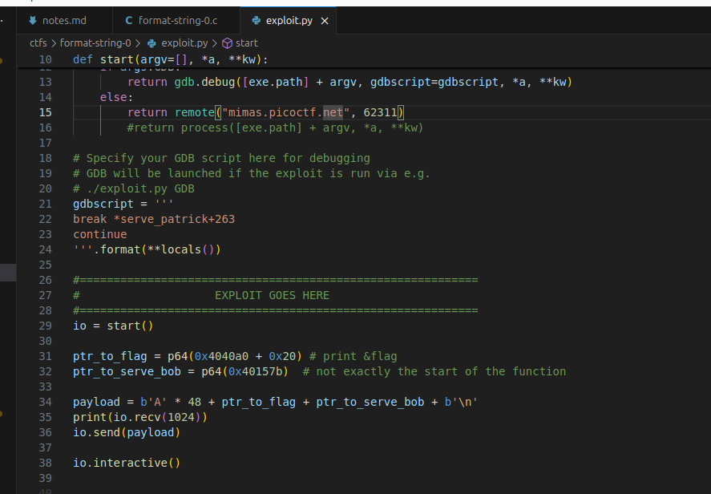

## format string 0

**Description**

Can you use your knowledge of format strings to make the customers happy? 

**Write-up**

Executing the binary.

Enabled protections:

Source code is provided. The flag is read from the file `flag.txt` to a buffer in the global scope.

### Solution Nº1 - The segmentation fault handler
App implements a segmentation fault handler that prints the flag, this method can be triggered directly in the `serve_patrick` function when user input is requested and read to the local scope of the function in the `choice1` buffer.  As such we directly obtain the flag `picoCTF{7h3_cu570m3r_15_n3v3r_SEGFAULT_dc0f36c4}`.

This is not the intended way to solve the challenge, as the main topic is format string category of vulnerability.

### Solution Nº2 - The intended way

This solution works by using the correct burgers in the menu, in this case `Gr%114d_Cheese`, meeting both conditions: being on the menu & more than 64 characters because at line 68 the `printf` call directly accepts the format specifier `%114d`. Similarly, the burger `Cla%sic_Che%s%steak` will have the format specifier `%s` used to print the flag.

### Solution Nº3 - Using printf to print the flag directly
The function `serve_bob` has another format string vulnerability. It will use user input has a format string argument to `printf`, line 98.

This solution takes the "burger not on the menu" path. We overwrite the return address with the address to the function `serve_bob`.

Used the command `pwn cyclic 65` to generate a sequence of bytes.

Executed the program with GDB and noticed the pattern of bytes that was going to be used as return address. Identified it was at position 56.

Passing the input `AAAAAAAAAAAAAAAAAAAAAAAAAAAAAAAAAAAAAAAAAAAAAAAAAAAAAAAABBBB` generated with `python3 -c "print(´A´*56+´B´*4)"`, RIP will be replaced with `0x42424242`.

Given that this program has PIE disabled (check enabled protections screenshot), it is possible to pass the hardcoded address of `serve_bob`, 0x00000000004014c7.

To facilitate debugging, generated a exploit template with `pwn template bin` and overwrote `RIP` with the address of `serve_bob` function.

To reach the format string vuln, it's easy now, replace RIP with the address where we want to jump. Furthermore, we control the RBP pointer (overwritten in the same operation as RIP), which will be used as argument of `printf`. Therefore it is possible to print the flag directly.

**Solution**

Flag: picoCTF{7h3_cu570m3r_15_n3v3r_SEGFAULT_dc0f36c4}

[back](./../..)