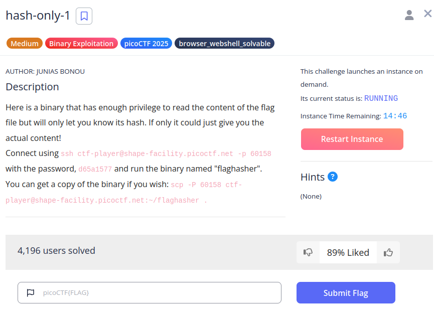
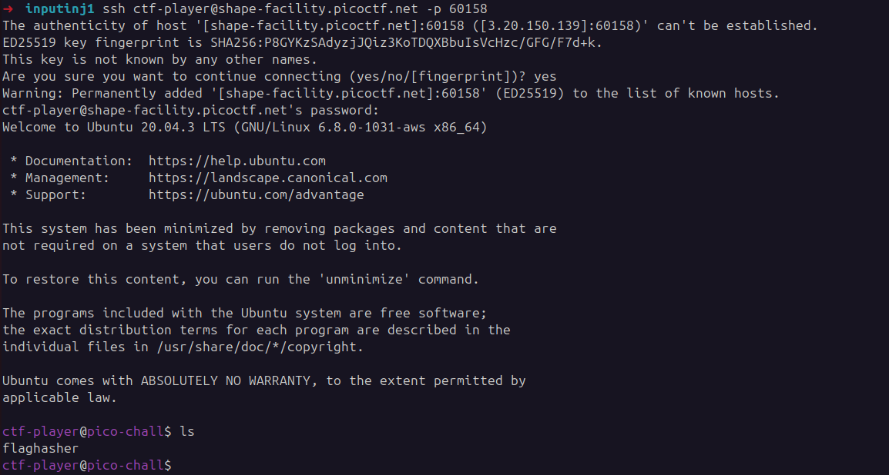
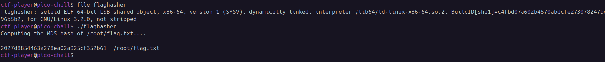
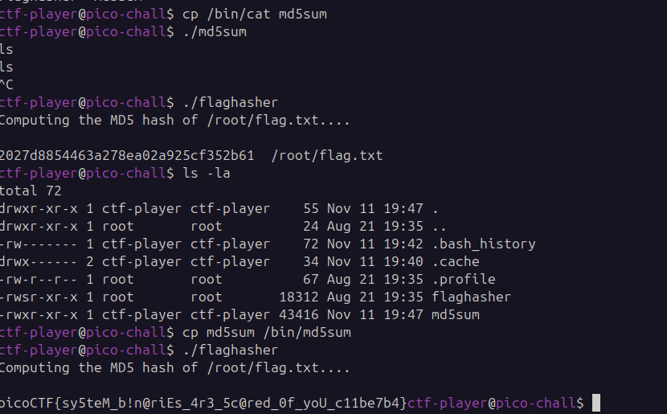

## hash-only-1
 

**Description**

Here is a binary that has enough privilege to read the content of the flag file but will only let you know its hash. If only it could just give you the actual content!

**Write-up**

Connected remotely.

Binary calculates hash of file `flag.txt`.

Extracted binary:

Decompiled the binary. It executed the command `/bin/bash -c 'md5sum /root/flag.txt'` to compile the hash.

To solve the challenge, I copied the binary `cat` to the `/bin` directory with the name `md5sum`.

When `flaghasher` runs, instead of using the `md5sum` binary it will use `cat`, printing the flag.

**Solution**

Flag: picoCTF{sy5teM_b!n@riEs_4r3_5c@red_0f_yoU_c11be7b4}

[back](/index)