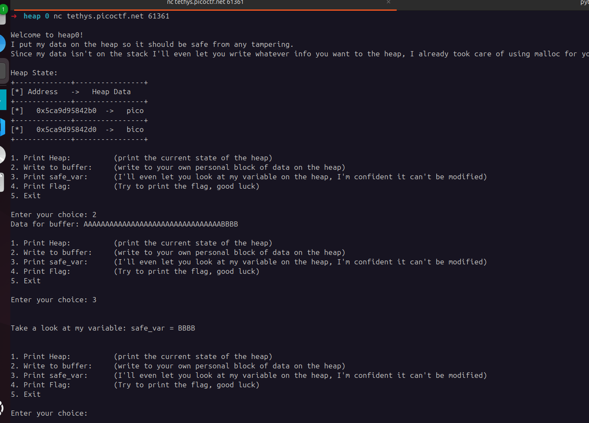

## heap 0
 

**Description**

Are overflows just a stack concern?

**Write-up**

The challenge is pretty simple, user must overflow the variable `safe_var` in the heap. This is trivial as the function `write_buffer` uses the function `scanf` to write an arbitrary number of bytes to `input_data`, another variable in heap before `safe_var`.

Executing the challenge, heap state is printed. From 1 block to the other, it's only 32 bytes.

After that we just have to use option 4 to print flag.

**Solution**

Flag: picoCTF{my_first_heap_overflow_749119de}

[back](/index)