## heap 3
 

**Description**
This program mishandles memory. Can you exploit it to get the flag?

**Write-up**

Similar to [heap 1](./../heap1/), however is allocating memory for a `struct` now. The pwn logic to win is still the same though, replace variable `object->flag` with `pico`.

An additional twist, is that we can't directly overwrite this object.
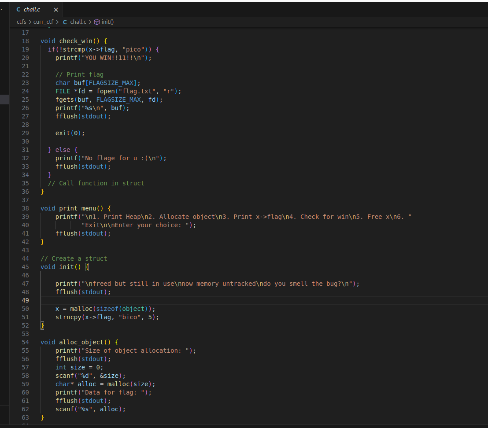
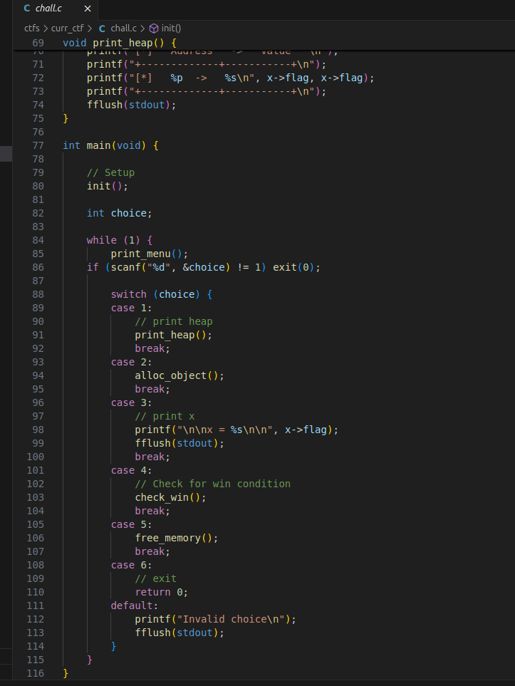

However, we also have a function `free_memory` which will free the target chunk, however the variable pointer is not cleaned meaning that when `check_win` is called, it will still access the same memory area. So if we manage to obtain a chunk to that area and write, the pointer will still be used to validate the struct field `flag` with now user controlled values. 
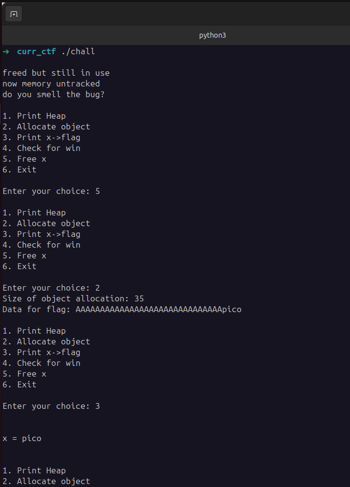
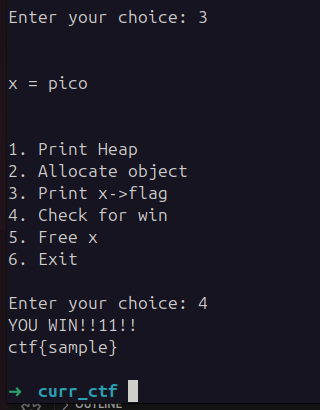

Seeing this brocess in GDB we can find the the initial `object` chunk at address `0x4056b0`, having the string `bico` at address `0x4056ce`.
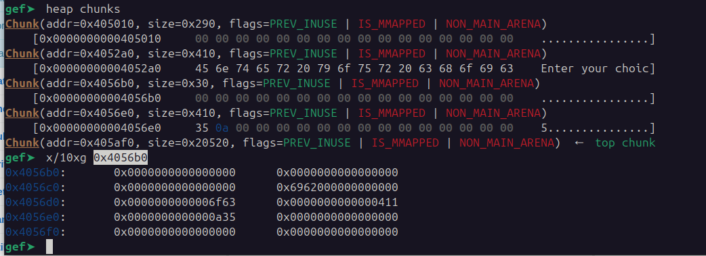

After this object is freed it will end up in the `Tcachebins`.
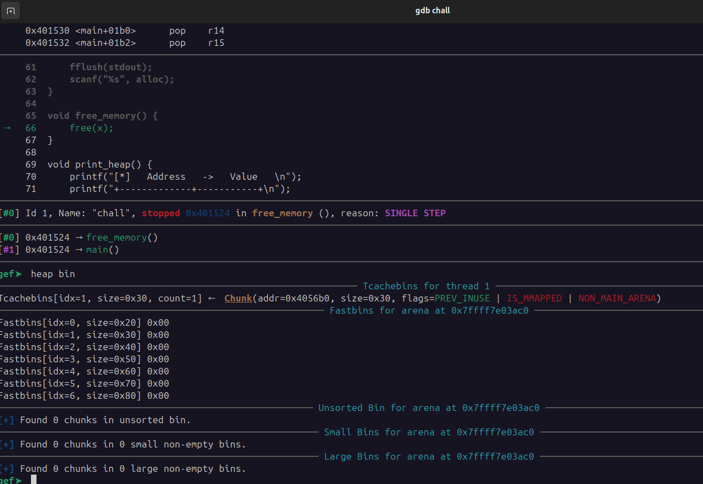

If we now allocate an object of size 35, we will receive from this list the freed chunk, therefore obtaining control over an area of memory that is still actively used.
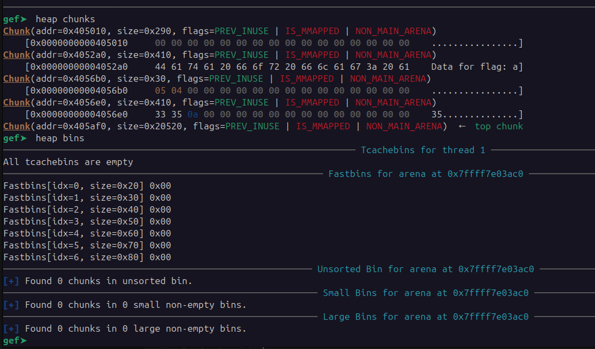

If we overwrite with 30 `A` and `pico` at address `0x4056ce` will now be written `pico`.
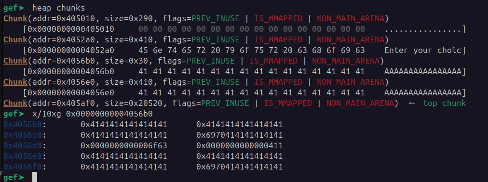
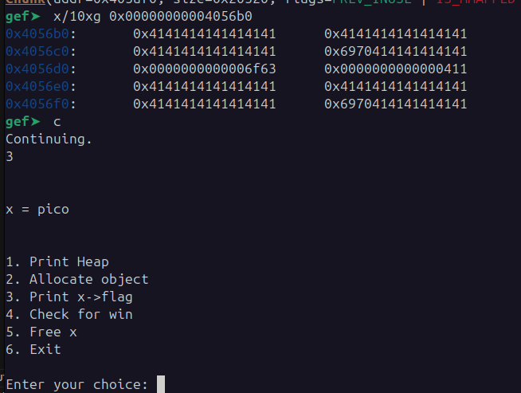

Since function `check_win` is still using a pointer to the old chunk, it will read the user controlled value becoming a `Use-After-Free` vulnerability.
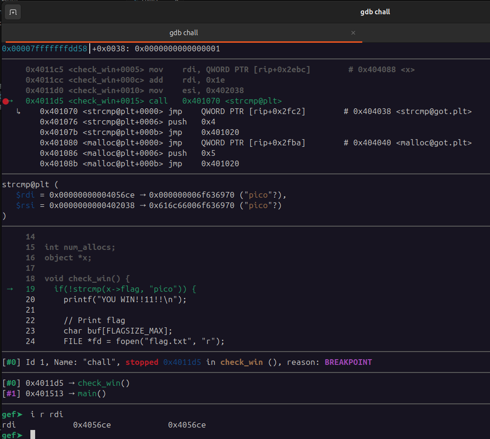
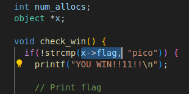

Obtaining the flag:
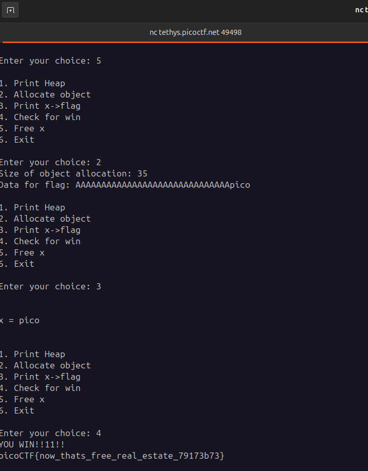

**Solution**

Flag: picoCTF{now_thats_free_real_estate_79173b73}

[back](/index)