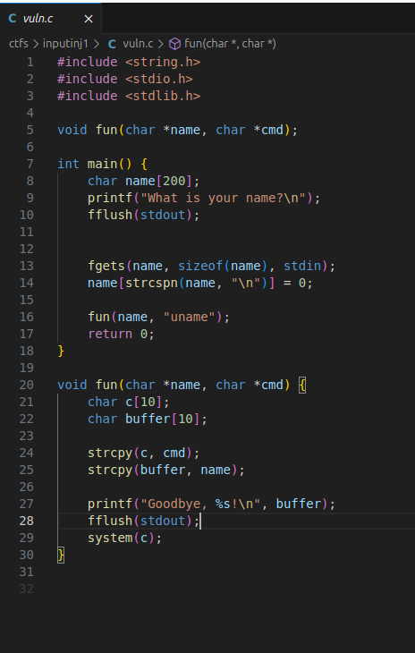
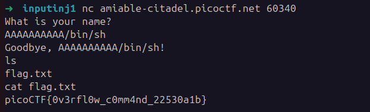

## Input Injection 1
 

**Description**
A friendly program wants to greet you… but its goodbye might say more than it should. Can you convince it to reveal the flag?

**Write-up**

Function `func` is vulnerable to buffer overflow. It is using the function `strcpy` to copy a buffer of 200 characters in one of 10. Allowing to overwrite the buffer `c`, which will be used to execute a command through the function `system`.

A simple input like `AAAAAAAAAA/bin/sh` allows to obtain a shell:

**Solution**

Flag: picoCTF{0v3rfl0w_c0mm4nd_22530a1b}

[back](./../..)