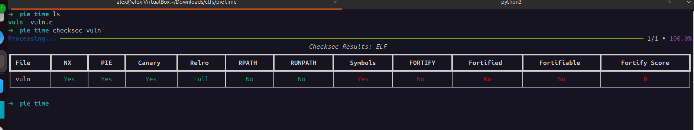
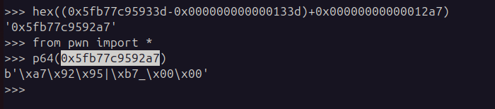
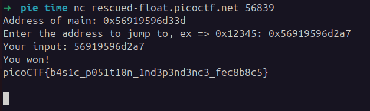

## PIE TIME
 

**Description**
Can you try to get the flag? Beware we have PIE!

**Write-up**

CTF uses scanf to read a pointer (`%lx`) and type casts that pointer to a function without arguments and void return.

To win, user must pass the address of function `win`. PIE (Position Independent Code) is enabled, meaning the address in memory of this function will not be fixed.

To calculate the correct address to pass, I calculated the base address of the code by subtracting `main` offset from printed value, and added the `win` function offset. Used `readelf` to print the offsets.

Submited that address to the binary.

**Solution**

Flag: picoCTF{b4s1c_p051t10n_1nd3p3nd3nc3_fec8b8c5}

[back](./../..)