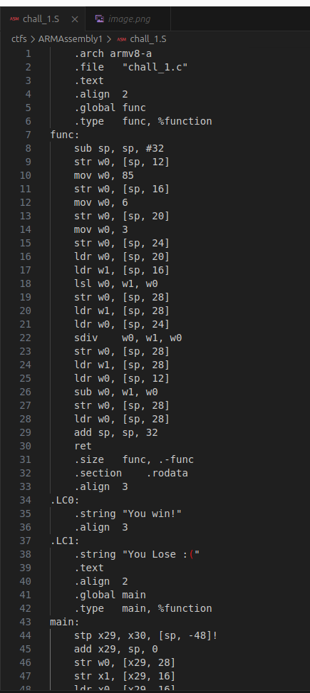

## ARMAssembly 1
 

**Description**

For what argument does this program print `win` with variables 85, 6 and 3? File: chall_1.S Flag format: picoCTF{XXXXXXXX} -> (hex, lowercase, no 0x, and 32 bits. ex. 5614267 would be picoCTF{0055aabb})

**Write-up**

➜  ARMAssembly1 file chall_1.S 
chall_1.S: assembler source, ASCII text

chall_1.S:



Main function will compare if result of calling func with an unknown value (the flag) returns 0.

If it is not 0 jump's to label .L4, which prints the message saying "You lose :(".

If the value is 0, calculates the base address of the page where .LC0 is and add's the offset to ".LC0", finally printing "You win!".

Analyzing the function "func", a series of operations will be done with the unknown value, 85, 6 and 3.

Something of the sorts:

```
sp+12 => not sure
sp+16 => 85
sp+20 => 6
sp+24 => 3

w0 => 6
w1 => 85

w0 => 5440 (1010101) << 6 = 1010101000000 = 5440
sp+28 => 5440
w1 => 5440
w0 => 3
w0 => 1813

sp+28 => 1813
w1 => 1813
w0 => not sure, sp+12
w0 => w0=w1-w0 => w0=1813-not sure
sp+28 = result w0
w0 = result
```

For the result to be 0, 1813 must be subtracted with 1813.

According to the CTF Instructions it must be the value in hexadecimal format.

**Solution**


Flag: picoCTF{00000715}


[back](/index)