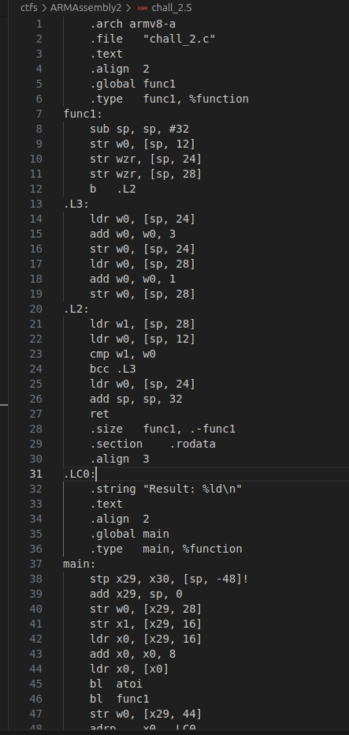
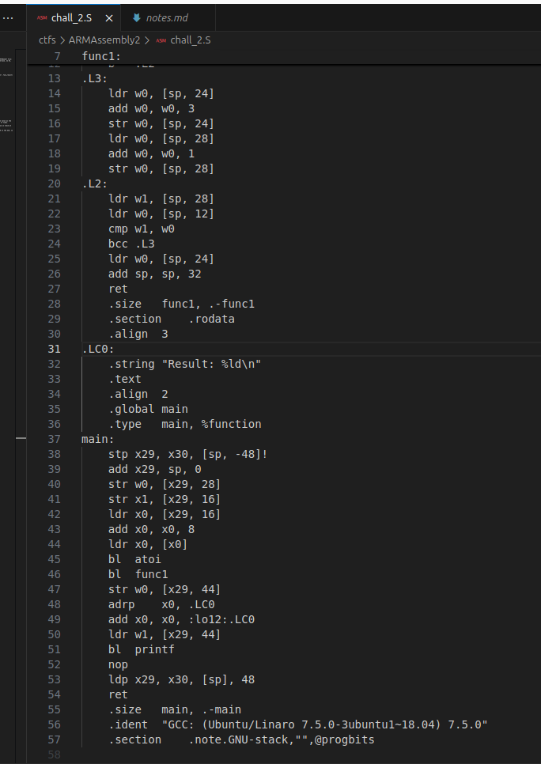

## ARMAssembly2
 

**Description**
What integer does this program print with argument 3297082261? File: chall_2.S Flag format: picoCTF{XXXXXXXX} -> (hex, lowercase, no 0x, and 32 bits. ex. 5614267 would be picoCTF{0055aabb})

**Write-up**




```
Main:
Line 44, loads x0 = 3297082261
Converts to int
Executes func1
Stores result of func1 at sp+44
Lines 48 to 51 are equivalent to printf("Result: %ld\n", func_result)

func_result is the flag.


func1:
w0 = 3297082261
sp+24 = 0
sp+28 = 0
Jump to .L2

.L2:
w1 = 0
w0 = 3297082261
w1 - w0
CF = 0 (Borrow required)
jump to .L3
w0 = 3

.L3 (loop counters)
W0 = 0
w0 = 3
sp + 24 = 3
w0 = 0
w0 = 1
sp + 28 = 1

Repeat from .L2
```

The cycle stops when the variable at sp+28 is the same value as the argument "3297082261", so it will execute that amount of times.

When bcc is not taken anymore it returns with the value in stack at position sp+24 and this is the printed value.

The local variable sp+24 is 3 times the value of sp+18 in the end, so 3297082261*3=9891246783 => 24D9072BF.

Taking the 32 lowest bits results in 4D9072BF.


**Solution**


Flag: picoCTF{4D9072BF}


[back](/index)