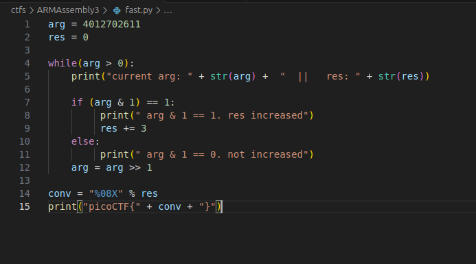

## ARMAssembly 3
 

**Description**
What integer does this program print with argument 4012702611? File: chall_3.S Flag format: picoCTF{XXXXXXXX} -> (hex, lowercase, no 0x, and 32 bits. ex. 5614267 would be picoCTF{0055aabb})

**Write-up**

Converted assembly code to python equivalent. 

Program will check the least significant bit to see if it is 0 or 1 by doing a bytewise operation between the "argument" (4012702611) and 1. 

If the result is 1, it will increment "res" by 3. 

Each iteration of the loop, code at label .L3 will shift right the argument by 1 position, halving the value.

The process is repeated until "argument" reaches value 0, at that point the "res" will be returned to be printed.

**Solution**

Flag: picoCTF{0000003F}

[back](/index)