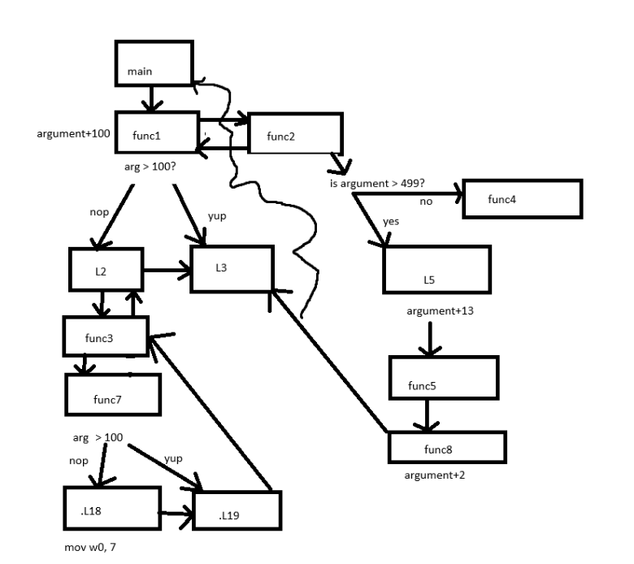

<a href="./chall_4.S" id="download-file" class="button">Download</a>  

## ARMAssembly 4
 

**Description**
What integer does this program print with argument 1151828495? File: chall_4.S Flag format: picoCTF{XXXXXXXX} -> (hex, lowercase, no 0x, and 32 bits. ex. 5614267 would be picoCTF{0055aabb})

**Write-up**

The difficulty of this challenge is understanding the program execution with stacked branch link's.

Drawing a **very crude** representation of the flow graph, we obtain something of the following:

In `func1` the `bls .L2` jump is not taken as the argument is greater than 100. A branch with link to `func2` is taken, this will take the program execution across .L5, func5 and func8. Along these steps the initial argument was added the values 100, 13 and 2. 

When `func8` returns, this will trigger the following execution path: func8 -> func5 -> .L6 (next instruction after line 42). At this point the `ret` instruction in .L6 will update the instruction pointer to the branch value saved by `func1` at line 17. The label .L3 does another `ret` returning to main.

The final argument value is: hex(1151828495+13+2+100) => 44a78282

**Solution**

Flag: picoCTF{44a78282}

[back](/index)