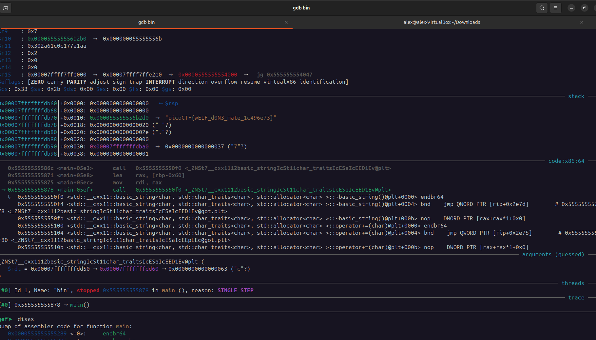

## FactCheck
 

**Description**

This binary is putting together some important piece of information... Can you uncover that information? Examine this file. Do you understand its inner workings? 

**Write-up**

Ghidra decompilation:

Possible to see part of the flag to be:
picoCTF{wELF_d0N3_m ate_

App is creating multiple strings that will use be used to build the flag.

Gathering all the strings used to build the final flag:
p1 = 1 , extra check, (appended) "5" < "B" => TRUE
p2 = c, extra check, (appended) "6" != "A" => TRUE 
p3 = 3 , extra check, (not appended) -> "3" (51)-"e" (101) == 3 => FALSE
p4 = 4
p5 = 9
p6 = a , extra check, (not appended) -> "a" == "G" => FALSE
p7 = 6
p8 = e
p9 = 7
p10 = 3

Final flag:
picoCTF{wELF_d0N3_mate_1c496e73}

It is easier to just debug the binary and observe the flag being built in real time.

**Solution**

Flag: picoCTF{wELF_d0N3_mate_1c496e73}

[back](./../..)