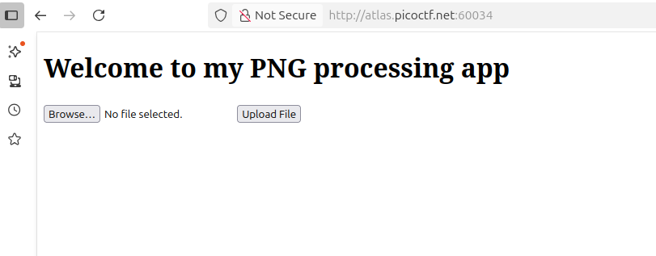
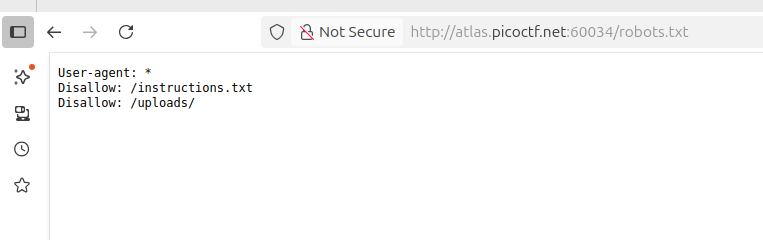
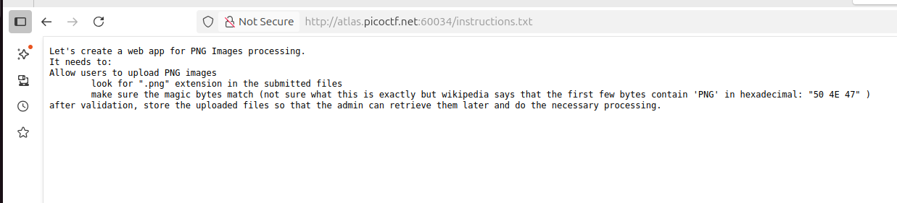
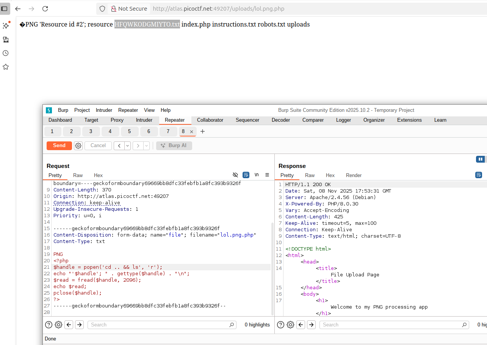

## Trickster
 

**Description**

I found a web app that can help process images: PNG images only! Try it here!

**Write-up**

Simple web page with upload interface.

Visiting robots.txt, 2 endpoints are exposed.

instructions.txt indicates that for the upload to be valid user must have ".png" in the file name and the magic bytes must have the png signature.

Captured a valid HTTP request with burp, implemented the conditions for the checks to pass and sent a php payload.

Visiting the file in the ´uploads´ directory with the file name, is possible to observe code execution.

**Solution**

Flag: picoCTF{c3rt!fi3d_Xp3rt_tr1ckst3r_9ae8fb17} 

[back](/index)