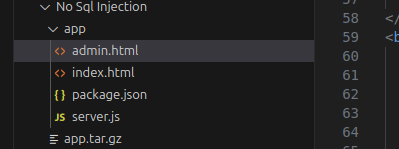
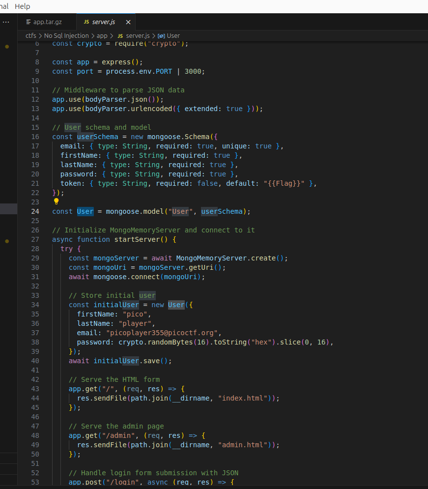
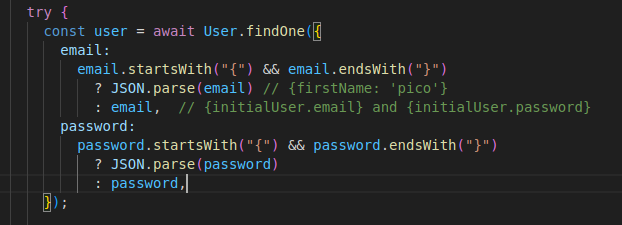
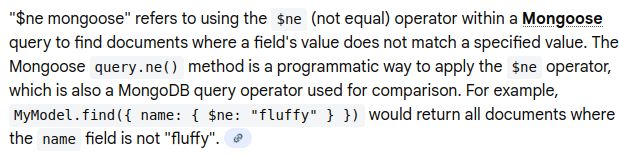
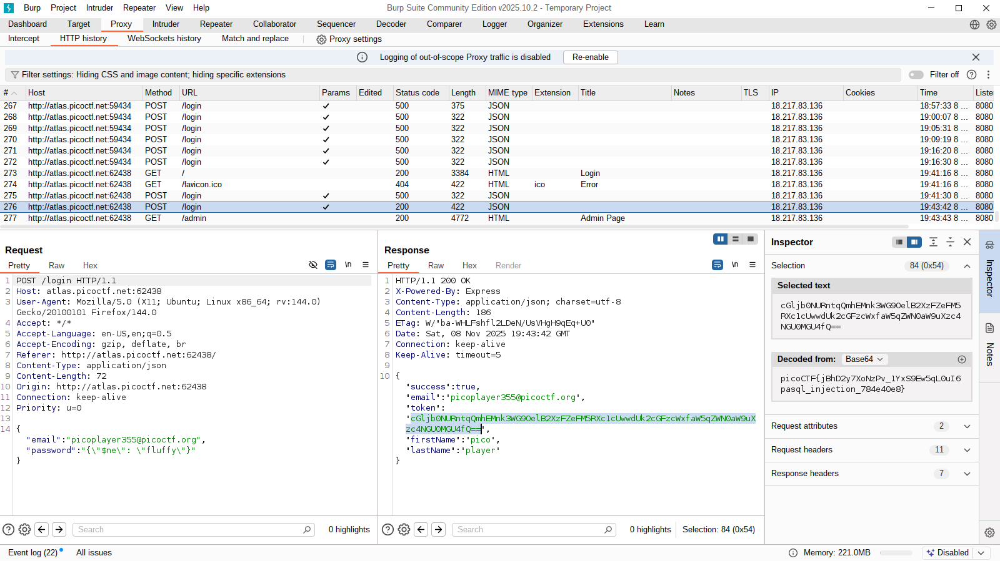

## No Sql Injection
 

**Description**
Can you try to get access to this website to get the flag? You can download the source here.

Additional details will be available after launching your challenge instance.

**Write-up**

Challenge provides the source code.

The flag is in the local database. Part of the user schema table in the token column.

Token/flag is sent to the user after login.

The only user in the database has the email `picoplayer355@picoctf.org`.

Username and email can be parsed to JSON if the credential starts with "{" and finishes with "}".
This means that it is possible to pass values such as `picoplayer355@picoctf.org` for username and query objects such as `{"$ne": "test"}` for the password.

The password will be parsed to the JSON {$ne: "test"}, $ne being a MongoDB operator to search for documents that are "Not equal to". 

When findOne runs, it will search for entries that match the email and the password will use the MongoDB operator $ne  "not equal" to "test", returning the user (as long as the password is not "test").

**Solution**

Flag: picoCTF{jBhD2y7XoNzPv_1YxS9Ew5qL0uI6pasql_injection_784e40e8}

[back](/index)