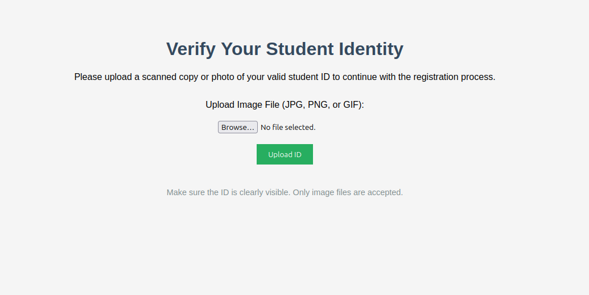
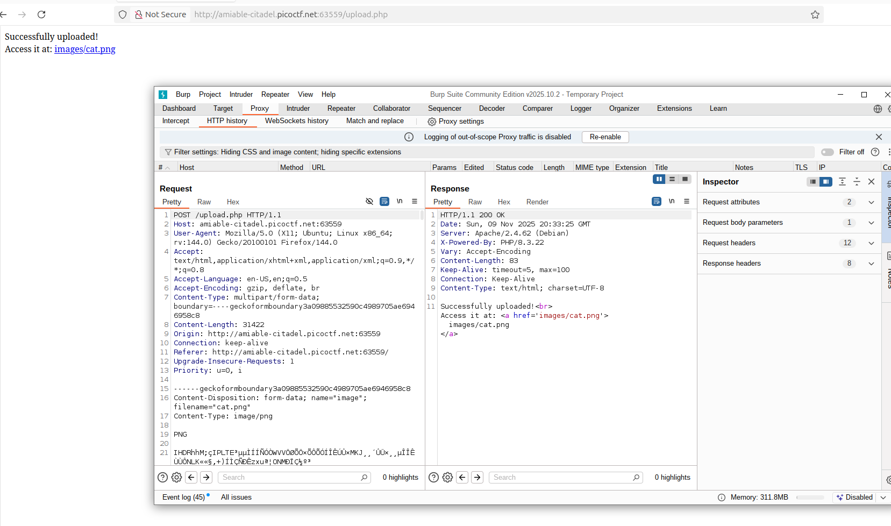
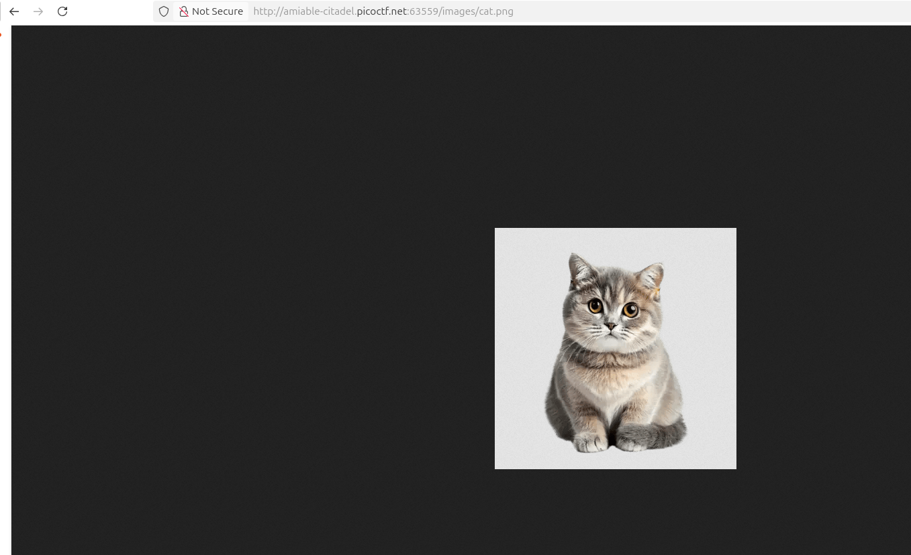
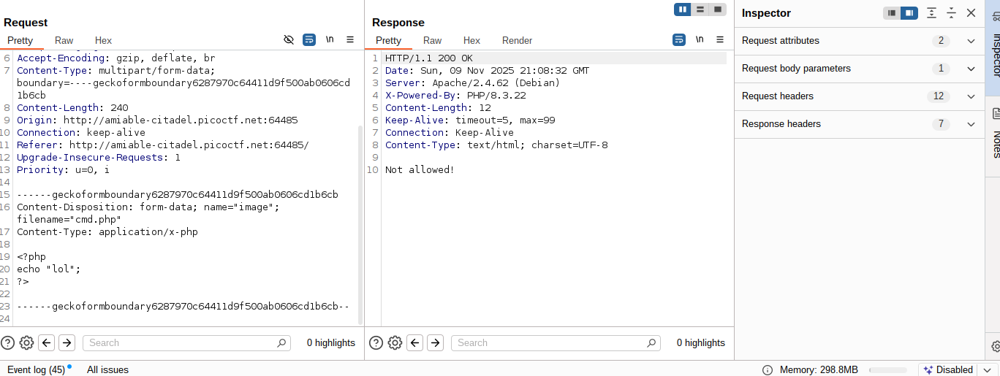
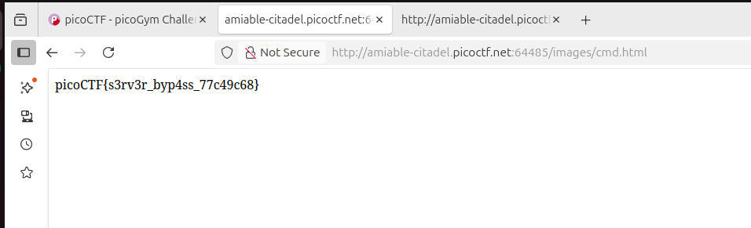

## byp4ss3d
 

**Description**
A university's online registration portal asks students to upload their ID cards for verification. The developer put some filters in place to ensure only image files are uploaded but are they enough? Take a look at how the upload is implemented. Maybe there's a way to slip past the checks and interact with the server in ways you shouldn't. You can access the web application at here!

**Write-up**

Web app allows for uploads.




Attempted to upload a PHP file however the extension is blocked.


Used other extensions such as `.pht`, `.phtm`... and others common for bypass. However did not have success in having them interpreted as PHP code.

To force this behavior, uploaded a `.htaccess` file that allowed for php execution in html files.


Finally, uploaded a "html" file with php code that allowed for command execution.


Such as:
```php
<?php
$handle = popen('ls', 'r');
$read = fread($handle, 2096);
echo $read;
pclose($handle);
?>
```

Visited the page and obtained the flag:


**Solution**


Flag: picoCTF{s3rv3r_byp4ss_77c49c68}


[back](./../..)